

# Autoseed [¶](#Autoseed-)

-----

See Also: [autoseed Application
Documentation](http://isis.astrogeology.usgs.gov/Application/presentation/Tabbed/autoseed/autoseed.html)

  - [Autoseed](#Autoseed-)
      - [Introduction](#Introduction-)
      - [What are overlap polygons?](#What-are-overlap-polygons-)
      - [What algorithms are available?](#What-algorithms-are-available-)
      - [What are the required parameters for the different
        algorithms?](#What-are-the-required-parameters-for-the-different-algorithms-)
          - [What is the MinimumThickness
            parameter?](#What-is-the-MinimumThickness-parameter-)
          - [What is the MinimumArea
            parameter?](#What-is-the-MinimumArea-parameter-)
          - [What are XSpacing and
            YSpacing?](#What-are-XSpacing-and-YSpacing-)
          - [What are MajorAxisPoints and
            MinorAxisPoints?](#What-are-MajorAxisPoints-and-MinorAxisPoints-)
      - [What programs must be run before running
        autoseed?](#What-programs-must-be-run-before-running-autoseed-)
      - [How do you determine which algorithm to
        use?](#How-do-you-determine-which-algorithm-to-use-)
      - [How do you determine XSpacing and
        YSpacing?](#How-do-you-determine-XSpacing-and-YSpacing-)
      - [What are the required parameters for autoseed and how do you
        run the
        program?](#What-are-the-required-parameters-for-autoseed-and-how-do-you-run-the-program-)
      - [What is the result of
        autoseed?](#What-is-the-result-of-autoseed-)
      - [Examples of image footprint and tiepoints plotted with
        different parameter
        settings.](#Examples-of-image-footprint-and-tiepoints-plotted-with-different-parameter-settings-)
          - [Coarse grid example](#Coarse-grid-example-)
          - [Fine grid example](#Fine-grid-example-)
          - [Coarse strip example](#Coarse-strip-example-)
          - [Fine strip example](#Fine-strip-example-)
          - [Limit example](#Limit-example-)
              - [Starting Point](#Starting-Point-)
              - [Step 1](#Step-1-)
              - [Step 2](#Step-2-)
              - [Step 3](#Step-3-)
              - [Step 4](#Step-4-)
      - [What is seedgrid?](#What-is-seedgrid--)
          - [Example of running seedgrid as a command
            line:](#Example-of-running-seedgrid-as-a-command-line-)

## Introduction [¶](#Introduction-)

-----

[Autoseed](http://isis.astrogeology.usgs.gov/Application/presentation/Tabbed/autoseed/autoseed.html)
is a program that will automatically build a gridded network of evenly
distributed tiepoints across overlapping polygons. The distance between
the tiepoints is defined in meters, or number of points along the major
axis and minor axis. Autoseed requires the success of ISIS3's
[spiceinit](http://isis.astrogeology.usgs.gov/Application/presentation/Tabbed/spiceinit/spiceinit.html)
,
[footprintinit](http://isis.astrogeology.usgs.gov/Application/presentation/Tabbed/footprintinit/footprintinit.html)
and
[findimageoverlaps](http://isis.astrogeology.usgs.gov/Application/presentation/Tabbed/findimageoverlaps/findimageoverlaps.html)
applications. The collection of tiepoints are further refined with other
ISIS3 programs, and used to improve the geometric accuracy of the input
images.

## What are overlap polygons? [¶](#What-are-overlap-polygons-)

-----

The automatic seeding program is dependent on the information about how
all the images to be combined into a single output overlap each other.
The polygons can be different shapes and sizes. A separate program (
**findimageoverlaps** ) attempts to find all the polygons and saves the
information to an output file. This output file is defined as the
*overlap* parameter in **autoseed** . The example below shows the
overlap polygons in different shades of color.

[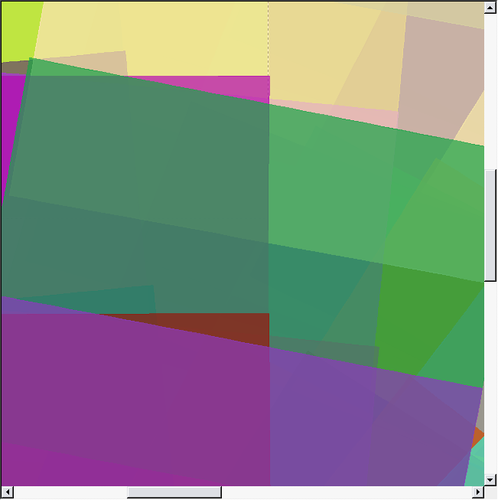](attachments/download/867/Overlap_polygon_example.png "Example of ISIS3 qmos image footprint plot of Clementine images.")

## What algorithms are available? [¶](#What-algorithms-are-available-)

-----

The three algorithms available are the following:

    Grid - best for different shapes and sizes of overlap polygon
    Limit - use to limit the number of seeded tiepoints per polygon
    Strip - best for rectangular shaped overlap polygons such as those for adjacent line scan data

The standard autoseed templates for the three algorithms are in
$ISIS3DATA/base/templates/autoseed/

## What are the required parameters for the different algorithms? [¶](#What-are-the-required-parameters-for-the-different-algorithms-)

-----

The required parameters for each algorithm are provided through a
separate Parameter Value Language (PVL) definition file.

Example of the contents of a PVL file for the *grid* algorithm:

    Object = AutoSeed
      Group = PolygonSeederAlgorithm
        Name = Grid
        Minimum Thickness = 0.0
        MinimumArea = 100000000
        XSpacing = 10000
        YSpacing = 10000
      EndGroup
    EndObject

Example of the contents of a PVL file for the *limit* algorithm:

    Object = AutoSeed
      Group = PolygonSeederAlgorithm
        Name = Limit
        Minimum Thickness = 0.0
        MinimumArea = 100000000
        MajorAxisPoints = 6
        MinorAxisPoints = 3
      EndGroup
    EndObject

Example of the contents of a PVL file for the *strip* algorithm:

    Object = AutoSeed
      Group = PolygonSeederAlgorithm
        Name = Strip
        Minimum Thickness = 0.0
        MinimumArea = 100000000
        XSpacing = 10000
        YSpacing = 10000
      EndGroup
    EndObject

Example of using keywords to specify a set of valid parameters to seed
tie points:

    Object = AutoSeed
      Group = PolygonSeederAlgorithm
        Name = Grid
        MinimumThickness = 0.0
        MinimumArea = 1000 <meters>
        XSpacing = 20000 <meters>
        YSpacing = 10000 <meters>
        PixelsFromEdge = 20.0
        MinEmission = 20.0
        MaxEmission = 75.0
        MinIncidence = 25.0
        MaxIncidecne = 80.0
        MinResolution = 255.0
        MaxResolution = 259.0
        # MinDN and MaxDN are costly checks
        MinDN = 0.145
        MaxDN = 0.175
      EndGroup
    EndObject

### What is the *MinimumThickness* parameter? [¶](#What-is-the-MinimumThickness-parameter-)

The MinimumThickness is used to exclude seeding tiepoints within
polygons that are narrow slivers. If the thickness value is below the
defined minimum thickness, then no tiepoints are seeded within the
polygon. The valid values are between 0.0 and 1.0, and the default value
is 0.0 if nothing is entered. The thickness value is derived by drawing
a box around the polygon, and calculating the ratio of the short side by
the long side of the box. The MinimumThickness option works best if the
polygons are rectangular or square shapes. Use this parameter with
caution because the calculated value for thickness may not be accurate.

### What is the *MinimumArea* parameter? [¶](#What-is-the-MinimumArea-parameter-)

The MinimumArea is used to specify what the smallest calculated value
for the minimum area of an overlap polygon must be in order to seed
tiepoints. The default value is 0.0 if nothing is entered for
MinimumArea. This parameter is useful for excluding small and skinny
overlap polygons from being seeded with tiepoints.

[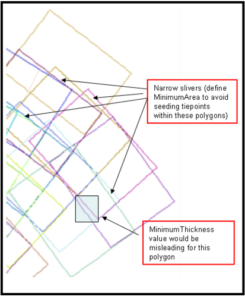](attachments/download/868/Narrow_sliver_polygon_example.png "Example of polygon types")

### What are *XSpacing* and *YSpacing* ? [¶](#What-are-XSpacing-and-YSpacing-)

The *grid* and *strip* algorithms require the user to define XSpacing
and YSpacing, and if nothing is entered the program will report an error
and fail. The XSpacing and YSpacing parameters are defined in meters,
and determine how the tiepoints will be distributed within each polygon.
The tiepoints are seeded starting at the center of each polygon, and
spaced every XSpacing increment along the X-axis, and YSpacing increment
along the Y-axis. The resolution of the input images will contribute to
how dense the tiepoints are seeded. See [Examples](fixit.wr.usgs.gov) .

### What are *MajorAxisPoints* and *MinorAxisPoints* ? [¶](#What-are-MajorAxisPoints-and-MinorAxisPoints-)

These two parameters are only used for the *Limit* algorithm. The
MajorAxisPoints is used to specify how many tiepoints to seed along the
longer side of a box drawn around the polygon. The MinorAxisPoints is
used to specify how many tiepoints to seed along the shorter side of a
box drawn around a polygon. So, if you set MajorAxisPoints = 10 and
MinorAxisPoints = 3, then you would have 30 equally spaced tiepoints (10
rows by 3 columns or 3 rows by 10 columns) within each of the overlap
polygons.

## What programs must be run before running autoseed? [¶](#What-programs-must-be-run-before-running-autoseed-)

-----

The following programs must be run on individual input images:

    spiceinit - attaches SPICE data to the ISIS3 cube
    footprintinit - adds image footprint information to ISIS3 cube labels
    camstats - attaches geometric and image statistics to the ISIS3 cube labels

The following program requires a list of images as input:

    findimageoverlaps - determines all the overlap polygons among all the
       images in the input list

## How do you determine which algorithm to use? [¶](#How-do-you-determine-which-algorithm-to-use-)

-----

The first step is to display the images you have selected to see how
they overlap each other using either PILOT, qmos, or some other display
method. The overlap polygons are areas where a unique set of images
overlap each other. The complexity of the polygons across your mosaic
area will determine which algorithm is the most appropriate to use.

**Examples:**

[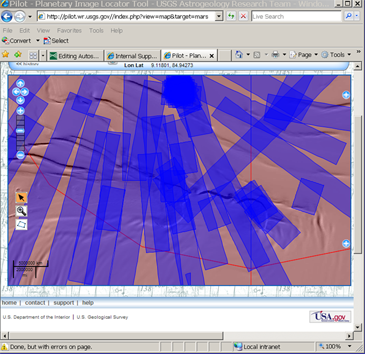](attachments/download/871/UPC_CTX_search_for_footprint_reduced.png "Example of the Astrogreology UPC image search")

This is an example of the rendered images using Astrogeology UPC image
search ( [PILOT](http://pilot.wr.usgs.gov/) ). The image footprints are
not in a uniform order, and the size of the images varies. The grid
algorithm would be the best to use for this data.

-----

[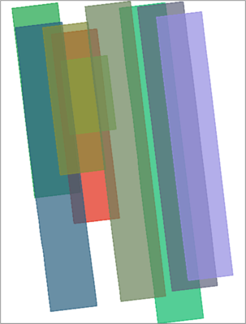](attachments/download/865/Ctx_footprint_plot.png "Example of ISIS3 qmos image footprint plot")

In this example, the resolution of the images are about the same, but
the ground area that was imaged varies in size. The strips of CTX
linescan data are adjacent to each other, and the overlap polygons are
simple and easily identified. The limit algorithm would be the easiest
to use. You would need to decide how many points to seed along the
longest side of the overlap polygon and how many points across the
shorter side. The strip algorithm will provide more evenly distributed
set of tiepoints, but you will need to figure out the most appropriate X
and Y spacing.

-----

[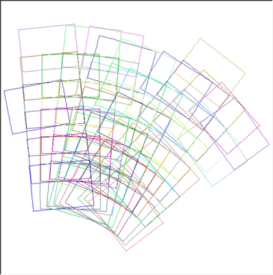](attachments/download/856/Clem_footprint_plot.png "Footprint plot of Clementine images near South Pole")

In this example, the resolution of the images are about the same. The
size of the overlap polygons vary in shape, orientation, and sizes. It
would be best to specify the MinimumArea to eliminate many of the
smaller polygons from getting seeded. The best option would be to use
either grid or strip algorithm to avoid clustered points in the smaller
polygons. The MinimumArea can be increased if there are too many points
clustered together in the smaller polygons, and the spacing can also be
increased to put a greater distance between the seeded tiepoints.

-----

[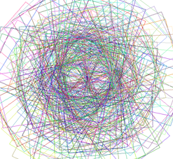](attachments/download/861/Clem_polar_footprints.png "Footprint plot of Clementine images at South Pole")

In this example, the overlap polygons are so complex that
**findimageoverlaps** will fail, and **autoseed** cannot be run. In this
case, the only option is to use the program **seedgrid** to generate a
network of seeded tiepoints. The **seedgrid** program does not require
prior knowledge of the overlap polygons, but does require latitude
range, longitude range, and a map template.

## How do you determine XSpacing and YSpacing? [¶](#How-do-you-determine-XSpacing-and-YSpacing-)

-----

It is important to know the range of resolutions for the images you wish
to include. Decide how many tiepoints you want to seed across the longer
side and shorter side of the overlap polygons. For example, let’s say
most of the polygons have 50 pixels of overlap along the shortest width
and 5000 pixels along the longest length and the median resolution is 6
meters/pixel, and you have decided to seed 3 points across the shorter
side and 10 points along the longer side of the polygons. The
calculation for the spacing would be the following:

    X-spacing = (50/(3 + 1)) * 6  =  75m
    y-spacing = (5000/(10 + 1)) * 6 = ~2727m (round up to 2800m)

The second option is to display two images whose overlap pattern is
representative of most of the images in the mosaic using ISIS3 **qview**
program. The following is an example of the **qview** measurement tool,
depicted as a ruler on the right side, to measure the distance of the
widest overlap area:

See [Using Qview to view cubes](Introduction_to_Isis) for more
information about **qview** .

The tool measured approximately 278 pixels. The resolution of these two
images are around 190 meters/pixel. So, the calculation for XSpacing
would be ((278 pixels/6) \* 190 m/pixel) resulting in 8803.3 meters. You
could start with XSpacing and YSpacing equal to 8800 meters as a
starting point, and then increase or decrease the number based on
whether you want to increase or decrease the distance between the seeded
tiepoints.

This example shows the measurement for the shorter side of the polygon,
which is about 86 pixels. Sometimes the spacing increments you select
may need to be different in the x and y directions, especially for line
scan data where the image has a lot more lines than samples. If the
desire is to seed only two tiepoints along the shorter side then your
calculation would be ((86 pixels/3) \* 190 m/pixel) giving an xspacing
of 5446 meters. You could use 5500 meters for x-spacing and 8800 meters
for y-spacing.

## What are the required parameters for autoseed and how do you run the program? [¶](#What-are-the-required-parameters-for-autoseed-and-how-do-you-run-the-program-)

-----

Autoseed parameters:

    fromlist - list of all the filenames to be included in a control solution
    deffile - PVL file containing the seeding algorithm and spacing between
              the tiepoints
    overlaplist - the output file from findimageoverlaps program
    cnet - if you wish to add to an existing control network file, enter the
           filename
    onet - the output filename for the control network file generated by
           autoseed
    errors - the output filename for error tracking for autoseed
    networkid - an ID name assigned to the control network file
    pointid - the starting string to be assigned to the PointId's plus
              question marks for number of digits needed, normally provided
              as "C?????"
    description - provide a description of the contents of the output
                  control net file

**Example of the autoseed GUI interface**

The user also has the option of running the program by typing the
following command line as a continuous string without using the GUI
interface:

    autoseed fromlist=lev1.lis deffile=clem_grid2_autoseed.def
    overlaplist=overlaps.lis onet=autoseed_grid.net errors=autoseed_grid.err
    networkid=Clementine1 pointid=C\?\?\?\?\?\? description="Clementine grid1"

## What is the result of autoseed? [¶](#What-is-the-result-of-autoseed-)

-----

The output file is a binary control network (cnet) file that contains
the control pointids and control measurements of all the images that
overlap each seeded tiepoint. The program **qmos** can be used to
display the images, image footprints, and the control network to see how
the tiepoints are distributed. If the distribution of tiepoints is too
dense, increase the spacing between the tie points to spread them apart
and to reduce the number of tiepoints. If the tiepoints are too sparse
then decrease the spacing to add more tiepoints. Rerun **autoseed** each
time the parameters in the PVL definition file are changed. When you
have reached an acceptable solution then use the program **qnet** to
evaluate and refine the tiepoints by loading the control network file.

The output network can no longer be viewed by a text editor unless the
network file has been converted to a PVL format with **cnetbin2pvl** ,
but use caution if the file size is large. The second option is to use
**cneteditor** to view the network file in the binary format.

**Convert binary control network to PVL format:**

    cnetbin2pvl from=hirise_set1_autoseed.net to=hirise_set1_autoseed_pvl.net

Example of the contents of a HiRISE cnet file (first 66 lines):

    Object = ControlNetwork
     NetworkId    = Hirise_set1
     TargetName   = Mars
     UserName     = elee
     Created      = 2012-05-08T10:38:21
     LastModified = 2012-05-08T10:38:21
     Description  = "HiRise set1 images autoseed with hirise_ccd_sets_seed.def"
     Version      = 3

     Object = ControlPoint
       PointType   = Free
       PointId     = hirise_set1_00001
       ChooserName = autoseed
       DateTime    = 2012-05-08T10:38:45

       Group = ControlMeasure
         SerialNumber  = MRO/HIRISE/867676384:40724/RED0/2
         MeasureType   = Candidate
         ChooserName   = autoseed
         DateTime      = 2012-05-08T10:38:45
         Sample        = 2040.423603891
         Line          = 20.242382897271
         AprioriSample = 2040.423603891
         AprioriLine   = 20.242382897271
       End_Group

       Group = ControlMeasure
         SerialNumber  = MRO/HIRISE/867676384:40724/RED1/2
         MeasureType   = Candidate
         ChooserName   = autoseed
         DateTime      = 2012-05-08T10:38:45
         Sample        = 43.186441092459
         Line          = 13.357872143126
         AprioriSample = 43.186441092459
         AprioriLine   = 13.357872143126
       End_Group
     End_Object

     Object = ControlPoint
       PointType   = Free
       PointId     = hirise_set1_00002
       ChooserName = autoseed
       DateTime    = 2012-05-08T10:38:45

       Group = ControlMeasure
         SerialNumber  = MRO/HIRISE/867676384:40724/RED0/2
         MeasureType   = Candidate
         ChooserName   = autoseed
         DateTime      = 2012-05-08T10:38:45
         Sample        = 2011.1452341621
         Line          = 16.380977898313
         AprioriSample = 2011.1452341621
         AprioriLine   = 16.380977898313
       End_Group

       Group = ControlMeasure
         SerialNumber  = MRO/HIRISE/867676384:40724/RED1/2
         MeasureType   = Candidate
         ChooserName   = autoseed
         DateTime      = 2012-05-08T10:38:45
         Sample        = 13.917053834296
         Line          = 9.5400377909342
         AprioriSample = 13.917053834296
         AprioriLine   = 9.5400377909342
       End_Group
     End_Object

**Display the control network with cneteditor:**

    cneteditor hirise_set1_autoseed.net

The example above shows a snapshot of the cneteditor GUI. The window can
be expanded to see additional columns.

## Examples of image footprint and tiepoints plotted with different parameter settings. [¶](#Examples-of-image-footprint-and-tiepoints-plotted-with-different-parameter-settings-)

-----

### Coarse *grid* example [¶](#Coarse-grid-example-)

| [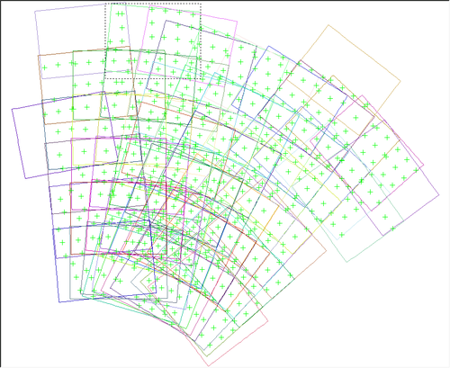](attachments/download/854/Clem_grid1_autoseed.png "Autoseed automatically seeded tiepoints for Clementine images") |
| ----------------------------------------------------------------------------------------------------------------------------------------------------------------------------------- |
| Autoseed automatically seeded tiepoints for Clementine images                                                                                                                       |

**Autoseed PVL definition file for *Grid* alogrithm**

    Name = Grid
    MinimumThickness = 0.0
    MinimumArea = 10000000
    XSpacing = 10000
    YSpacing = 10000

The spacing increment for both X and Y directions are the same due to
the similar shapes of the overlap polygons. The MinimumArea was defined
to limit clustered tiepoints.

-----

### Fine *grid* example [¶](#Fine-grid-example-)

| [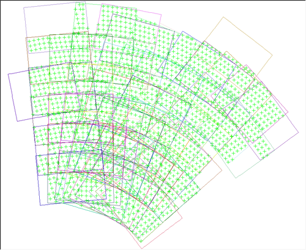](attachments/download/855/Clem_grid2_autoseed.png "Autoseed automatically seeded tiepoints for Clementine images") |
| ----------------------------------------------------------------------------------------------------------------------------------------------------------------------------------- |
| Autoseed automatically seeded tiepoints for Clementine images                                                                                                                       |

**Autoseed PVL definition file for *Grid* algorithm**

    Name = Grid
    MinimumThickness = 0.0
    MinimumArea = 10000000
    XSpacing = 5000
    YSpacing = 5000

The spacing increment decreased by a factor of two so more tiepoints can
be automatically seeded. It was desirable to have more tiepoints due to
the fact that we are working with data near the South Pole where there
are more areas in shadows than normal.

-----

### Coarse *strip* example [¶](#Coarse-strip-example-)

| [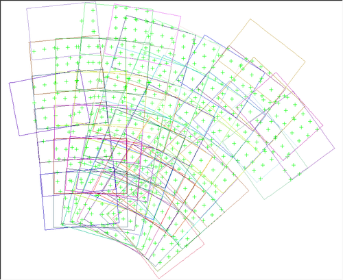](attachments/download/862/Clem_strip1_autoseed.png "Autoseed automatically seeded tiepoints for Clementine images") |
| ------------------------------------------------------------------------------------------------------------------------------------------------------------------------------------- |
| Autoseed automatically seeded tiepoints for Clementine images                                                                                                                         |

**Autoseed PVL definition file for *Strip* alogrithm**

    Name = Strip
    MinimumThickness = 0.0
    MinimumArea = 10000000
    XSpacing = 10000
    YSpacing = 10000

The spacing increment for both X and Y directions are the same due to
the similar shapes of the overlap polygons. The MinimumArea was defined
to limit clustered tiepoints. The result is very similar to the grid
algorithm and some of the tiepoints are seeded in difference locations.

-----

### Fine *strip* example [¶](#Fine-strip-example-)

| [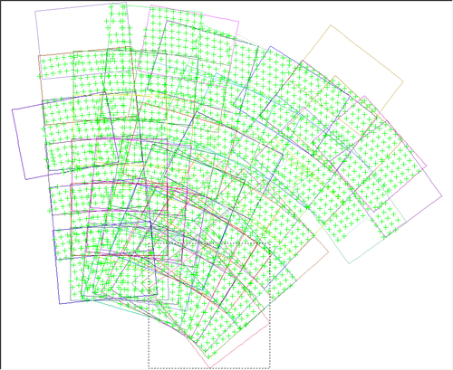](attachments/download/863/Clem_strip2_autoseed.png "Autoseed automatically seeded tiepoints for Clementine images") |
| ------------------------------------------------------------------------------------------------------------------------------------------------------------------------------------- |
| Autoseed automatically seeded tiepoints for Clementine images                                                                                                                         |

**Autoseed PVL definition file for *Strip* alogrithm**

    Name = Strip
    MinimumThickness = 0.0
    MinimumArea = 10000000
    XSpacing = 5000
    YSpacing = 5000

The spacing increment decreased by a factor of two so more tiepoints can
be automatically seeded. It was desirable to have more tiepoints due to
the fact that we are working with data near the South Pole where there
are more areas in shadows than normal. There are more tiepoints
clustered along polygon boundaries for this test.

-----

### *Limit* example [¶](#Limit-example-)

#### Starting Point [¶](#Starting-Point-)

[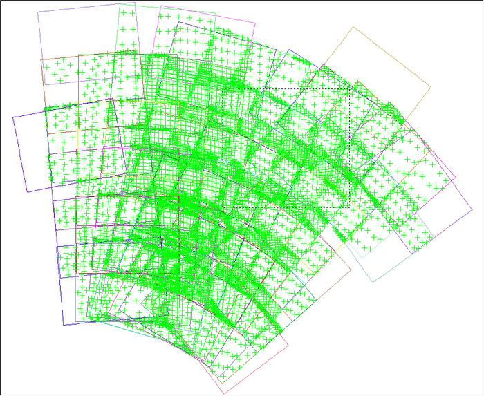](attachments/download/857/Clem_limit1_autoseed.png "Clem_limit1_autoseed.png")

    MinimumThickness = 0.0
    MinimumArea = 10000000
    MajorAxisPoints = 6
    MinorAxisPoints = 3

The starting point.

-----

#### Step 1 [¶](#Step-1-)

[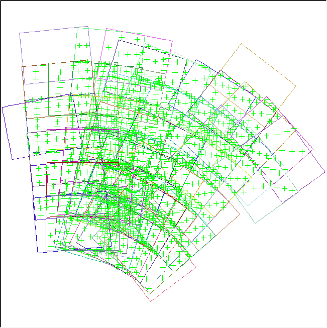](attachments/download/859/Clem_limit2_autoseed.png "Clem_limit2_autoseed.png")

    MinimumThickness = 0.0
    MinimumArea = 10000000
    MajorAxisPoints = 3
    MinorAxisPoints = 1

The number of points for the major and minor axis were reduced to seed
fewer tiepoints.

-----

#### Step 2 [¶](#Step-2-)

[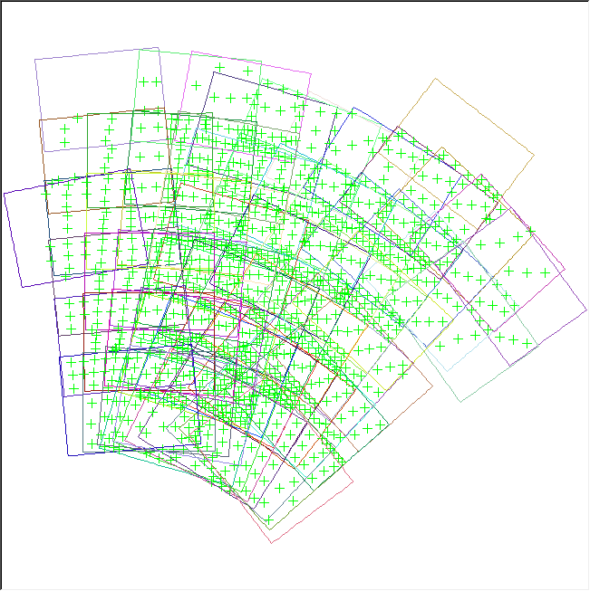](attachments/download/858/Clem_limit3_autoseed.png "Clem_limit3_autoseed.png")

    MinimumThickness = 0.0
    MinimumArea = 20000000
    MajorAxisPoints = 3
    MinorAxisPoints = 1

The MinimumArea was doubled to eliminate tiepoints in the small
polygons.

-----

#### Step 3 [¶](#Step-3-)

[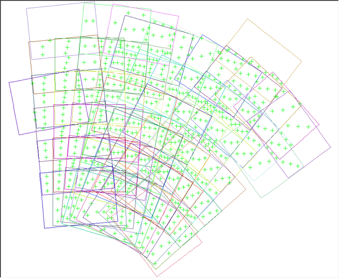](attachments/download/860/Clem_limit4_autoseed.png "Clem_limit4_autoseed.png")

    MinimumThickness = 0.0
    MinimumArea = 50000000
    MajorAxisPoints = 3
    MinorAxisPoints = 1

The MinimumArea was increased again to remove more tiepoints from the
small polygons.

-----

#### Step 4 [¶](#Step-4-)

[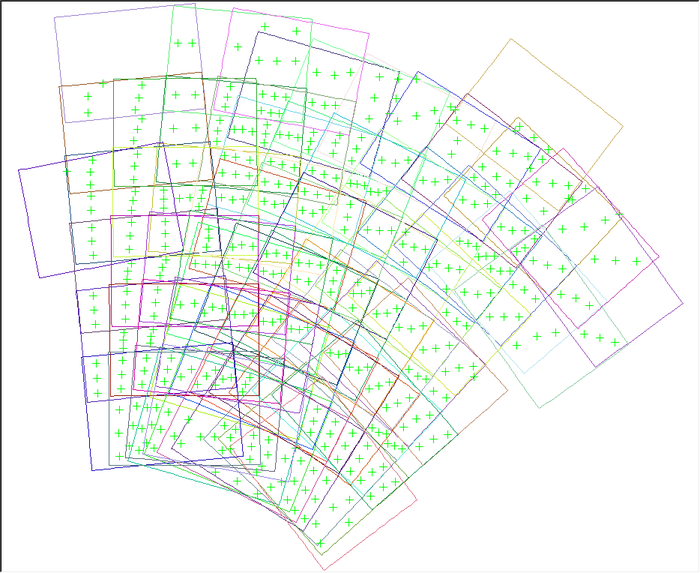](attachments/download/912/Clem_limit5_autoseed.png "Clem_limit5_autoseed.png")

    MinimumThickness = 0.0
    MinimumArea = 75000000
    MajorAxisPoints = 3
    MinorAxisPoints = 1

The MinimumArea was increased even further to eliminate tiepoints that
were still too close together especially along the polygon boundaries.

## What is **seedgrid** ? [¶](#What-is-seedgrid-)

-----

The last option is to utilize **seedgrid** instead of **autoseed** if
**findimageoverlaps** fails. This method seeds tiepoints without relying
on the overlap polygons. The program will seed tiepoints across a
specified area based solely on the spacing provided by the user, either
in x/y spacing or lat/lon increment. The output file will contain the
PointId and the latitude and longitude coordinate associated with each
pointid. This option is also useful if your data set includes images
with a wide range of resolutions, or if the limb or terminator in the
image.

### Example of running seedgrid as a command line: [¶](#Example-of-running-seedgrid-as-a-command-line-)

    seedgrid target=Mars minlat=0 maxlat=5 minlon=0 maxlon=6
    spacing=latlon latstep=1 lonstep=1 networkid=Seedgrid1
    pointid=Mars_seedgrid_\?\?\? onet=seedgrid.net
    description="Seedgrid latinc=1 loninc=1"

    cnetbin2pvl from=seedgrid.net to=seedgrid_pvl.net

    Partial contents of seedgrid control network file:

    Object = ControlNetwork
     NetworkId    = Seedgrid1
     TargetName   = Mars
     UserName     = elee
     Created      = 2012-06-01T11:07:49
     LastModified = 2012-06-01T11:07:49
     Description  = "Seedgrid latinc=1 loninc=1"
     Version      = 3

     Object = ControlPoint
       PointType   = Free
       PointId     = Mars_seedgrid_001
       ChooserName = seedgrid
       DateTime    = 2012-06-01T11:07:49
       Ignore      = True

       # AprioriLatitude = 0.0 <degrees>
       AprioriX    = 3396190.0 <meters>

       # AprioriLongitude = 0.0 <degrees>
       AprioriY    = 0.0 <meters>

       # AprioriRadius = 3396190.0 <meters>
       AprioriZ    = 0.0 <meters>
     End_Object

     Object = ControlPoint
       PointType   = Free
       PointId     = Mars_seedgrid_002
       ChooserName = seedgrid
       DateTime    = 2012-06-01T11:07:49
       Ignore      = True

       # AprioriLatitude = 1.0 <degrees>
       AprioriX    = 3395672.7438132 <meters>

       # AprioriLongitude = 0.0 <degrees>
       AprioriY    = 0.0 <meters>

       # AprioriRadius = 3396190.0 <meters>
       AprioriZ    = 59271.688218238 <meters>
     End_Object

The next step would be to run **cnetadd** to add new control measurement
for the images in your input list.

    ls *lev1.cub > lev1.lis
    cnetadd cnet=seedgrid.net addlist=lev1.lis onet=seedgrid_cnetadd.net
    tolist=cnetadd_output.lis log=seedgrid_cnetadd.log modifiedpoints=modified.lis
    polygon=yes retrieval=point

Continue with control registration with **pointreg** or other cnet
programs.

[Autoseed\_gui\_2012.png](attachments/download/853/Autoseed_gui_2012.png)
[View](attachments/download/853/Autoseed_gui_2012.png "View")
 (79.3 KB)   Jesse Mapel,
2016-05-31 12:58 PM 

[Clem\_grid1\_autoseed.png](attachments/download/854/Clem_grid1_autoseed.png)
[View](attachments/download/854/Clem_grid1_autoseed.png "View")
 (83.8 KB)   Jesse Mapel,
2016-05-31 12:58 PM 

[Clem\_grid2\_autoseed.png](attachments/download/855/Clem_grid2_autoseed.png)
[View](attachments/download/855/Clem_grid2_autoseed.png "View")
 (104 KB)   Jesse Mapel,
2016-05-31 12:58 PM 

[Clem\_footprint\_plot.png](attachments/download/856/Clem_footprint_plot.png)
[View](attachments/download/856/Clem_footprint_plot.png "View")
 (141 KB)   Jesse Mapel,
2016-05-31 12:58 PM 

[Clem\_limit1\_autoseed.png](attachments/download/857/Clem_limit1_autoseed.png)
[View](attachments/download/857/Clem_limit1_autoseed.png "View")
 (115 KB)   Jesse Mapel,
2016-05-31 12:58 PM 

[Clem\_limit3\_autoseed.png](attachments/download/858/Clem_limit3_autoseed.png)
[View](attachments/download/858/Clem_limit3_autoseed.png "View")
 (67.7 KB)   Jesse Mapel,
2016-05-31 12:58 PM 

[Clem\_limit2\_autoseed.png](attachments/download/859/Clem_limit2_autoseed.png)
[View](attachments/download/859/Clem_limit2_autoseed.png "View")
 (68.7 KB)   Jesse Mapel,
2016-05-31 12:58 PM 

[Clem\_limit4\_autoseed.png](attachments/download/860/Clem_limit4_autoseed.png)
[View](attachments/download/860/Clem_limit4_autoseed.png "View")
 (82.4 KB)   Jesse Mapel,
2016-05-31 12:58 PM 

[Clem\_polar\_footprints.png](attachments/download/861/Clem_polar_footprints.png)
[View](attachments/download/861/Clem_polar_footprints.png "View")
 (148 KB)   Jesse Mapel,
2016-05-31 12:58 PM 

[Clem\_strip1\_autoseed.png](attachments/download/862/Clem_strip1_autoseed.png)
[View](attachments/download/862/Clem_strip1_autoseed.png "View")
 (82.6 KB)   Jesse Mapel,
2016-05-31 12:58 PM 

[Clem\_strip2\_autoseed.png](attachments/download/863/Clem_strip2_autoseed.png)
[View](attachments/download/863/Clem_strip2_autoseed.png "View")
 (108 KB)   Jesse Mapel,
2016-05-31 01:00 PM 

[Cneteditor\_2012.png](attachments/download/864/Cneteditor_2012.png)
[View](attachments/download/864/Cneteditor_2012.png "View")
 (77.5 KB)   Jesse Mapel,
2016-05-31 01:00 PM 

[Ctx\_footprint\_plot.png](attachments/download/865/Ctx_footprint_plot.png)
[View](attachments/download/865/Ctx_footprint_plot.png "View")
 (114 KB)   Jesse Mapel,
2016-05-31 01:00 PM 

[Ctx\_footprint\_plot\_cropped\_demo.png](attachments/download/866/Ctx_footprint_plot_cropped_demo.png)
[View](attachments/download/866/Ctx_footprint_plot_cropped_demo.png "View")
 (47 KB)   Jesse Mapel,
2016-05-31 01:00 PM 

[Overlap\_polygon\_example.png](attachments/download/867/Overlap_polygon_example.png)
[View](attachments/download/867/Overlap_polygon_example.png "View")
 (22.9 KB)   Jesse Mapel,
2016-05-31 01:00 PM 

[Narrow\_sliver\_polygon\_example.png](attachments/download/868/Narrow_sliver_polygon_example.png)
[View](attachments/download/868/Narrow_sliver_polygon_example.png "View")
 (84.4 KB)   Jesse Mapel,
2016-05-31 01:00 PM 

[Qview\_measure\_for\_spacing\_calculation\_indexcolor.png](attachments/download/869/Qview_measure_for_spacing_calculation_indexcolor.png)
[View](attachments/download/869/Qview_measure_for_spacing_calculation_indexcolor.png "View")
 (94.5 KB)   Jesse Mapel,
2016-05-31 01:00 PM 

[Qview\_moreoverlap\_measure\_for\_spacing\_calculationt.png](attachments/download/870/Qview_moreoverlap_measure_for_spacing_calculationt.png)
[View](attachments/download/870/Qview_moreoverlap_measure_for_spacing_calculationt.png "View")
 (126 KB)   Jesse Mapel,
2016-05-31 01:00 PM 

[UPC\_CTX\_search\_for\_footprint\_reduced.png](attachments/download/871/UPC_CTX_search_for_footprint_reduced.png)
[View](attachments/download/871/UPC_CTX_search_for_footprint_reduced.png "View")
 (170 KB)   Jesse Mapel,
2016-05-31 01:00 PM 

[Clem\_limit5\_autoseed.png](attachments/download/912/Clem_limit5_autoseed.png)
[View](attachments/download/912/Clem_limit5_autoseed.png "View")
 (79 KB)   Jesse Mapel,
2016-05-31 02:25 PM 

