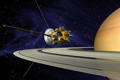

# Cassini [¶](#Cassini-)

-----

The ISIS3 software package can be used to process data for several of
the Cassini mission instruments, including those of the Imaging Science
Subsystem (ISS), Visual and Infrared Mapping Spectrometer (VIMS) and
RADAR.

Here you'll find step-by-step instructions for cartographic and science
data processing of these data so that you can create your own
high-quality research data products. To get started, click on the
science instrument name below.

  - [Cassini](#Cassini-)
      - [Brief Mission Summary](#Brief-Mission-Summary-)
      - [Science Goals of the Mission](#Science-Goals-of-the-Mission-)
      - [Science Instruments](#Science-Instruments-)
      - [References & Related
        Resources](#References--Related-Resources-)
          - [Cassini Mission and
            Instrument](#Cassini-Mission-and-Instrument-)
          - [Imaging Science Subsystem
            (ISS)](#Imaging-Science-Subsystem-ISS-)
          - [RADAR](#RADAR-)
          - [Visual and Infrared Mapping Spectrometer
            (VIMS)](#Visual-and-Infrared-Mapping-Spectrometer-VIMS-)
          - [Planetary Data System (PDS) Information and Data Search
            Tools](#Planetary-Data-System-PDS-Information-and-Data-Search-Tools-)

## Brief Mission Summary [¶](#Brief-Mission-Summary-)

-----

|  |
| ---------------------------------------------------------------------------------------------------------- |
| **Cassini approaching Saturn** Artist's conception.                                                        |
| Credit: NASA/JPL                                                                                           |

Launched in October, 1997 on a Titan IV-Centaur rocket from Cape
Canaveral, Florida, Cassini executed two gravity-assist flybys of Venus,
then one of each of the Earth and Jupiter to send it on to arrive at
Saturn in June, 2004.

Upon reaching Saturn, Cassini swings close to the planet in late 2004.
Cassini released the European-built Huygens probe for its descent of up
to 2 1/2 hours through Titan's dense atmosphere. Huygens landing and
last signal hours later occurred on January 14, 2005.

During the course of the Cassini orbiter's mission, it has executed
dozens of close flybys of particular bodies of interest -- including
over fifty encounters of Titan and many of Enceladus, Rhea, Iapetus,
Mimas, Dione and Hyperion. More flyby's are planned in the extended
mission called the Equinox Mission (through Sept. 2010).

Just recently, in February 2010, NASA extended the mission through May
2017, calling it the Cassini Solstice Mission. 155 additional orbits are
planned with 54 flybys of Titan and 11 of the icy moon, Enceladus.

## Science Goals of the Mission [¶](#Science-Goals-of-the-Mission-)

-----

Circled by distinctive rings and attended by a group of at least 18
moons, Saturn has been called one of the most intriguing planetary
realms in the solar system. Its largest moon, Titan, boasts organic
chemistry that may hold clues to how life formed on the primitive Earth.
So it is that Saturn and Titan was the destination of the Cassini
mission, a project by NASA, the European Space Agency and the Italian
Space Agency. The U.S. portion of the mission is managed for NASA by the
Jet Propulsion Laboratory. Cassini's principal objectives are:

1.  Determine the three-dimensional structure and dynamical behavior of
    the rings;
2.  Determine the composition of the satellite surfaces and the
    geological history of each object;
3.  Determine the nature and origin of the dark material on Iapetus'
    leading hemisphere;
4.  Measure the three-dimensional structure and dynamical behavior of
    the magnetosphere;
5.  Study the dynamical behavior of Saturn's atmosphere at cloud level;
6.  Study the time variability of Titan's clouds and hazes; and,
7.  Characterize Titan's surface on a regional scale.

## Science Instruments [¶](#Science-Instruments-)

-----

  - **[ISS (Imaging Science Subsystem)](Working_with_Cassini_ISS_Data)**
    Acquires images in visible, near-ultraviolet, and near-infrared
    light.
  - **[RADAR](Working_with_Cassini_RADAR)** Maps surface of Titan using
    radar imager to pierce veil of haze. Also used to measure heights of
    surface features.
  - **[VIMS (Visual and Infrared Mapping
    Spectrometer)](Working_with_Cassini_VIMS)**
  - **[Huygens Probe
    Experiments](http://sci.esa.int/science-e/www/area/index.cfm?fareaid=12)**

## References & Related Resources [¶](#References--Related-Resources-)

-----

### Cassini Mission and Instrument [¶](#Cassini-Mission-and-Instrument-)

  - [Mission](http://saturn.jpl.nasa.gov/index.cfm)
  - [Operations Laboratory or CICLOPS](http://ciclops.org/?js=1)
  - [Overview](http://www.planetary.org/multimedia/space-images/charts/20130128_cassini_mission_overview.html)
  - [Cartographic map
    products](http://pds-imaging.jpl.nasa.gov/volumes/carto.html)

### Imaging Science Subsystem (ISS) [¶](#Imaging-Science-Subsystem-ISS-)

  - [Instrument](http://ciclops.org/iss/iss.php)
  - [Online data
    volumes](http://pds-imaging.jpl.nasa.gov/volumes/iss.html)

### RADAR [¶](#RADAR-)

  - [Instrument](https://saturn.jpl.nasa.gov/radio-detection-and-ranging/)
  - [Online data
    volumes](http://pds-imaging.jpl.nasa.gov/volumes/radar.html)
  - [Users
    Guide](http://pds-imaging.jpl.nasa.gov/documentation/Cassini_RADAR_Users_Guide.pdf)

### Visual and Infrared Mapping Spectrometer (VIMS) [¶](#Visual-and-Infrared-Mapping-Spectrometer-VIMS-)

  - [Instrument](http://wwwvims.lpl.arizona.edu/)
  - [Online data
    volumes](http://pds-imaging.jpl.nasa.gov/volumes/vims.html)

### Planetary Data System (PDS) Information and Data Search Tools [¶](#Planetary-Data-System-PDS-Information-and-Data-Search-Tools-)

  - [PDS Atmospheres Node, Lead Node for
    Cassini](http://atmos.nmsu.edu/data_and_services/atmospheres_data/Cassini/Cassini.html)
  - PDS Imaging Node:
      - [Data Release
        Calendar](http://pds-imaging.jpl.nasa.gov/schedules/cassini_delivery.html)
      - [Cassini
        Mission](http://pds-imaging.jpl.nasa.gov/Missions/Cassini_mission.html)
      - [Photojournal](http://photojournal.jpl.nasa.gov/mission/Cassini-Huygens)
      - [Planetary Image Atlas](http://pds-imaging.jpl.nasa.gov/search/)
      - [Tutorial](http://pds-imaging.jpl.nasa.gov/help/How_to_obtain_Cassini_data.pdf)
  - PDS Rings Node:
      - [Mission](http://pds-rings.seti.org/cassini/)
      - [Supporting
        Information](http://pds-rings.seti.org/cassini/links.html)
      - [OPUS Search Tool](http://pds-rings.seti.org/search/)
  - PDS Engineering Node:
      - [Global data search engine](http://pds.nasa.gov/)
  - PDS Small Bodies Node:
      - [Data Holdings](http://sbn.psi.edu/archive/cocda/)
  - PDS Navigation and Ancillary Information Node:
      - [Spice
        Kernels](ftp://naif.jpl.nasa.gov/pub/naif/CASSINI/kernels/)
      - [Toolkit](ftp://naif.jpl.nasa.gov/pub/naif/toolkit/)

[Cassini\_Art\_th200.png](attachments/download/892/Cassini_Art_th200.png)
[View](attachments/download/892/Cassini_Art_th200.png "View") - Cassini
approaching Saturn  (33.9 KB) 
 Makayla Shepherd, 2016-05-31 01:37 PM 

