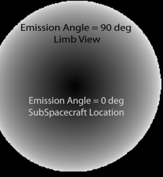
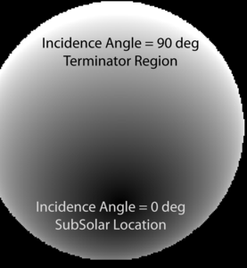
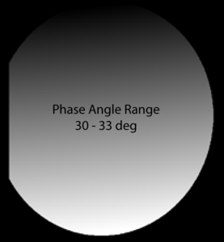
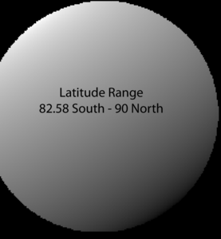
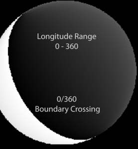

<div id="main">

<div id="content">

<div class="contextual">

</div>

<div class="wiki wiki-page">

<span id="Camera-Geometry"></span>

# Camera Geometry [¶](#Camera-Geometry-)

-----

  - [Camera Geometry](#Camera-Geometry-)
      - [Introduction](#Introduction-)
      - [Camera Geometry](#Camera-Geometry-2-)
      - [Camera Information
        Applications](#Camera-Information-Applications-)
          - [Camstats](#Camstats-)
          - [Mosrange](#Mosrange-)
          - [Ct](#Ct-)
          - [Phocube](#Phocube-)

<span id="Introduction"></span>

## Introduction [¶](#Introduction-)

-----

In order to access and view the geometry for an ISIS3 image cube \[raw
instrument camera cube, (i.e., PDS-EDR)\], the application
[**spiceinit**](http://isis.astrogeology.usgs.gov/Application/presentation/Tabbed/spiceinit/spiceinit.html)
must be **successfully** applied to the cube. Once **spiceinit** has
been applied, there are a number of applications that will be able to
compute and output statistics about your image based on the raw **Camera
Geometry** .

<span id="Camera-Geometry-2"></span>

## Camera Geometry [¶](#Camera-Geometry-2-)

-----

**Camera Geometry** refers to the viewing geometry of an observation. It
also implies a 'non-projected' cube (sometimes referred to as a Level1,
though it does not require radiometric calibration). It is **IMPORTANT**
to note that within the ISIS3 environment, unless allowed to be
otherwise specified, **ALL** applications default (for input and output)
to the following geometric reference (regardless of target body):

  - **Longitude\_Domain = 360** \[Longitudes will be reported in the
    range of 0 to 360 degrees (not -180 to 180)\]
  - **Latitude\_System = Ocentric** \[Versus Ographic; Note: there is
    not difference for a spherical body\]
  - **Longitude Direction = East** \[Longitude values increase to the
    east\]

Definitions for the geometric reference terms can be found in [Learning
About Map Projections](Learning_About_Map_Projections)

<span id="Camera-Information-Applications"></span>

## Camera Information Applications [¶](#Camera-Information-Applications-)

-----

<span id="Camstats"></span>

### **Camstats** [¶](#Camstats-)

For a given image cube, the application
[**camstats**](http://isis.astrogeology.usgs.gov/Application/presentation/Tabbed/camstats/camstats.html)
will report Minimum, Maximum, Average and Standard Deviation for the
following:

**Geometric Information**

  - Latitude
  - Longitude
  - Resolution, LineResolution, SampleResolution
  - AspectRatio

**Photometric Information**

  - Phase Angle
  - Emission Angle
  - Incidence Angle
  - LocalSolarTime
  - NorthAzimuth

Example (not all parameters shown):

    camstats from=xxxx.cub linc=1 sinc=1

**NOTE:** The *linc* and *sinc* parameters default to 1. For larger
pixel size images, such as HiRISE or CTX data, setting the *linc* and
*sinc* values to higher values (10, 100) would help the application to
run faster. Set with care knowing that the application is literally
skipping line/sample data to retrieve SPICE information.

  - **camstats** supplies useful information that can be considered and
    applied when map projecting images (Level2 processing).

<span id="Mosrange"></span>

### **Mosrange** [¶](#Mosrange-)

Given a list of multiple raw image cubes, the application
[**mosrange**](http://isis.astrogeology.usgs.gov/Application/presentation/Tabbed/mosrange/mosrange.html)
computes the range of latitude/longitude and resolution statistics for
all images given.

Example (not all parameters shown):

    mosrange fromlist=list_of_lev0_w_spice.lis to=output_map_information.map projection=Equirectangular

  - This is one application that allows the user to specify output
    latitude type, longitude direction and longitude domain.

  - Knowing the information about your set of images at this point is
    useful, especially if the goal is to generate a mosaic. The output
    can be used later in defining the desired output map projection in
    Level 2 processing.

<span id="Campt"></span>

### **Campt** [¶](#Ct-)

The application
[**campt**](http://isis.astrogeology.usgs.gov/Application/presentation/Tabbed/campt/campt.html)
will supply geometric and photometric information based on a *single*
latitude/longitude value (remember the raw camera geometry defaults when
entering values) or a *single* line/sample coordinate of an image cube.

**Geometric Information**

  - Latitude
  - Longitude
  - Resolution

**Photometric Information**

  - Phase Angle
  - Emission Angle
  - Incidence Angle

**In addition** , this application will return a list of other
spacecraft, sun and instrument related information such as:

  - SpacecraftPosition
  - SpacecraftAzimuth
  - SubSpacecraftLongitude
  - SubSolarLatitude
  - SubSolarLongitude
  - Time information (EphemerisTime, UTC)

Example (not all parameters shown):  
*Enter lat- [](fixit.wr.usgs.gov)* [*Ocentric* **](fixit.wr.usgs.gov)
*/long- [](fixit.wr.usgs.gov)* [*360* **](fixit.wr.usgs.gov) *point
location*

    campt from=xxxx.cub latitude=0.0 longitude=270.0 type=ground

or

Example (not all parameters shown):  
*Enter line/sample pixel location-current default of application*

    campt from=xxxx.cub line=512 sample=512 type=image

<span id="Phocube"></span>

### **Phocube** [¶](#Phocube-)

[**phocube**](http://isis.astrogeology.usgs.gov/Application/presentation/Tabbed/phocube/phocube.html)
will compute and generate a separate output [multi-band ISIS3
cube](https://USGS-Astrogeology.github.io/ISIS3/gh-pages/ISIS_Cube_Format.html) where each band will represent the selected
(parameter=TRUE) geometric and photometric elements. The bands are named
appropriately in the output cube labels: **Group=BandBin** .

``` 
 Object = IsisCube
     Object = Core
     StartByte   = 65537
     Format      = Tile
     TileSamples = 128
     TileLines   = 128
     Group = Dimensions
       Samples = 1024
       Lines   = 1024
       Bands   = 6
     End_Group
     Group = Pixels
       Type       = Real
       ByteOrder  = Lsb
       Base       = 0.0
       Multiplier = 1.0
     End_Group
   End_Object
    Group = BandBin
    Name = ("Phase Angle", "Emission Angle", "Incidence Angle", "Latitude", "Longitude")
  End_Group
```

  - **phocube** requires a successful **spiceinit** execution
  - **phocube** can be applied to an unprojected "Level1" image cube or
    an individual map projected "Level2" image.
  - **phocube** will not work on a mosaic cube, the photometric
    information for each input file is eliminated from the mosaic output
    file.

Example:  
Run **phocube** on a fly-by Cassini ISS-Wide Angle Camera image of
Enceladus. In this example, **phocube** will generate a 6-band output
cube.

  - **NOTE:** The image used in this example has been processed through
    Level1 \[ingestion, spiceinit and radiometric calibration\]. Refer
    to: [Working with Cassini ISS Data](Working_with_Cassini_ISS_Data)

Each band will contain the information asked for (parameters set to
true) in the following command:

    phocube from=W1487302209_2.lev1.cub to=W1487302209_2_pho.cub 
            phase=true  emission=true  incidence=true  latitude=true  longitude=true 

  - All bands of the phocube output can be displayed in qview
  - To access a selected band in an application, use the cube-attribute
    syntax.  

For example, calculate and report the average values of the Incidence
Angle (Band 3).  
The command line for the **stats** applications is as follows:

    stats from=W1487302209_2_pho.cub+3  to=W1487302209_2_inc_stats.pvl 

The Example ISS Wide-Angle Camera image of Enceladus and the output of
**phocube** :


[](attachments/download/877/Iss_WAC_ema_figure.png "Phocube-Emission Angle Band)")
[](attachments/download/878/Iss_WAC_inc_figure.png "Phocube Incidence Angle Band)")

[](attachments/download/879/Iss_WAC_phase_figure.png "Phocube-Phase Angle Band)")
[](attachments/download/880/Iss_WAC_lat_figure.png "Phocube-Latitude Band")
[](attachments/download/881/Iss_WAC_lon_figure.png "Phocube-Longitude Band)")

</div>

<div class="attachments">

<div class="contextual">

</div>

[Iss\_WAC\_enceladus\_sm2.png](attachments/download/847/Iss_WAC_enceladus_sm2.png)
[View](attachments/download/847/Iss_WAC_enceladus_sm2.png "View")
<span class="size"> (39.4 KB) </span> <span class="author"> Kristin
Berry, 2016-05-31 12:57 PM </span>

[Iss\_WAC\_ema\_figure.png](attachments/download/877/Iss_WAC_ema_figure.png)
[View](attachments/download/877/Iss_WAC_ema_figure.png "View")
<span class="size"> (63.6 KB) </span> <span class="author"> Kristin
Berry, 2016-05-31 01:17 PM </span>

[Iss\_WAC\_inc\_figure.png](attachments/download/878/Iss_WAC_inc_figure.png)
[View](attachments/download/878/Iss_WAC_inc_figure.png "View")
<span class="size"> (61.2 KB) </span> <span class="author"> Kristin
Berry, 2016-05-31 01:17 PM </span>

[Iss\_WAC\_phase\_figure.png](attachments/download/879/Iss_WAC_phase_figure.png)
[View](attachments/download/879/Iss_WAC_phase_figure.png "View")
<span class="size"> (30.9 KB) </span> <span class="author"> Kristin
Berry, 2016-05-31 01:17 PM </span>

[Iss\_WAC\_lat\_figure.png](attachments/download/880/Iss_WAC_lat_figure.png)
[View](attachments/download/880/Iss_WAC_lat_figure.png "View")
<span class="size"> (33.6 KB) </span> <span class="author"> Kristin
Berry, 2016-05-31 01:17 PM </span>

[Iss\_WAC\_lon\_figure.png](attachments/download/881/Iss_WAC_lon_figure.png)
[View](attachments/download/881/Iss_WAC_lon_figure.png "View")
<span class="size"> (43.2 KB) </span> <span class="author"> Kristin
Berry, 2016-05-31 01:17 PM </span>

</div>

<div style="clear:both;">

</div>

</div>

</div>
