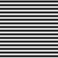
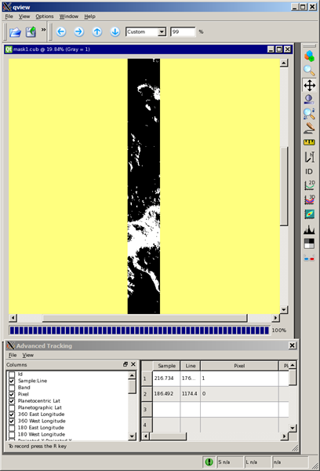
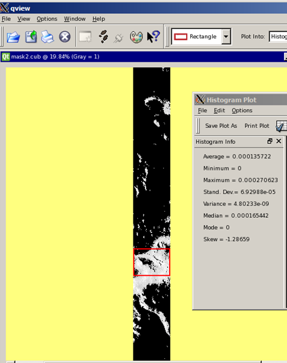
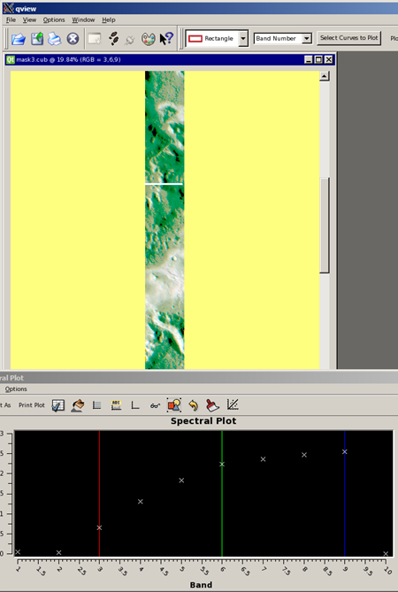
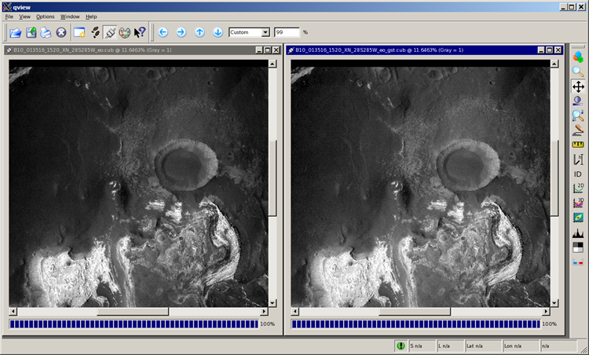
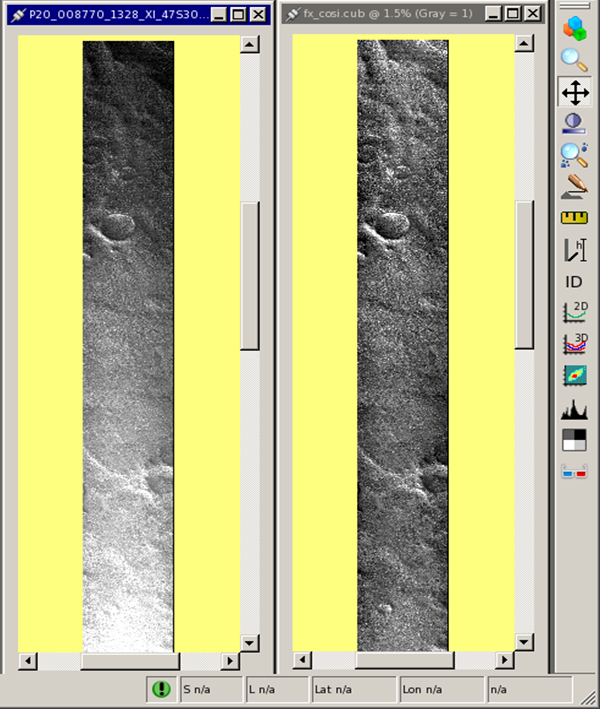

<div id="main">

<div id="content">

<div class="contextual">

</div>

<div class="wiki wiki-page">

<span id="General-Utility"></span>

# General Utility [¶](#General-Utility-)

-----

  - [General Utility](#General-Utility-)
      - [Introduction](#Introduction-)
      - [String Parameters](#String-Parameters-)
      - [Input Data](#Input-Data-)
      - [Requirements and result of
        operators](#Requirements-and-result-of-operators-)
      - [Create only an output file](#Create-only-an-output-file-)
      - [Apply equations to existing cube
        files](#Apply-equations-to-existing-cube-files-)
          - [Create an output cube that isolates all pixel values
            greater than .00015 for band
            1:](#Create-an-output-cube-that-isolates-all-pixel-values-greater-than-00015-for-band-1-)
          - [Create an output cube that isolates all pixel values
            greater than .00015 for band1 and retains the input DN
            values:](#Create-an-output-cube-that-isolates-all-pixel-values-greater-than-00015-for-band1-and-retains-the-input-DN-values-)
          - [Create an output cube that isolates all pixel values
            greater than .00015 for all
            bands:](#Create-an-output-cube-that-isolates-all-pixel-values-greater-than-00015-for-all-bands-)
          - [Apply a gamma stretch to an input
            file:](#Apply-a-gamma-stretch-to-an-input-file-)
          - [Create an output cube that divides the input pixel by the
            cosine of the incidence angle to perform a simple
            photometric
            correction:](#Create-an-output-cube-that-divides-the-input-pixel-by-the-cosine-of-the-incidence-angle-to-perform-a-simple-photometric-correction-)
      - [Other command line entry
        exles:](#Other-command-line-entry-exles-)

<span id="Introduction"></span>

## Introduction [¶](#Introduction-)

-----

The suite of ISIS3 image processing applications perform a wide variety
of functions to manipulate the image data. Occasionally, there is a need
to apply a unique set of equations to correct or produce an image that
none of the existing programs will perform, such as applying a gamma
stretch or creating a cube file based on a mathematical equation. In
these instances, using the **fx** program may accomplish the task. The
application is still under development so it may take multiple steps,
especially if the AND and/or OR logical operators are needed. The
modulus (%), AND, and OR operators are not implemented yet.

<span id="String-Parameters"></span>

## String Parameters [¶](#String-Parameters-)

-----

The command line parsing has been improved to handle escape sequences
and support arrays better. The equation parser is case insensitive,
ignores whitespace, and converts all braces to parentheses.

The command line syntax changes are as follows (with TCSH/BASH
examples):  
Parameter values, when quoted, no longer need the quotes escaped:

**TCSH/BASH**

Before:

    crop from=\"some file.cub\" to=\"output file.cub\"

Now:

    crop from="some file.cub" to="output file.cub"

Please note that dollar signs ($) still need to be backslashed for
batchlist variables.  
Array values, for programs such as spiceinit, will be much the same.

**TCSH**

Before:

    spiceinit from=input.cub ck='(file1.bc,file2.bc)'

Now:

    spiceinit from=input.cub ck='(file1.bc,file2.bc)'

**BASH**

Before:

    spiceinit from=input.cub ck='(file1.bc,file2.bc)'

Now:

    spiceinit from=input.cub ck='(file1.bc,file2.bc)'

However, an escape has been added to differentiate a first parenthesis
from the beginning of an array sequence.

**TCSH**

Before:

    fx equation='"(1+2)/2"'

Now:

    fx equation='\(1+2)/2'

**BASH**

Before:

    fx equation='"(1+2)/2"'

Now:

    fx equation=\(1+2)/2

The equation string entered within a GUI interface may not work if the
entire string is copied, and executed at the command line. If the first
character in the equation is a "(" then it must be prefixed by a "\\" if
executing at the command line, but the remaining parentheses do not need
to be prefixed with a backslash.

For example:

Works inside **fx** GUI:

    fx f1=BIFQF23N004_D218_T069S02_V02_I3.cub to=tt.cub equation=(f1*(f1>.004))

Fails on the command line:

    fx f1=BIFQF23N004_D218_T069S02_V02_I3.cub to=tt.cub equation=(f1*(f1>.004))

    fx f1=BIFQF23N004_D218_T069S02_V02_I3.cub to=tt.cub equation="(f1*(f1>.004))"

Works on the command line:

    fx f1=BIFQF23N004_D218_T069S02_V02_I3.cub to=tt.cub equation="\(f1*(f1>.004))"

For additional information see [**fx command
page**](http://isis.astrogeology.usgs.gov/Application/presentation/Tabbed/fx/fx.html)  
Note: some instructions may be outdated.

<span id="Input-Data"></span>

## Input Data [¶](#Input-Data-)

-----

The input data can be a single band or multiple band cube file. Up to
five files can be entered for parameters *f1 to f5* , or an arbitrary
number of files can be included in a file list and entered for the
*fromlist* parameter. The other option is to only create an output file
based on a user defined equation. If the band number is not specified
for the multiple band cube files, then the equation is applied to all
the bands in the file.

**Example**

``` 
f1=file1.cub f2=file2.cub f3=file4.cub f5=file5.cub  
```

or

    ls *lev1.cub > files.lis
    from=files.lis

<span id="Requirements-and-result-of-operators"></span>

## Requirements and result of operators [¶](#Requirements-and-result-of-operators-)

-----

The following operators return a "0" or "1" DN value when they are used
in the equations:

  - \<
  - \>
  - \<=
  - \>=
  - \==  
  - \!=

The following operators require that the images be ran through
**spiceinit** first, so that the necessary information can be extracted
based on the camera model information stored in the image labels:

  - pha, phal, phac
  - ina, inal, inac
  - ema, emal, emac
  - lat
  - lon
  - radius
  - resolution

The following are used to convert between degrees and radians:

  - rads
  - degs

***Note: All trigonometric functions expect angles in radians, not
degrees. However, all camera functions return angles in degrees and
therefore should be converted to radians***

The following operators use the input image statistics to apply the
equations:

  - linemin
  - linemax
  - cubemin
  - cubemax
  - cubeavg
  - cubestd

The following are used to compare two input values (user entered and/or
from input files):

  - min  
  - max

The following shifts the pixels left or right:

  - \<\<  
  - \>\>

For example:

``` 
  f1 << 10
```

``` 
  S1 L1 = S10 L1
  S2 L1 = S11 L1
  ...
  SN-10 L1 = Null
  SN-9 L1 = Null
```

Trigonometric functions:

  - sin, cos, tan
  - acos, atan, atan2
  - sinh, cosh, tanh
  - csc, sec, cot

Operators:

  - \+ - \* / ^
  - abs, sqrt, neg or --
  - log10,log or ln

<span id="Create-only-an-output-file"></span>

## Create only an output file [¶](#Create-only-an-output-file-)

-----

The example below uses the line number (representing degrees) as input
into the cosine function to create a (100 lines by 100 samples) output
file. Input values representing *degrees* must be used with caution
because different results are produced if the input value is not
converted to radians first or the output not converted back to degrees:

Example 1:

    fx to=test_cosrad.cub equation="cos(rads(line))" mode=outputonly lines=100 samples=100

Image created with the cosine function of the line numbers after
converting to radians:  


Example 2:

    fx to=test_cos.cub equation=cos(line) mode=outputonly lines=100 samples=100

Image created with the cosine function of line numbers without
converting to radians first:  


<span id="Apply-equations-to-existing-cube-files"></span>

## Apply equations to existing cube files [¶](#Apply-equations-to-existing-cube-files-)

-----

<span id="Create-an-output-cube-that-isolates-all-pixel-values-greater-than-00015-for-band-1"></span>

### Create an output cube that isolates all pixel values greater than .00015 for band 1: [¶](#Create-an-output-cube-that-isolates-all-pixel-values-greater-than-00015-for-band-1-)

    fx f1=I10645014RDR.lev1crop.cub+1 to=mask1.cub equ="f1>.00015"

  
Image created with the *equation="f1\>.00015"*  
Note: The DN values are now "0" and "1"

<span id="Create-an-output-cube-that-isolates-all-pixel-values-greater-than-00015-for-band1-and-retains-the-input-DN-values"></span>

### Create an output cube that isolates all pixel values greater than .00015 for band1 and retains the input DN values: [¶](#Create-an-output-cube-that-isolates-all-pixel-values-greater-than-00015-for-band1-and-retains-the-input-DN-values-)

    fx f1=I10645014RDR.lev1crop.cub+1 to=mask2.cub equ="f1*(f1>.00015)"

  
Image created with the *equation="f1* (f1\>.00015)"\*  
Note: The DN values are now "0" in the areas where the input values was
less than 0.00015

<span id="Create-an-output-cube-that-isolates-all-pixel-values-greater-than-00015-for-all-bands"></span>

### Create an output cube that isolates all pixel values greater than .00015 for all bands: [¶](#Create-an-output-cube-that-isolates-all-pixel-values-greater-than-00015-for-all-bands-)

    fx f1=I10645014RDR.lev1crop.cub to=mask3.cub equ="f1*(f1>.00015)"

  
Image created with the *equation="f1* (f1\>.00015)"\*  
Note: The DN values are now "0" in the areas where the input values was
less than 0.00015 in all ten bands, and appears as green in the color
file.

Below is the image label of the multiple band cube used as input in the
example above. Notice there is no instrument information, so this
particular file cannot be run through spiceinit. In addition, none of
the functions requiring a camera model can be used on the 10 band cube
file.

``` 
 Object = IsisCube
  Object = Core
    StartByte   = 65537
    Format      = Tile
    TileSamples = 320
    TileLines   = 500 

    Group = Dimensions
      Samples = 320
      Lines   = 2500
      Bands   = 10   *** NOTE: multiple bands ***
    End_Group 

    Group = Pixels
      Type       = Real
      ByteOrder  = Lsb
      Base       = 0.0
      Multiplier = 1.0
    End_Group
  End_Object 

  Group = BandBin
    Center       = (6.78, 6.78, 7.93, 8.56, 9.35, 10.21, 11.04, 11.79, 12.57,
                    14.88)
    Width        = (1.01, 1.01, 1.09, 1.16, 1.20, 1.10, 1.19, 1.07, 0.81,
                    0.87)
    OriginalBand = (1, 2, 3, 4, 5, 6, 7, 8, 9, 10)
  End_Group 

  Group = AlphaCube
    AlphaSamples        = 320
    AlphaLines          = 10768
    AlphaStartingSample = 0.5
    AlphaStartingLine   = 2859.5
    AlphaEndingSample   = 320.5
    AlphaEndingLine     = 5359.5
    BetaSamples         = 320
    BetaLines           = 2500
  End_Group
 End_Object  

 Object = Label
  Bytes = 65536
 End_Object 
```

<span id="Apply-a-gamma-stretch-to-an-input-file"></span>

### Apply a gamma stretch to an input file: [¶](#Apply-a-gamma-stretch-to-an-input-file-)

    fx f1=B10_013516_1520_XN_28S285W_eo.cub to=B10_013516_1520_XN_28S285W_eo_gst.cub equation="{[cubemax(f1)-abs(cubemin(f1))]*{[f1-abs(cubemin(f1))]/[cubemax(f1)-abs(cubemin(f1))]}^(1.0/1.8)}

  
Image created with the *equation="{\[cubemax(f1)-abs(cubemin(f1))\]*
{\[f1-abs(cubemin(f1))\]/\[cubemax(f1)-abs(cubemin(f1))\]}
<sup>1.0/1.8</sup> }"\*

The CTX image has instrument information that can be used with some of
the functions that require camera model information. The following is a
partial list of the label contents to show as example:

``` 
 Object = IsisCube
  Object = Core
    StartByte   = 65537
    Format      = Tile
    TileSamples = 500
    TileLines   = 512 <br>
    Group = Dimensions
      Samples = 5000
      Lines   = 52224
      Bands   = 1
    End_Group

    Group = Pixels
      Type       = Real
      ByteOrder  = Lsb
      Base       = 0.0
      Multiplier = 1.0
    End_Group
  End_Object

  Group = Instrument
    SpacecraftName        = Mars_Reconnaissance_Orbiter
    InstrumentId          = CTX
    TargetName            = Mars
    MissionPhaseName      = PSP
    StartTime             = 2008-06-09T20:17:54.712
    SpacecraftClockCount  = 0897509894:216
    OffsetModeId          = 196/190/181
    LineExposureDuration  = 1.877 <MSEC>
    FocalPlaneTemperature = 292.4 <K>
    SampleBitModeId       = SQROOT
    SpatialSumming        = 1
    SampleFirstPixel      = 0
  End_Group

  Group = Archive
    DataSetId           = MRO-M-CTX-2-EDR-L0-V1.0
    ProductId           = '''''P20_008770_1328_XI_47S308W'''''
    ProducerId          = MRO_CTX_TEAM
    ProductCreationTime = 2009-01-20T23:37:21
    OrbitNumber         = 8770
  End_Group

  Group = BandBin
    FilterName = BroadBand
    Center     = 0.65 <micrometers>
    Width      = 0.15 <micrometers>
  End_Group

  Group = Kernels
    NaifFrameCode             = -74021
    LeapSecond                = $base/kernels/lsk/naif0009.tls
    TargetAttitudeShape       = $base/kernels/pck/pck00009.tpc
    TargetPosition            = (Table, $base/kernels/spk/de405.bsp)
    InstrumentPointing        = (Table,
                                 $mro/kernels/ck/mro_sc_psp_080603_080609.bc,
                                 $mro/kernels/fk/mro_v14.tf)
    Instrument                = Null
    SpacecraftClock           = $mro/kernels/sclk/MRO_SCLKSCET.00046.65536.tsc
    InstrumentPosition        = (Table, $mro/kernels/spk/mro_psp7.bsp)
    InstrumentAddendum        = $mro/kernels/iak/mroctxAddendum004.ti
    ShapeModel                = $base/dems/molaMarsPlanetaryRadius0005.cub
    InstrumentPositionQuality = Reconstructed
    InstrumentPointingQuality = Reconstructed
    CameraVersion             = 1
  End_Group

  Group = Radiometry
    FlatFile = /usgs/cpkgs/isis3/data/mro/calibration/ctxFlat_0002.cub
    iof      = 2.10004797011897e-04
  End_Group
 End_Object
```

<span id="Create-an-output-cube-that-divides-the-input-pixel-by-the-cosine-of-the-incidence-angle-to-perform-a-simple-photometric-correction"></span>

### Create an output cube that divides the input pixel by the cosine of the incidence angle to perform a simple photometric correction: [¶](#Create-an-output-cube-that-divides-the-input-pixel-by-the-cosine-of-the-incidence-angle-to-perform-a-simple-photometric-correction-)

    fx f1=P20_008770_1328_XI_47S308W_eo.cub to=fx_cosi.cub equation="f1/cos(rads(ina(f1)))

  
Image created with the *equation="f1/cos(rads(ina(f1)))"*  
Note: The brightness of the image on the right has been normalized
throughout the image.

<span id="Other-command-line-entry-examples"></span>

## Other command line entry exles: [¶](#Other-command-line-entry-exles-)

-----

Output data values in logarithmic form using three different options:

Option 1:

    fx f1=BIF_I3.cub to=BIB_test.cub+Lsb+BandSequential+Attached+UnsignedByte+-20.05:5.35<br>
        equation="max(-20.0,min{10.0*log10[max(0.01,f1)],5.0})"

Option 2:

    fx f1=BIF_I3.cub to=BIB_test.cub+Lsb+BandSequential+Attached+UnsignedByte+-20.05:5.35
      equation="max(min(10.0*log10(max(f1,0.01)),5.0),--20.0)"

Option 3:

    fx f1=BIF_I3.cub to=BIB_test.cub+Lsb+BandSequential+Attached+UnsignedByte+-20.05:5.35
      equation="max(neg (20.0),min{10.0*log10[max(0.01,f1)],5.0})"'

Other examples of applying algebraic equations:

    fx f1=test1.cub f2=test2.cub equ="\(f1-f2)/(f1+f2)" to=result.cub

    fx f1=test1.cub f2=test2.cub equ="f1-(f2*0.77)" to=result.cub

    fx f1=test.cub to=new_test.cub equation="f1/cos(rads(pha(f1)))"

    fx f1=test1.cub f2=test2.cub f3=test3.cub f4=test4.cub equation="\(sqrt(f2^2+f3^2+f4^2))/f1" to=test.cub

</div>

<div class="attachments">

<div class="contextual">

</div>

[Fx\_mask\_singleband\_example2.png](attachments/download/958/Fx_mask_singleband_example2.png)
[View](attachments/download/958/Fx_mask_singleband_example2.png "View")
<span class="size"> (79.2 KB) </span> <span class="author"> Kristin
Berry, 2016-05-31 04:03 PM </span>

[Fx\_mask\_singleband\_example.png](attachments/download/959/Fx_mask_singleband_example.png)
[View](attachments/download/959/Fx_mask_singleband_example.png "View")
<span class="size"> (71.9 KB) </span> <span class="author"> Kristin
Berry, 2016-05-31 04:03 PM </span>

[Fx\_cosine\_of\_LineNum\_radian.png](attachments/download/960/Fx_cosine_of_LineNum_radian.png)
[View](attachments/download/960/Fx_cosine_of_LineNum_radian.png "View")
<span class="size"> (10.7 KB) </span> <span class="author"> Kristin
Berry, 2016-05-31 04:03 PM </span>

[Fx\_cosine\_of\_LineNum.png](attachments/download/961/Fx_cosine_of_LineNum.png)
[View](attachments/download/961/Fx_cosine_of_LineNum.png "View")
<span class="size"> (10.7 KB) </span> <span class="author"> Kristin
Berry, 2016-05-31 04:03 PM </span>

[Fx\_mask\_allbands\_example.png](attachments/download/962/Fx_mask_allbands_example.png)
[View](attachments/download/962/Fx_mask_allbands_example.png "View")
<span class="size"> (99.3 KB) </span> <span class="author"> Kristin
Berry, 2016-05-31 04:03 PM </span>

[Fx\_cosine\_inc\_angle.png](attachments/download/963/Fx_cosine_inc_angle.png)
[View](attachments/download/963/Fx_cosine_inc_angle.png "View")
<span class="size"> (273 KB) </span> <span class="author"> Kristin
Berry, 2016-05-31 04:03 PM </span>

[Fx\_CTX\_pre\_post\_gamma\_stretch\_example.png](attachments/download/964/Fx_CTX_pre_post_gamma_stretch_example.png)
[View](attachments/download/964/Fx_CTX_pre_post_gamma_stretch_example.png "View")
<span class="size"> (290 KB) </span> <span class="author"> Kristin
Berry, 2016-05-31 04:03 PM </span>

</div>

<div style="clear:both;">

</div>

</div>

</div>
