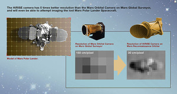
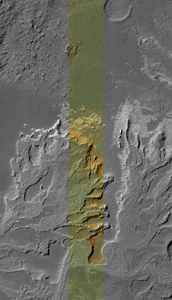
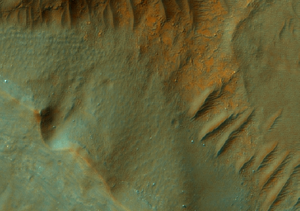

# HiRISE [¶](#HiRISE-)

-----

[The Mars Reconnaissance Orbiter Mission](MRO)

### Instrument Overview [¶](#Instrument-Overview-)

HiRISE has acquired more than 20,000 images of the martian surface in
unprecedented detail.

HiRISE operates in visible wavelengths with a telescope that will
produce images at resolutions never before possible in planetary
exploration. These high resolution images will enable scientists to
resolve 1-meter (about 3-foot) sized objects on Mars and to study the
morphology (surface structure) in a much more comprehensive manner than
ever before.

From an altitude of approximately 300 kilometers above Mars, HiRISE will
return surface images comprised of pixels representing 30 centimeters of
the martian surface.

These high-resolution images provide unprecedented views of layered
materials, gullies, channels, and other science targets, as well as
possible future landing sites.

    A comparison between the resolution of a camera aboard
    Mars Global Surveyor and the HiRISE camera on 
    Mars Reconnaissance Orbiter. Credit: NASA/JPL 

### Technical Details [¶](#Technical-Details-)

This telescopic camera has a primary mirror diameter of 50 centimeters
and a field of view of 1.15°. At its focal plane, the instrument holds
an array of 14 electronic detectors, each covered by a filter in one of
three wavelength bands: 400 to 600 nanometers (blue-green), 550 to 850
nanometers (red), or 800 to 1000 nanometers (near-infrared). Ten red
detectors are positioned in a line totaling 20,028 pixels across to
cover the whole width of the field of view. Typical red images are
20,000 pixels wide by 40,000 lines high. Two each of the blue-green and
near-infrared detectors lie across the central 20% of the field. Pixel
size in images taken from an altitude of 300 kilometers will be 30
centimeters across, about a factor of two better than the
highest-resolution down-track imaging possible from any earlier Mars
orbiter and a factor of five better than any extended imaging to date.
Generally, at least three pixels are needed to show the shape of a
feature, so the smallest resolvable features in the images will be about
a meter across for an object with reasonable contrast to its
surroundings. The instrument uses a technology called time delay
integration to accomplish a high signal-to-noise ratio for unprecedented
image quality.

The Principal Investigator (lead scientist) for HiRISE is Alfred McEwen
from the [Lunar and Planetary Laboratory](http://www.lpl.arizona.edu/)
at the [University of Arizona](http://www.arizona.edu/) .

    This image is one half (vertically) of a HiRISE observation
    scaled down to approximately 1/50th of its original resolution.
    It is of a small area inside Eberswalde crater in
    Margaritifer Sinus. Taken on November 8, 2006, the image is a 
    composite of all 10 red detectors and the 2 blue-green detectors.

    This is a full resolution sub-area of the image on the right
    (indicated by the red outline). One pixel represents 25.6 cm 
    on the surface of Mars.

-----

### References & Related Resources [¶](#References--Related-Resources-)

  - [HiRISE instrument
    description](http://mars.jpl.nasa.gov/mro/mission/instruments/hirise/)
  - [HiRISE instrument technical
    description](http://marsoweb.nas.nasa.gov/HiRISE/papers/6th_mars_conf/Delemere_HiRISE_InstDev.pdf)
    (PDF)
  - [HiRISE mission web site](http://marsoweb.nas.nasa.gov/HiRISE/)
  - [en.wikipedia.org/wiki/HiRISE](http://en.wikipedia.org/wiki/HiRISE)
  - [Mars Reconnaissance Orbiter mission web
    site](http://mars.jpl.nasa.gov/mro/)

[HiRISE\_Sample\_Full\_Resolution\_Subarea.png](attachments/download/918/HiRISE_Sample_Full_Resolution_Subarea.png)
[View](attachments/download/918/HiRISE_Sample_Full_Resolution_Subarea.png "View")
 (564 KB)   Ian Humphrey,
2016-05-31 02:51 PM 

[HiRISE\_Sample\_Observation.png](attachments/download/919/HiRISE_Sample_Observation.png)
[View](attachments/download/919/HiRISE_Sample_Observation.png "View")
 (403 KB)   Ian Humphrey,
2016-05-31 02:51 PM 

[MRO\_HiRISE.jpg](attachments/download/920/MRO_HiRISE.jpg)
[View](attachments/download/920/MRO_HiRISE.jpg "View")
 (105 KB)   Ian Humphrey,
2016-05-31 02:52 PM 

