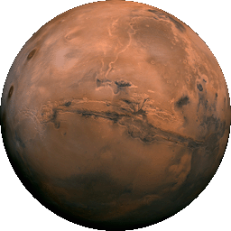
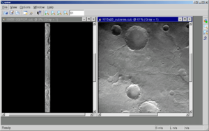
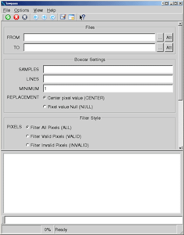
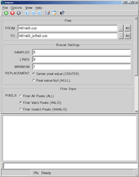
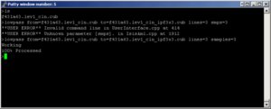
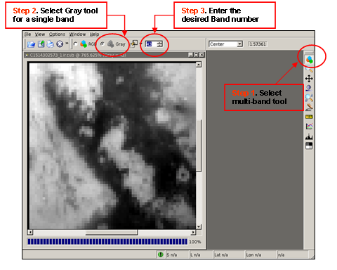

# Introduction to ISIS [¶](#Introduction-to-ISIS-)

-----

  - [Introduction to ISIS](#Introduction-to-ISIS-)
      - [What is ISIS?](#What-is-ISIS-)
      - [User Interface for ISIS](#User-Interface-for-ISIS-)
      - [Reserved Command Line
        Arguments](#Reserved-Command-Line-Arguments-)
      - [Parameter Command Line
        Arguments](#Parameter-Command-Line-Arguments-)
      - [Application Running Modes](#Application-Running-Modes-)
      - [ISIS Graphical Mode](#ISIS-Graphical-Mode-)
      - [ISIS Text Mode](#ISIS-Text-Mode-)
      - [Using qview to View Cubes](#Using-qview-to-View-Cubes-)
          - [Load and Display a Multi-Band
            Cube](#Load-and-Display-a-Multi-Band-Cube-)
              - [Display Single Band in Black and
                White](#Display-Single-Band-in-Black-and-White-)
              - [Display a Red, Green, Blue Color
                Composite](#Display-a-Red-Green-Blue-Color-Composite-)
      - [Bonus](#Bonus-)

## What is ISIS? [¶](#What-is-ISIS-)

-----

ISIS is an image processing software package. The focus of the software
is to manipulate imagery collected by current and past NASA planetary
missions sent to Mars, Jupiter, Saturn, and other solar system bodies.

If you're familiar with commercial image processing packages (for
example: Adobe Photoshop, PaintShop Pro, Envi, or ERDAS Imagine) you'll
recognize many of the standard image processing operations ISIS is
capable of, such as contrast stretch, image algebra, filters, and
statistical analysis.

However, the real power of ISIS is its unique capabilities for
processing data from NASA spacecraft missions such as Voyager, Viking,
Galileo, Mars Global Surveyor, and Mars Odyssey. ISIS is able to import
raw mission data into a usable geospatial image product, and has tools
for digital mosaicking of adjacent images, photometric modeling and
normalization, removal of systematic noise patterns, overlaying
graticules, and numerous other cartographic and scientific analysis
functions.

The following are just a few examples of how the USGS Astrogeology
Research Program has used ISIS in our work (links open in a new
window):

  - **Global mosaics** : mosaicking hundreds or thousands of images
    collected by space exploration missions to create seamless,
    cartographically accurate, global image maps for use by the
    planetary science community for research and mapping. See our
    [Map-a-Planet](https://astrogeology.usgs.gov/tools/map-a-planet-2) site to view these
    products.

> This famous mosaic of the Valles Marineris hemisphere of Mars was
> created using ISIS. The mosaic is composed of 102 Viking Orbiter
> images of Mars, and is projected into point perspective, a view
> similar to that which one would see from a spacecraft at a distance of
> 2500 kilometers from the surface of the planet.

  - **Geologic Mapping** : we create accurate base image maps for
    geologists to use in creating geologic maps. See our [Planetary
    Geologic Mapping
    Program](http://astrogeology.usgs.gov/Projects/PlanetaryMapping/)
    for more information about this work.

  - **Scientific Research** : Using ISIS to mosaic images of a region
    of interest to create a scientifically accurate image product, and
    analyzing the imagery based on spectral, textural, or other
    attributes. See the following Science Magazine abstract for examples
    of images from the Mars Exploration Rover Mission Microscopic Image
    that were processed and analyzed using ISIS as part of the
    scientific research resulting from the mission: Textures of the
    [Soils and Rocks at Gusev Crater from Spirit's Microscopic
    Imager](http://astrogeology.usgs.gov/search/details/Mars/MER/ImagerFindings/ScienceMI824/pdf)
    .

## User Interface for ISIS [¶](#User-Interface-for-ISIS-)

-----

ISIS programs fall into two main groups: interactive and
non-interactive. Interactive programs allow you to observe the results
of actions you take almost immediately. The main interactive program is
[**qview**](http://isis.astrogeology.usgs.gov/Application/presentation/Tabbed/qview/qview.html)
, the image display program for ISIS. However, most programs in ISIS
fall into the non-interactive group. These programs process the data you
supply, usually one or more image files, and write the results to a new
file. Some examples are
[**lowpass**](http://isis.astrogeology.usgs.gov/Application/presentation/Tabbed/lowpass/lowpass.html)
,
[**ratio**](http://isis.astrogeology.usgs.gov/Application/presentation/Tabbed/ratio/ratio.html)
and
[**moc2isis**](http://isis.astrogeology.usgs.gov/Application/presentation/Tabbed/moc2isis/moc2isis.html)
. At this point we will concentrate on the user interface for
non-interactive programs because their interfaces are all similar.
Interactive programs are somewhat unique, so they each have their own
documentation.

> **qview** , ISIS's image display application, is an interactive
> application\]\]

All ISIS programs are launched via the command line. The command line
refers to the text typed at the prompt of a terminal window such as
xterm, console, or putty, or in a script like cshell, or perl. ISIS
programs are started by typing the name of the program followed by any
arguments. All arguments must be separated from each other by at least
one space.

Command line arguments are broken into two categories: reserved, and
parameter. Reserved arguments always begin with a dash (-) and change
major things about how the program runs while parameter arguments supply
data to the application and control how it processes that input data to
create output data.

## Reserved Command Line Arguments [¶](#Reserved-Command-Line-Arguments-)

-----

Reserved arguments all begin with a dash (-), and are not sensitive to
case (i.e., -help is the same as -HElp). A list of basic reserved
arguments includes:

  - **-webhelp** Launch a web browser showing the ISIS help page for
    that program. All other arguments will be ignored.
  - **-help** Display a list of the program's parameters showing their
    default values. For example:

<!-- end list -->

    > equalizer -help
    FROMLIST    = Null
    HOLDLIST    = Null
    TOLIST      = Null
    OUTSTATS    = NULL
    INSTATS     = NULL
    PROCESS     = (*BOTH, CALCULATE, APPLY)
    SOLVEMETHOD = (QRD, *SPARSE)
    ADJUST      = (*BOTH, BRIGHTNESS, CONTRAST, GAIN)
    MINCOUNT    = 1000
    WEIGHT      = FALSE
    PERCENT     = 100.0

  - **-last** Run the program using the same parameter arguments from
    the most recent time the program was run. This does not include any
    reserved arguments.
  - **-restore=filename** Run the program using the arguments from the
    file specified in filename.

Reserved arguments come in two forms, solitary keyword or keyword value
pair. Solitary keywords tell the program to perform some special action
such as the -help keyword above. Keyword value pairs also tell the
program to perform some special action, but use additional information
for that action like in the -restore argument above. The keyword and
value must be separated from each other with an equals sign (=). The
equals sign may have spaces on either or both sides of it.

## Parameter Command Line Arguments [¶](#Parameter-Command-Line-Arguments-)

-----

Parameter arguments are always made up of keyword value pairs. The
keyword and value are separated by an equals sign just like reserved
arguments, but they begin with an alphabetic letter instead of a dash.
Parameters control what input data to use, what settings to use to
process that input data, and where to put the output data. There are six
different types of parameters:

  - Cube file names - A cube file name is the location on disk of an
    ISIS cube. It can be either the input to this program or where to
    place the output. Input cubes, must be the output from some other
    ISIS program. Most programs can process cubes from ISIS2, but some
    information may be interpreted differently. Output cubes, will
    always be the location to place processed results from the
    application. When entering the filename of a cube it is not
    necessary to enter the .cub extension. It will be added for you if
    you do not type it.

<!-- end list -->

    from=r0700563_lev1.cub
    to= f431a62

  - Data file names - A data file name is the location on disk of a file
    which is not an ISIS cube. This includes input files from missions
    such as Mars Global Surveyor or Viking, and output files such as
    that produced by the program **stats** or **isis2std** .

<!-- end list -->

    to=myStatistic.dat

  - Floating point numbers - Floating point numbers are numeric values
    with a whole part and/or a fractional part. Parameters with this
    type can be given values like 1.0, 0.7823, 127 or 0.31416E+1

<!-- end list -->

    radius=317.681

  - Integers - Integer numbers have only a whole part. Parameters of
    this type can be given values like 0, 2, -18223 or 255.

<!-- end list -->

    lines=1024

  - Boolean - Boolean parameters are used as flags to indicate true or
    false. The ISIS user interface allows true values to be represented
    by True, T, Yes or Y. False values can be False, F, No or N. Any
    mixture of upper and lower case letters is allowed. The name of the
    parameter for boolean's is usually a question such as USEDEM. This
    should be read as "Do you want the program to use a DEM when it
    processes the input?"

<!-- end list -->

    CREATESPECIAL=FALSE
    emission=true

  - String - A string is a simple sequence of printable characters. For
    example "MARS", "BiLinear" or "The quick brown fox."

<!-- end list -->

    bittype=real

## Application Running Modes [¶](#Application-Running-Modes-)

-----

All non-interactive programs can run in one of two modes, text mode
(runs without launching a window) or graphical mode (launches a window
for providing parameters). Which mode the program runs in depends on
what arguments you supplied on the command line. If any parameter
arguments are present on the command line, the program will run in text
mode unless explicitly overridden using the reserved argument -gui.

## ISIS Graphical Mode [¶](#ISIS-Graphical-Mode-)

-----

To run an ISIS program in graphical mode, simply type the name of the
program followed by the Enter key. The program will display a window
that allows you to set parameters for the program, start/stop running
the algorithm on the data, observe the current status of the program,
and see any logged information.

As mentioned earlier, if there are any parameter arguments on the
command line the program will run in text mode. You can override this
feature by supplying the -gui reserved argument on the command line. The
gui flag refers to the term Graphical User Interface (or, simply GUI,
pronounced ''gooey''), and forces the application to run in graphical
mode. The program will then load any parameter arguments and launch the
program in graphical mode instead of text mode. The following command
will launch the **lowpass** program in graphical mode with the
parameters set according to what was on the command line:

    lowpass from=f431a63.cub to=f431a63_lpf3x3.cub lines=3 samples=3 -gui

> **lowpass, regular graphical mode**  
> when run with no parameters, lowpass opens in graphical mode to let
> you fill in the parameters

> **lowpass, forced into graphical mode with -gui**  
> here, lowpass was run with parameters, but by using the -gui flag,
> lowpass opens in graphical mode and automatically fills in values for
> any parameters you passed it on the command line

As you can see the parameter arguments on the command line were used to
set the values for the **lowpass** application, and the -gui reserved
argument caused the program to run in graphical mode instead of in text
mode.

## ISIS Text Mode [¶](#ISIS-Text-Mode-)

-----

For text mode, ISIS programs get all their parameters from you via the
command line arguments, process the data, and then exit. Programs may or
may not show a status message and results on the terminal window. While
running, an application that encounters an error will show the error
message on the terminal window and then exit. It is then up to you to
correct the error and try again.

> **lowpass running in text mode**  
> We ran the **lowpass** application, passing all the parameters along
> on the command line. Oops\! We spelled "samples" wrong, but
> **lowpass** gives us a handy error message to let us know what the
> problem was. We run it again, it shows us its status as it runs, and
> returns us to the command line prompt when it's finished.

## Using qview to View Cubes [¶](#Using-qview-to-View-Cubes-)

-----

Naturally, one of the first things anyone wants to do when they get
their hands on image data is look at it\! The **qview** application is
the image viewer for ISIS. **qview** has a number of tools to let you
zoom in and out, change the contrast, choose color combinations,
compare, and otherwise interact with and look at your images. We'll talk
about some of these tools in detail later. For now, let's just learn how
to open an image in **qview** .

1.  Run **qview** by typing qview on the command line. The **qview**
    viewer application window will open.

2.  Select Open... from the File menu. A dialog box labeled "Open" will
    appear. Images in the native ISIS format are called ISIS cubes or
    simply cubes.
    
      - Find the directory containing your ISIS cubes
      - Select one or more to open
      - Click the Open button

3.  Your image(s) will appear in the **qview** window\!

### Load and Display a Multi-Band Cube [¶](#Load-and-Display-a-Multi-Band-Cube-)

**qview** will load an entire multi-band cube into memory.

#### Display Single Band in Black and White [¶](#Display-Single-Band-in-Black-and-White-)

Each band can be selected to view as follows:

#### Display a Red, Green, Blue Color Composite [¶](#Display-a-Red-Green-Blue-Color-Composite-)

## Bonus [¶](#Bonus-)

-----

Now that you know how to run ISIS programs go experiment with some of
the basic ones like **stats** , **hist** or **mirror** .

Download the ISIS cube
[Intro2isis.cub.gz](attachments/download/1084/Intro2isis.cub.gz) - the
cube is compressed in a GZIP archive file. Use gunzip to uncompress the
cube. The filename of the cube is Intro2isis.cub.

Run each of the following applications, using intro2isis.cub as your
input '(FROM)' file. Try running in both the GUI and command line modes.
The following links to application documentation may be helpful:

  - [**stats**](http://isis.astrogeology.usgs.gov/Application/presentation/Tabbed/stats/stats.html)
    : The **stats** application computes statistics (such as average,
    mode, minimum, maximum, etc.) for the pixels in a single band. To
    choose a band other than the default (band 1) in GUI mode, click the
    arrow to the right of the "From" field and choose "Change
    attributes..." from the menu. You can then enter a different band
    number.

  - [**hist**](http://isis.astrogeology.usgs.gov/Application/presentation/Tabbed/hist/hist.html)
    : The **hist** application creates a tabular representation of the
    histogram of a single band in a cube. Like stats, the default band
    is band 1 and can be changed in the file attributes in the GUI.

  - [**mirror**](http://isis.astrogeology.usgs.gov/Application/presentation/Tabbed/mirror/mirror.html)
    : The **mirror** application flips a cube from left to right (making
    an output cube that looks like the mirror-image of the input cube).
    Make sure your output '(TO)' filename is different than your input
    '(FROM)' filename\!

After running the **mirror** application, open both the input cube
(intro2isis.cub) and output cube in **qview** to see the results\!

[Intro2isis.cub.gz](attachments/download/1084/Intro2isis.cub.gz)
 (380 KB)   Ian Humphrey,
2016-06-01 01:45 PM 

[Qview\_vims\_bandrgb.png](attachments/download/1085/Qview_vims_bandrgb.png)
[View](attachments/download/1085/Qview_vims_bandrgb.png "View")
 (147 KB)   Ian Humphrey,
2016-06-01 01:53 PM 

[Qview\_vims\_singleband.png](attachments/download/1086/Qview_vims_singleband.png)
[View](attachments/download/1086/Qview_vims_singleband.png "View")
 (90.9 KB)   Ian
Humphrey, 2016-06-01 01:53 PM 

[LowpassScreenShot3.png](attachments/download/1087/LowpassScreenShot3.png)
[View](attachments/download/1087/LowpassScreenShot3.png "View")
 (20.7 KB)   Ian
Humphrey, 2016-06-01 01:55 PM 

[LowpassScreenShot2.png](attachments/download/1088/LowpassScreenShot2.png)
[View](attachments/download/1088/LowpassScreenShot2.png "View")
 (26.8 KB)   Ian
Humphrey, 2016-06-01 01:59 PM 

[LowpassScreenShot1.png](attachments/download/1089/LowpassScreenShot1.png)
[View](attachments/download/1089/LowpassScreenShot1.png "View")
 (26 KB)   Ian Humphrey,
2016-06-01 01:59 PM 

[QviewTwoCubes.png](attachments/download/1090/QviewTwoCubes.png)
[View](attachments/download/1090/QviewTwoCubes.png "View")
 (85 KB)   Ian Humphrey,
2016-06-01 02:07 PM 

[IsisSupport.png](attachments/download/1091/IsisSupport.png)
[View](attachments/download/1091/IsisSupport.png "View")
 (727 KB)   Ian Humphrey,
2016-06-01 02:10 PM 

[Mars\_hemi.gif](attachments/download/1092/Mars_hemi.gif)
[View](attachments/download/1092/Mars_hemi.gif "View")
 (40.8 KB)   Ian
Humphrey, 2016-06-01 02:20 PM 

