<div id="main">

<div id="content">

<div class="contextual">

</div>

<div class="wiki wiki-page">

<span id="Learning-About-Map-Projections"></span>

# Learning About Map Projections [¶](#Learning-About-Map-Projections-)

-----

  - [Learning About Map Projections](#Learning-About-Map-Projections-)
      - [What is a Map?](#What-is-a-Map-)
      - [What is a Map Projection?](#What-is-a-Map-Projection-)
      - [ISIS3 Supported Projections](#ISIS3-Supported-Projections-)
      - [What is a Planetary Image Map?](#What-is-a-Planetary-Image-Map-)
      - [What is a Planetary Image
        Mosaic?](#What-is-a-Planetary-Image-Mosaic-)
      - [Defining a Map in ISIS3](#Defining-a-Map-in-ISIS3-)
      - [Target Shape Definition](#Target-Shape-Definition-)
          - [Interactive Planetary Radii
            Demonstration](#Interactive-Planetary-Radii-Demonstration-)
      - [Latitude Type](#Latitude-Type-)
          - [Quick Tips](#Quick-Tips-)
          - [Interactive Planetocentric and Planetographic
            Demonstration](#Interactive-Planetocentric-and-Planetographic-Demonstration-)
      - [Longitude Direction and
        Domain](#Longitude-Direction-and-Domain-)
          - [Interactive Longitude Direction of Domain
            Demonstration](#Interactive-Longitude-Direction-of-Domain-Demonstration-)
      - [Ground Range](#Ground-Range-)
          - [Interactive Ground range
            demonstration](#Interactive-Ground-range-demonstration-)
      - [Pixel Resolution](#Pixel-Resolution-)
          - [Interactive Example of pixel
            resolutions](#Interactive-Exle-of-pixel-resolutions-)
      - [Projection and Parameters](#Projection-and-Parameters-)
      - [Projecting a Camera Cube](#Projecting-a-Camera-Cube-)
          - [Quick Tips](#Quick-Tips-2-)
      - [Problems at the Longitude
        Seams](#Problems-at-the-Longitude-Seams-)
      - [Power Tip: Reprojecting an Image
        Map](#Power-Tip-Reprojecting-an-Image-Map-)
      - [Power Tip: Making Mosaics](#Power-Tip-Making-Mosaics-)
      - [Creating a mosaic](#Creating-a-mosaic-)
      - [Other Hints and Tips](#Other-Hints-and-Tips-)

<span id="What-is-a-Map"></span>

## What is a Map? [¶](#What-is-a-Map-)

-----

A map is a two dimensional representation of a three dimensional object
such as a sphere, ellipsoid (egg-shape), or an irregular shaped body.
For planetary maps, these 3-D objects are the planets, their moons, and
irregular bodies such as asteroids. Maps allow scientists and
researchers to analyze and measure characteristics of features on the
body such as area, distance, and direction. See [Map
(Wikipedia)](http://en.wikipedia.org/wiki/Map) for a detailed
description of maps.

| 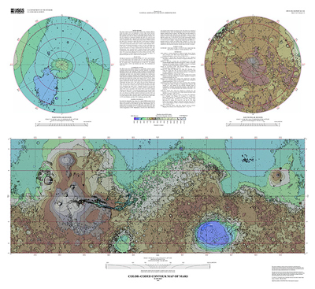 |
| ------------------------------------------------------------------------------------------------------------------------------------ |
| Example of a map made using data from the Mars Orbiter Laser Altimeter (MOLA)                                                        |

<span id="What-is-a-Map-Projection"></span>

## What is a Map Projection? [¶](#What-is-a-Map-Projection-)

-----

A projection is an algorithm or equation for mapping a three dimensional
body onto a two dimensional surface such as paper, a computer screen, or
in our case, a digital image. There are many different types of
projections.

| 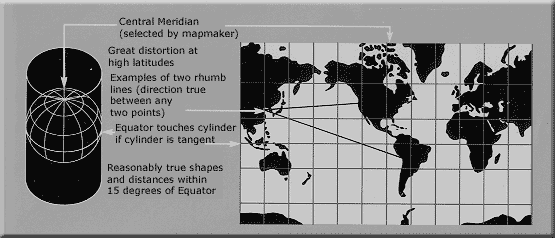 |
| ---------------------------------------------------------------------------------------------------------------------------------------------------------------- |
| **Mercator Projection** : The classic Mercator projection places a cylinder (rolled piece of paper) tangent to the equator:                                      |

For additional information on types and properties of map projections
see [Map Projection
(USGS)](http://egsc.usgs.gov/isb//pubs/MapProjections/projections.html)
.

<span id="ISIS3-Supported-Projections"></span>

## ISIS3 Supported Projections [¶](#ISIS3-Supported-Projections-)

-----

**ISIS3 currently supports the following projections:**

  - Equirectangular
  - Lambert Azimuthal Equal Area
  - Lambert Conformal
  - Lunar Azimuthal Equal Area
  - Mercator
  - Mollweide
  - Oblique Cylindrical
  - Orthographic
  - Planar
  - Point Perspective
  - Polar Stereographic
  - Ring Cylindrical
  - Robinson
  - Simple Cylindrical
  - Sinusoidal
  - Transverse Mercator
  - Upturned Ellipsoid Transverse Azimuthal

**Related Resources**

  - [USGS: Map
    Projections](http://egsc.usgs.gov/isb//pubs/MapProjections/projections.html)
    - descriptions and comparisons of several map projections

<span id="What-is-a-Planetary-Image-Map"></span>

## What is a Planetary Image Map? [¶](#What-is-a-Planetary-Image-Map-)

-----

A primary capability of ISIS3 is to create map projected images of raw
instrument data. This allows researchers to make fundamental
measurements on and observations about the images.

The following is an example of a single Mars Global Surveyor (MGS) Mars
Orbital Camera (MOC) instrument image that has been transformed to a
planetary image map using the Sinusoidal projection.

| 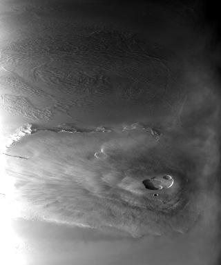 | 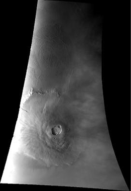 |
| --------------------------------------------------------------------- | ----------------------------------------------------------------------------------- |
| MOC image before transformation                                       | MOC image after sinusoidal transformation                                           |

<span id="What-is-a-Planetary-Image-Mosaic"></span>

## What is a Planetary Image Mosaic? [¶](#What-is-a-Planetary-Image-Mosaic-)

-----

Equally as important, ISIS3 allows a collection of raw instrument images
to be projected and stitched together (mosaicked) into large regional or
global maps.

Five Mars Odyssey THEMIS instrument images that have been projected and
mosaicked to generate a regional planetary image map using the
Sinusoidal projection:

| [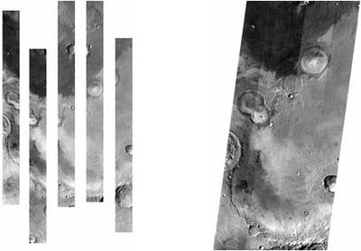](attachments/download/909/Sample_mosaic_themis.jpg "Five Mars Odyssey THEMIS instrument images that have been projected and mosaicked to generate a regional planetary image map using the Sinusoidal projection)") |
| ------------------------------------------------------------------------------------------------------------------------------------------------------------------------------------------------------------------------------------------------------------------------------------- |

<span id="Defining-a-Map-in-ISIS3"></span>

## Defining a Map in ISIS3 [¶](#Defining-a-Map-in-ISIS3-)

-----

In order to project an image, characteristics of the map must be
established. They include the latitude/longitude coverage or ground
range, the pixel resolution, the target body radii, latitude and
longitude definitions, and the projection. In ISIS3 we record all of
this information in a Parameter Value Language (PVL) formatted map file.
For example this MGS MOC image was projected using the following:

``` 
 Group = Mapping
  TargetName         = Mars
  EquatorialRadius   = 3396190.0 <meters>
  PolarRadius        = 3376200.0 <meters>
  LatitudeType       = Planetocentric
  LongitudeDirection = PositiveEast
  LongitudeDomain    = 360

  ProjectionName     = Sinusoidal
  CenterLongitude    = 227.95679808356

  MinimumLatitude    = 10.766902750622
  MaximumLatitude    = 34.44419678224
  MinimumLongitude   = 219.7240455337
  MaximumLongitude   = 236.18955063342

  PixelResolution    = 426.87763879023 <meters/pixel>
 End_Group
```

|  |
| --------------------------------------------------------------------------------- |
| Image projected using the above mapfile                                           |

<span id="Target-Shape-Definition"></span>

## Target Shape Definition [¶](#Target-Shape-Definition-)

-----

The target shape must be defined in order to project an image. The shape
is characterized by the equatorial and polar radii of the body.
Depending on the projection, one or both of these values will be used.
The chart below shows which projections are for a sphere only (use only
the equatorial radius) and which work for ellipsoids:

Marked below are the PVL keywords used to define the target radii, which
must be given in units of meters.

``` 
 Group = Mapping
  TargetName         = Mars
  **EquatorialRadius   = 3396190.0 <meters>**
  **PolarRadius        = 3376200.0 <meters>**
  LatitudeType       = Planetocentric
  LongitudeDirection = PositiveEast
  LongitudeDomain    = 360

  ProjectionName     = Sinusoidal
  CenterLongitude    = 227.95679808356

  MinimumLatitude    = 10.766902750622
  MaximumLatitude    = 34.44419678224
  MinimumLongitude   = 219.7240455337
  MaximumLongitude   = 236.18955063342

  PixelResolution    = 426.87763879023 <meters/pixel>
 End_Group
```

| Projection          | Sphere | Ellipsoid |
| ------------------- | ------ | --------- |
| Sinusoidal          | X      |           |
| Simple Cylindrical  | X      |           |
| Equirectangular     | X      |           |
| Polar Stereographic | X      | X         |
| Orthographic        | X      |           |
| Mercator            | X      | X         |
| Transverse Mercator | X      | X         |
| Lambert Conformal   | X      | X         |

<span id="Interactive-Planetary-Radii-Demonstration"></span>

### Interactive Planetary Radii Demonstration [¶](#Interactive-Planetary-Radii-Demonstration-)

<span id="Latitude-Type"></span>

## Latitude Type [¶](#Latitude-Type-)

-----

Latitudes can be represented either in **planetocentric** or
**planetographic** form. The planetocentric latitude is the angle
between the equatorial plane and a line from the center of the body. The
**planetographic latitude** is the angle between the equatorial plane
and a line that is normal to the body. In a quick summary, both
latitudes are equivalent on a sphere (i.e., equatorial radius equal to
polar radius); however, they differ on an ellipsoid (e.g., Mars, Earth).

``` 
 Group = Mapping
  TargetName         = Mars
  EquatorialRadius   = 3396190.0 <meters>
  PolarRadius        = 3376200.0 <meters>
  **LatitudeType       = Planetocentric**
  LongitudeDirection = PositiveEast
  LongitudeDomain    = 360

  ProjectionName     = Sinusoidal
  CenterLongitude    = 227.95679808356

  MinimumLatitude    = 10.766902750622
  MaximumLatitude    = 34.44419678224
  MinimumLongitude   = 219.7240455337
  MaximumLongitude   = 236.18955063342

  PixelResolution    = 426.87763879023 <meters/pixel>
 End_Group
```

<span id="Quick-Tips"></span>

### Quick Tips [¶](#Quick-Tips-)

  - The latitude type will affect how other PVL keywords such as
    MinimumLatitude, CenterLatitude are interpreted.
  - Projections such as Sinusoidal, Simple Cylindrical, and
    Equirectangular will place pixels differently in the image depending
    on the latitude type. Pixel placement for other projections is not
    affected. The LatitudeType keyword must be either **Planetocentric**
    or **Planetographic** .

<span id="Interactive-Planetocentric-and-Planetographic-Demonstration"></span>

### Interactive Planetocentric and Planetographic Demonstration [¶](#Interactive-Planetocentric-and-Planetographic-Demonstration-)

**PLACE INTERACTIVE DEMO HERE**

<span id="Longitude-Direction-and-Domain"></span>

## Longitude Direction and Domain [¶](#Longitude-Direction-and-Domain-)

-----

Two keywords indicate how longitude is defined on the target body and
must be specified. The LongitudeDirection keyword indicates whether
longitude increases to the east or west, that is, positive to the east
or positive to the west. The LongitudeDomain keyword specifies how
longitudes should be interpreted 0° to 360° or -180° to 180°. In both
cases, these specifications affect other keywords and the interpretation
of other keywords, such as MinimumLongitude and CenterLongitude.

The LongitudeDirection keyword must be either PositiveEast or
PositiveWest, while the LongitudeDomain keyword must be 180 or 360.
These keywords are marked in the example below.

``` 
 Group = Mapping
  TargetName         = Mars
  EquatorialRadius   = 3396190.0 <meters>
  PolarRadius        = 3376200.0 <meters>
  LatitudeType       = Planetocentric
  **LongitudeDirection = PositiveEast**
  **LongitudeDomain    = 360**

  ProjectionName     = Sinusoidal
  CenterLongitude    = 227.95679808356

  MinimumLatitude    = 10.766902750622
  MaximumLatitude    = 34.44419678224
  MinimumLongitude   = 219.7240455337
  MaximumLongitude   = 236.18955063342

  PixelResolution    = 426.87763879023 <meters/pixel>
 End_Group
```

<span id="Interactive-Longitude-Direction-of-Domain-Demonstration"></span>

### Interactive Longitude Direction of Domain Demonstration [¶](#Interactive-Longitude-Direction-of-Domain-Demonstration-)

**PLACE INTERACTIVE DEMO HERE**

<span id="Ground-Range"></span>

## Ground Range [¶](#Ground-Range-)

-----

The ground range defines the extent of the map. That is, the minimum and
maximum latitude/longitude values. Recall that these are in terms of the
latitude system, longitude direction, and longitude domain. In the
keywords below, the keywords marked define the ground range of the map.

``` 
 Group = Mapping
  TargetName         = Mars
  EquatorialRadius   = 3396190.0 <meters>
  PolarRadius        = 3376200.0 <meters>
  LatitudeType       = Planetocentric
  LongitudeDirection = PositiveEast
  LongitudeDomain    = 360

  ProjectionName     = Sinusoidal
  CenterLongitude    = 227.95679808356

  **MinimumLatitude    = 10.766902750622**
  **MaximumLatitude    = 34.44419678224**
  **MinimumLongitude   = 219.7240455337**
  **MaximumLongitude   = 236.18955063342**

  PixelResolution    = 426.87763879023 <meters/pixel>
 End_Group
```

<span id="Interactive-Ground-range-demonstration"></span>

### Interactive Ground range demonstration [¶](#Interactive-Ground-range-demonstration-)

**PLACE INTERACTIVE DEMO HERE**

<span id="Pixel-Resolution"></span>

## Pixel Resolution [¶](#Pixel-Resolution-)

-----

The pixel resolution defines the size of pixels in a map projected image
in either meters per pixel, or pixels per degree. In the example below
is the marked keyword used to define the pixel resolution in meters per
pixel.

``` 
 Group = Mapping
  TargetName         = Mars
  EquatorialRadius   = 3396190.0 <meters>
  PolarRadius        = 3376200.0 <meters>
  LatitudeType       = Planetocentric
  LongitudeDirection = PositiveEast
  LongitudeDomain    = 360

  ProjectionName     = Sinusoidal
  CenterLongitude    = 227.95679808356

  MinimumLatitude    = 10.766902750622
  MaximumLatitude    = 34.44419678224
  MinimumLongitude   = 219.7240455337
  MaximumLongitude   = 236.18955063342

  **PixelResolution    = 426.87763879023 <meters/pixel>**
 End_Group
```

Alternatively, the resolution can be defined as pixels per degree. For
example

``` 
 Group = Mapping
  TargetName         = Mars
  EquatorialRadius   = 3396190.0 <meters>
  PolarRadius        = 3376200.0 <meters>
  LatitudeType       = Planetocentric
  LongitudeDirection = PositiveEast
  LongitudeDomain    = 360

  ProjectionName     = Sinusoidal
  CenterLongitude    = 227.95679808356

  MinimumLatitude    = 10.766902750622
  MaximumLatitude    = 34.44419678224
  MinimumLongitude   = 219.7240455337
  MaximumLongitude   = 236.18955063342

  **Scale              = 138.85641255722 <pixels/degree>**
 End_Group
```

<span id="Interactive-Example-of-pixel-resolutions"></span>

### Interactive Exle of pixel resolutions [¶](#Interactive-Exle-of-pixel-resolutions-)

**PLACE INTERACTIVE DEMONSTRATION HERE**

<span id="Projection-and-Parameters"></span>

## Projection and Parameters [¶](#Projection-and-Parameters-)

-----

The final information required in the map file is the projection for
mapping the body to a two dimensional surface. In addition to the
projection name, projection-specific parameters must be provided. For
example, Sinusoidal requires the CenterLongitude. The following table
outlines the keywords required for each projection:

| ProjectionName                       | CenterLongitude | CenterLatitude | FirstStandardParallel | SecondStandardParallel | ScaleFactor | CenterAzimuth | Distance | CenterRadius |
| ------------------------------------ | --------------- | -------------- | --------------------- | ---------------------- | ----------- | ------------- | -------- | ------------ |
| Equirectangular                      | X               | X              |                       |                        |             |               |          |              |
| LambertAzimuthalEqualArea            | X               | X              |                       |                        |             |               |          |              |
| LambertConformal                     | X               | X              | X                     | X                      |             |               |          |              |
| LunarAzimuthalEqualArea              |                 |                |                       |                        |             |               |          |              |
| Mercator                             | X               | X              |                       |                        |             |               |          |              |
| Mollweide                            | X               |                |                       |                        |             |               |          |              |
| ObliqueCylindrical                   | X               |                |                       |                        |             |               |          |              |
| Orthographic                         | X               | X              |                       |                        |             |               |          |              |
| Planar                               |                 |                |                       |                        |             | X             |          |              |
| PointPerspective                     | X               | X              |                       |                        |             |               | X        |              |
| PolarStereographic                   | X               | X              |                       |                        |             |               |          |              |
| RingCylindrical                      |                 |                |                       |                        |             | X             |          | X            |
| Robinson                             | X               |                |                       |                        |             |               |          |              |
| SimpleCylindrical                    | X               |                |                       |                        |             |               |          |              |
| Sinusoidal                           | X               |                |                       |                        |             |               |          |              |
| TransverseMercator                   | X               | X              |                       |                        | X           |               |          |              |
| UpturnedEllipsoidTransverseAzimuthal | X               |                |                       |                        |             |               |          |              |

<span id="Projecting-a-Camera-Cube"></span>

## Projecting a Camera Cube [¶](#Projecting-a-Camera-Cube-)

-----

To project a raw instrument (camera) cube to a map projected image you
must use the ISIS3 program
[**cam2map**](http://isis.astrogeology.usgs.gov/Application/presentation/Tabbed/cam2map/cam2map.html)
. The program allows you to enter a map file to specify the projection,
ground range, resolution, and target definition. If a map file is not
supplied the program will provide the following defaults:

| Parameters                                                                     | Default Value                                                     |
| ------------------------------------------------------------------------------ | ----------------------------------------------------------------- |
| MinimumLatitude, MaximumLatitude, MinimumLongitude, MaximumLongitude           | Automatically computed using information from the camera model    |
| PixelResolution                                                                | Automatically computed using information from the camera model    |
| EquatorialRadius, PolarRadius, LatitudeSystem, LongitudeRange, LongitudeDomain | Automatically computed using the TargetName from the cube labels. |
| CenterLatitude, CenterLongitude, and other projection specific parameters      | Automatically computed using the middle of the ground range       |

| [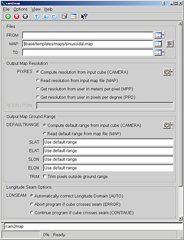](attachments/download/917/Cam2map_screenshot.jpg "Screen shot of the cam2map application)") |
| ---------------------------------------------------------------------------------------------------------------------------------------------------------- |
| A screen shot of the cam2map application                                                                                                                   |

<span id="Quick-Tips-2"></span>

### Quick Tips [¶](#Quick-Tips-2-)

  - [**cam2map**](http://isis.astrogeology.usgs.gov/Application/presentation/Tabbed/cam2map/cam2map.html)
    requires the input to be a camera cube and therefore ISIS3 must
    support the camera model in order for this program to be successful.
  - [**spiceinit**](http://isis.astrogeology.usgs.gov/Application/presentation/Tabbed/spiceinit/spiceinit.html)
    must be run on the input cube as well.

<span id="Problems-at-the-Longitude-Seams"></span>

## Problems at the Longitude Seams [¶](#Problems-at-the-Longitude-Seams-)

-----

Problems can occur when working on images that cross the longitude seam.
For example, choosing a map file with:

``` 
 LongitudeDomain = 360
```

A map file combined with an image that was viewed over the 0°/360° seam
will visually look like the following example.

When a camera acquires image data it is stored in a certain domain:

[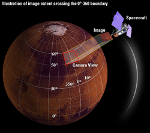](attachments/download/923/Mars_sphere_illustration.png "Thumbnail")

When an image is created from the acquired data using the same domain,
the correct image is generated:

[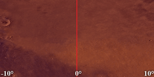](attachments/download/921/180_domain_correct.png "Thumbnail")

When an image is created in a different longitude domain, the resulting
image is incorrect (below, this image was scaled down to fit on the
screen):  
[](attachments/download/922/360_domain_incorrect.png "Thumbnail")

These illustrate the problems that can arise when working with images
that cross the longitude seam.

The
[**cam2map**](http://isis.astrogeology.usgs.gov/Application/presentation/Tabbed/cam2map/cam2map.html)
program has an option which automatically changes the longitude domain
if it detects the image crossing the seam. If you turn this option off,
be aware you can generate large images with mostly NULL data. Note that
a similar problem occurs at the -180°/180° longitude boundary if
LongitudeDomain = 180.

<span id="Power-Tip-Reprojecting-an-Image-Map"></span>

## Power Tip: Reprojecting an Image Map [¶](#Power-Tip-Reprojecting-an-Image-Map-)

-----

Occasionally the need arises to reproject an image map. For example,
converting from a Simple Cylindrical to Sinusoidal projection:

[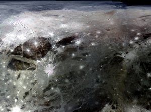](attachments/download/929/SimpleCylindrical.jpg "Thumbnail")
[](attachments/download/928/Blue_right_arrow.gif "Thumbnail")
[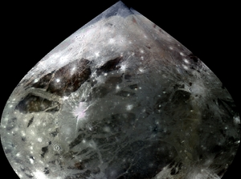](attachments/download/930/SinusodialProjection.jpg "Thumbnail")

Another purpose for reprojecting an image map is to get all the images
with the same projection, parameters, resolution, latitude system, etc
in order to mosaic. For example,

| [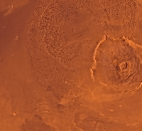](attachments/download/933/Simple_135-110.jpg "Simple Cylindrical") |
| ----------------------------------------------------------------------------------------------------------------------------- |
| Simple Cylindrical                                                                                                            |

| [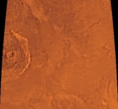](attachments/download/935/Sinusodial_135-110.jpg "Sinusoidal") |
| ----------------------------------------------------------------------------------------------------------------------------- |
| Sinusoidal                                                                                                                    |

| [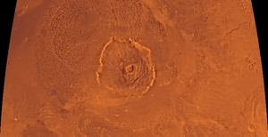](attachments/download/934/Mosaic_sinus.jpg "Sinusoidal Mosaic from Mars.") |
| ----------------------------------------------------------------------------------------------------------------------------------- |
| Sinusoidal Mosaic from Mars                                                                                                         |

The program for reprojecting an image map is
[**map2map**](https://isis.astrogeology.usgs.gov/Application/presentation/Tabbed/map2map/map2map.html)
.

<span id="Power-Tip-Making-Mosaics"></span>

## Power Tip: Making Mosaics [¶](#Power-Tip-Making-Mosaics-)

-----

In order to mosaic a set of cubes they must all be projected in
[**cam2map**](http://isis.astrogeology.usgs.gov/Application/presentation/Tabbed/cam2map/cam2map.html)
or
[**map2map**](http://isis.astrogeology.usgs.gov/Application/presentation/Tabbed/map2map/map2map.html)
using the SAME pixel resolution, target definition, and projection and
parameters (e.g., center longitude, etc). Note the ground range does not
need to be the same. This is fairly straight-forward as you can project
all the images with the same map file, just leave out the
MinimumLatitude, MinimumLongitude, MaximumLatitude, MaximumLongitude
parameters.

In the example below, we see the mapping file used to project the five
images in the THEMIS mosaic below

``` 
 Group = Mapping
  LatitudeType       = Planetocentric
  LongitudeDirection = PositiveEast
  LongitudeDomain    = 360

  ProjectionName     = Sinusoidal
  CenterLongitude    = 354.0

  PixelResolution    = 100.0 <meters/pixel>
 End_Group
 End
```

| 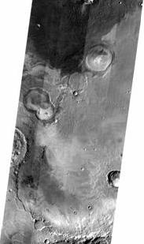 |
| ---------------------------------------------------------- |
| THEMIS Mosiac                                              |

<span id="Creating-a-mosaic"></span>

## Creating a mosaic [¶](#Creating-a-mosaic-)

-----

  - The most convenient way to mosaic a number of map projected images
    is to use the
    [**automos**](http://isis.astrogeology.usgs.gov/Application/presentation/Tabbed/automos/automos.html)
    application. Automos reads a list of input images, computes the
    latitude and longitude coverage of all the images and creates the
    output mosaic.

  - The
    [**mapmos**](http://isis.astrogeology.usgs.gov/Application/presentation/Tabbed/mapmos/mapmos.html)
    application mosaics one image at a time. Remember to set create=true
    the first time mapmos is run with the first image in order to create
    the output mosaic file.

  - It is possible to mosaic images together by specifying the output
    pixel coordinate placement using the
    [**handmos**](http://isis.astrogeology.usgs.gov/Application/presentation/Tabbed/handmos/handmos.html)
    application. This would be for any ISIS3 image cubes that do not
    have a camera model or cartographic mapping information that is
    required by mapmos and automos.

<span id="Other-Hints-and-Tips"></span>

## Other Hints and Tips [¶](#Other-Hints-and-Tips-)

-----

  - In lieu of using a standard text editor, the programs
    [**maptemplate**](http://isis.astrogeology.usgs.gov/Application/presentation/Tabbed/maptemplate/maptemplate.html)
    or
    [**mosrange**](http://isis.astrogeology.usgs.gov/Application/presentation/Tabbed/mosrange/mosrange.html)
    can be used to assist in the building of map files.

  - A map projected image can be used as a map file. For example, a
    Viking and MOC image taken of the same area can be projected by
    running
    [**cam2map**](http://isis.astrogeology.usgs.gov/Application/presentation/Tabbed/cam2map/cam2map.html)
    on the Viking image using the defaults and then the MOC image
    projected using the Viking image as the map file. The MOC image will
    have the same projection, target definition, resolution, and ground
    range so that the images can be easily compared.

  - In general, the pixel resolution of the image map is only accurate
    in certain portions of the image; however, this is entirely
    dependent upon the projection you select. The labels of the output
    cube will have a keyword called TrueScaleLatitude and/or
    TrueScaleLongitude and these represent where the resolution is
    accurate. The accuracy may be true along that meridian or parallel
    or point. Again this depends upon the projection.

  - The output map image size will vary depending on ground range and
    pixel resolution. Care should be taken to ensure your output image
    is not too large. You can check the size of image that will produced
    with a fully-defined map file by using the
    [**mapsize**](http://isis.astrogeology.usgs.gov/Application/presentation/Tabbed/mapsize/mapsize.html)
    program.

</div>

<div class="attachments">

<div class="contextual">

</div>

[Mercator.gif](attachments/download/896/Mercator.gif)
[View](attachments/download/896/Mercator.gif "View") <span class="size">
(21.1 KB) </span> <span class="author"> Kristin Berry, 2016-05-31 01:54
PM </span>

[Mola\_of\_sheet2a\_thumb.jpg](attachments/download/897/Mola_of_sheet2a_thumb.jpg)
[View](attachments/download/897/Mola_of_sheet2a_thumb.jpg "View")
<span class="size"> (186 KB) </span> <span class="author"> Kristin
Berry, 2016-05-31 01:54 PM </span>

[MOC1.jpg](attachments/download/903/MOC1.jpg)
[View](attachments/download/903/MOC1.jpg "View") <span class="size">
(12.2 KB) </span> <span class="author"> Kristin Berry, 2016-05-31 01:59
PM </span>

[SinuMOC1.jpg](attachments/download/904/SinuMOC1.jpg)
[View](attachments/download/904/SinuMOC1.jpg "View") <span class="size">
(56.9 KB) </span> <span class="author"> Kristin Berry, 2016-05-31 01:59
PM </span>

[Sample\_mosaic\_themis.jpg](attachments/download/909/Sample_mosaic_themis.jpg)
[View](attachments/download/909/Sample_mosaic_themis.jpg "View")
<span class="size"> (19.3 KB) </span> <span class="author"> Kristin
Berry, 2016-05-31 02:17 PM </span>

[Cam2map\_screenshot.jpg](attachments/download/917/Cam2map_screenshot.jpg)
[View](attachments/download/917/Cam2map_screenshot.jpg "View")
<span class="size"> (179 KB) </span> <span class="author"> Kristin
Berry, 2016-05-31 02:46 PM </span>

[180\_domain\_correct.png](attachments/download/921/180_domain_correct.png)
[View](attachments/download/921/180_domain_correct.png "View")
<span class="size"> (248 KB) </span> <span class="author"> Kristin
Berry, 2016-05-31 02:56 PM </span>

[360\_domain\_incorrect.png](attachments/download/922/360_domain_incorrect.png)
[View](attachments/download/922/360_domain_incorrect.png "View")
<span class="size"> (5.15 KB) </span> <span class="author"> Kristin
Berry, 2016-05-31 02:56 PM </span>

[Mars\_sphere\_illustration.png](attachments/download/923/Mars_sphere_illustration.png)
[View](attachments/download/923/Mars_sphere_illustration.png "View")
<span class="size"> (476 KB) </span> <span class="author"> Kristin
Berry, 2016-05-31 02:56 PM </span>

[Blue\_right\_arrow.gif](attachments/download/928/Blue_right_arrow.gif)
[View](attachments/download/928/Blue_right_arrow.gif "View")
<span class="size"> (1.25 KB) </span> <span class="author"> Kristin
Berry, 2016-05-31 03:05 PM </span>

[SimpleCylindrical.jpg](attachments/download/929/SimpleCylindrical.jpg)
[View](attachments/download/929/SimpleCylindrical.jpg "View")
<span class="size"> (337 KB) </span> <span class="author"> Kristin
Berry, 2016-05-31 03:05 PM </span>

[SinusodialProjection.jpg](attachments/download/930/SinusodialProjection.jpg)
[View](attachments/download/930/SinusodialProjection.jpg "View")
<span class="size"> (269 KB) </span> <span class="author"> Kristin
Berry, 2016-05-31 03:05 PM </span>

[Simple\_135-110.jpg](attachments/download/933/Simple_135-110.jpg)
[View](attachments/download/933/Simple_135-110.jpg "View")
<span class="size"> (136 KB) </span> <span class="author"> Kristin
Berry, 2016-05-31 03:07 PM </span>

[Mosaic\_sinus.jpg](attachments/download/934/Mosaic_sinus.jpg)
[View](attachments/download/934/Mosaic_sinus.jpg "View")
<span class="size"> (223 KB) </span> <span class="author"> Kristin
Berry, 2016-05-31 03:07 PM </span>

[Sinusodial\_135-110.jpg](attachments/download/935/Sinusodial_135-110.jpg)
[View](attachments/download/935/Sinusodial_135-110.jpg "View")
<span class="size"> (123 KB) </span> <span class="author"> Kristin
Berry, 2016-05-31 03:07 PM </span>

[Mosaic\_after.jpg](attachments/download/939/Mosaic_after.jpg)
[View](attachments/download/939/Mosaic_after.jpg "View")
<span class="size"> (10.1 KB) </span> <span class="author"> Kristin
Berry, 2016-05-31 03:14 PM </span>

</div>

<div style="clear:both;">

</div>

</div>

</div>
