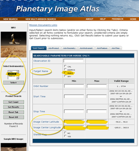
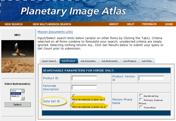
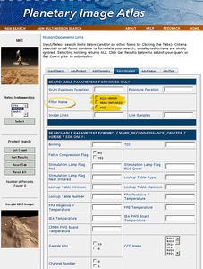
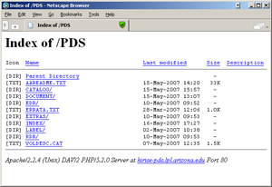
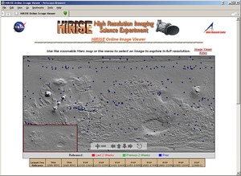
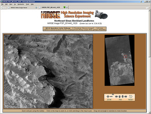
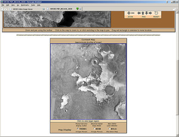
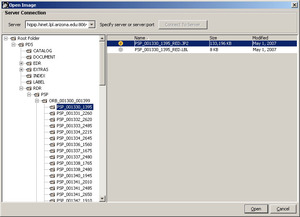
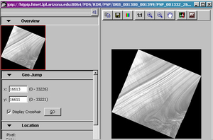
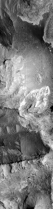

# Level0 HiRISE [¶](#Level0-HiRISE-)

-----

  - [Level0 HiRISE](#Level0-HiRISE-)
      - [Data Acquisition](#Data-Acquisition-)
          - [Planetary Image Atlas](#Planetary-Image-Atlas-)
              - [File Naming Convention](#File-Naming-Convention-)
              - [Search](#Search-)
              - [Browsing by Volume](#Browsing-by-Volume-)
              - [Related Resources](#Related-Resources-)
          - [HiRISE Online Image Viewer](#HiRISE-Online-Image-Viewer-)
          - [HiRISE Image Access Solutions
            Viewer](#HiRISE-Image-Access-Solutions-Viewer-)
      - [Ingestion](#Ingestion-)
      - [SPICE (Spacecraft & Planetary ephemeredes, Instrument C-matrix
        and Event
        kernels)](#SPICE-Spacecraft--Planetary-ephemeredes-Instrument-C-matrix-and-Event-kernels-)
      - [Raw Camera Geometry](#Raw-Camera-Geometry-)

## Data Acquisition [¶](#Data-Acquisition-)

-----

There are several resources and tools for searching, previewing, and
acquiring MRO HiRISE image data. The HiRISE team produces two types of
official [Planetary Data System (PDS)](http://pds.nasa.gov/) data
products from the HiRISE instrument:

  - **Experiment Data Record** (EDR). HiRISE EDRs contain the data
    collected by a single channel of the twenty eight available on the
    instrument and transmitted back to earth by the MRO spacecraft.
  - **Reduced Data Record** (RDR). HiRISE RDRs contain a radiometric
    calibrated, map projected, mosaic of multiple channels from a single
    observation. These products are stored in JPEG 2000 format.
    [JPEG 2000 overview on
    Wikipedia](http://en.wikipedia.org/wiki/JPEG_2000)

The following sites are useful for viewing and/or acquiring HiRISE data:

| Site                                                                                                                  | Products | Viewer | Interactive Global Map | Download Full Product |
| --------------------------------------------------------------------------------------------------------------------- | -------- | ------ | ---------------------- | --------------------- |
| [Planetary Data System (PDS) Imaging Node's Planetary Image Atlas](http://pds-imaging.jpl.nasa.gov/search/mro/hirise) | EDR,RDR  | Yes    | No                     | Yes                   |
| [HiRISE PDS Data Node](http://hirise-pds.lpl.arizona.edu/PDS/)                                                        | EDR,RDR  | No     | No                     | Yes                   |
| [HiRISE Online Image Viewer](http://marsoweb.nas.nasa.gov/HiRISE/hirise_images/)                                      | RDR      | Yes    | Yes                    | Yes                   |
| [HiRISE Image Access Solutions (IAS) Viewer](http://hirise.lpl.arizona.edu/iasclient/)                                | RDR      | Yes    | No                     | No                    |

The PDS archives these raw images in a standard format called the
Experiment Data Record (EDR). For a single HiRISE observation there may
be up to 28 EDR files which must be downloaded for processing.

PDS [Planetary Image Atlas](http://pds-imaging.jpl.nasa.gov/search/) ,
managed by the Jet Propulsion Laboratory (JPL) and USGS Astrogeology
Research Program, allows the user to search through the MRO database for
HiRISE, CTX, and MARCI products, and identify images based on various
parameters, such as orbit number, geographic location, and mission
phase. This tool includes both basic and advanced search capabilities.
The site offers both EDR and RDR data products.

The [HiRISE PDS Data Node](http://hirise-pds.lpl.arizona.edu/PDS/) at
the University of Arizona provides access to all publicly released
HiRISE EDR and RDR data products. All data products can be accessed in
the traditional PDS volume format on the site.

For viewing HiRISE RDRs, you can use the [HiRISE IAS
Viewer](HiRISE_IAS_Viewer?parent=Level0_HiRISE) to view RDR images and
save snapshots. The tool also provides some basic tools for viewing
metadata, adjusting the contrast, and navigation the image. This is a
good tool to use for browsing for images based on your region of
interest.

[HiRISE Online Image Viewer](http://hirise.lpl.arizona.edu/iasclient/)
allows you to select observations from a global map, preview images
online, and download RDR image data at various resolutions in JPEG or
JPEG 2000 format. This is a good tool to use for browsing for
observations in the PDS Data Node directory structure.

### Planetary Image Atlas [¶](#Planetary-Image-Atlas-)

    Screenshot of the Image Atlas 'Quick Search' options for
    Mars Reconnaissance Orbiter

The PDS Planetary Image Atlas, managed by the Jet Propulsion Laboratory
(JPL) and USGS Astrogeology Research Program, allows the user to search
through the HiRISE database and identify images based on parameters
entered by the user. This tool includes both basic and advanced search
capabilities.

The Planetary Data System (PDS) Imaging Node houses data from several
planetary missions, and offers a variety of methods for accessing their
holdings. For now, we will concentrate on acquiring MRO HiRISE data.

#### File Naming Convention [¶](#File-Naming-Convention-)

Deciphering the filename can be helpful both when searching for data and
also when managing files on your system. The PDS naming convention for
channel EDRs is

    PPP_XXXXXX_YYYY_CCD_CHANNEL.IMG

Where:

  - **PPP** is the mission phase
      - **AEB** Aerobraking
      - **TRA** Transition
      - **PSP** Primary Science Phase
      - **REL** Relay
      - **Exx** Extended missions (if needed)
  - **XXXXXX** is the orbit number
  - **YYYY** is the target code, which refers to the latitudinal
    position of the center of the planned observation relative to the
    start of the orbit. The first three digits are whole degrees, the
    fourth digit the fractional degrees rounded to 0.5 degrees. (example
    Mars target codes on a descending orbit: 0900 for 90.0° or
    south-pole, 1800 for 180.0° or equator, 2700 for 270.0° or
    north-pole)
  - **CCD** is the filter/CCD identifier RED0-RED9, IR10, IR11, BG12,
    BG13
  - **CHANNEL** is the channel number 0 or 1

For example, *PSP\_002733\_1880\_RED5\_0.IMG* is an image centered at
188.0° latitudinal degrees from the start of the orbit around Mars,
collected by channel 0 of CCD 5, red filter, during orbit 2733 of the
primary science phase. See the [Software Interface Specification for
HiRISE Experiment Data Record
Products](http://hirise.lpl.arizona.edu/pdf/HiRISE_EDR_RDR_Vol_SIS_2007_05_22.pdf)
(PDF) for additional details.

Similarly, the PDS naming convention for RDR mosaicked observation
products is

    PPP_XXXXXX_YYYY.IMG

#### Search [¶](#Search-)

The PDS [Planetary Image
Atlas](http://pds-imaging.jpl.nasa.gov/Missions/) provides a *Product
Search* tool to interrogate the collection of HiRISE images. This tool
lets us query information about each image and ignores the data that we
have no interest in. A good way to reduce the number of images to look
at is by defining an area of interest with latitude and longitude
ranges. You can also restrict the search by choosing a minimum and
maximum resolution. Remember to keep in mind the coordinate system (
*areocentric east* for HiRISE) and units (generally meters for
distances) required by the search tool. Launch the [Mars Reconnaissance
Orbiter Product Search](http://pds-imaging.jpl.nasa.gov/search/mro/) to
give it a try.

The table below lists the primary search parameters that can help you
narrow down the number of images that are returned by a search of the
PDS HiRISE image collection. The images below show screenshots of the
[MRO Product Search](http://pds-imaging.jpl.nasa.gov/search/mro/) . Note
there are two categories (the tabs above the search form) where these
search parameters are found: Quick Search and Instrument.

| Parameter                          | Notes                                                                                                                                                 |
| ---------------------------------- | ----------------------------------------------------------------------------------------------------------------------------------------------------- |
| General: **Instrument**            | Select HiRISE from the selection choices on the left side of the window.                                                                              |
| Quick Search: **Center Latitude**  | Enter minimum latitude and maximum latitude values that encompass the latitude range of your area of interest, in areographic west coordinates.       |
| Quick Search: **Center Longitude** | Enter minimum longitude and maximum longitude values that encompass the longitude range of your area of interest, in areographic west coordinates.    |
| Quick Search: **Target Name**      | Since we're interested in working with images of Mars, choose Mars so you don't have to wade through listings for other bodies.                       |
| Instrument: **Filter Name**        | If you're only interested in data from one particular filter, make the appropriate selection.                                                         |
| Product: **Data Set ID**           | For Isis processing, you'll want to work with EDR products, so select *MRO-M-HIRISE-2-EDR-V1.0* to filter the RDR products out of the search results. |

Once you've made your search parameter selections, click the *Get Count*
to see how many results your search will return, or *Get Results* to
perform the search and access the results.

    Screenshot of the Image Atlas 'Quick Search' options
    for the Mars Reconnaissance Orbiter

    Screenshot of the Image Atlas 'Quick Search' options
    for the Mars Reconnaissance Orbiter

    HiRISE PDS Data Node

#### Browsing by Volume [¶](#Browsing-by-Volume-)

You can also go to the online data and Browse Online Data Volumes, which
offers FTP access to the image data archive. This allows you to look at
the image and text files in the archive, where you can find more helpful
information. To give it a try, launch the [Planetary Image
Atlas](http://pds-imaging.jpl.nasa.gov/Missions/) in a new browser
window. Now click the [Mars Reconnaissance
Orbiter](http://pds-imaging.jpl.nasa.gov/Admin/resources/cd_mro.html)
Browse Online Data Volumes and choose a volume to look at. In each
volume, data are organized into subdirectories by product type, mission
phase, and orbit. Currently, the [HiRISE PDS Data
Node](http://hirise-pds.lpl.arizona.edu/PDS/) holds the data archive.

When you know the images that you would like to work with, you can go to
this area with an FTP tool (or web browser) and download the images. The
data areas of the FTP site are briefly described below:

  - **RDR** or **EDR** - for Isis processing, you'll want to browse the
    EDR directory \*\* **PSP** , etc. is the mission phase - Primary
    Science Phase (PSP) data is most likely what you'll want to use.
    \*\*\* **ORB\_\[start orbit\]\_\[end orbit\]** refers the orbit
    range. These directories contain the data files.

#### Related Resources [¶](#Related-Resources-)

  - [Planetary Image Atlas](http://pds-imaging.jpl.nasa.gov/Missions/)
  - [Planetary Image Atlas Help
    Pages](http://pds-imaging.jpl.nasa.gov/Atlas/intro.html)

### HiRISE Online Image Viewer [¶](#HiRISE-Online-Image-Viewer-)

The HiRISE Team has created a really nice web-based tool for viewing
HiRISE images. This view can be useful for searching for and previewing
observation images in your region of interest. The tool is available on
the [HiRISE Online Image
Viewer](http://marsoweb.nas.nasa.gov/HiRISE/hirise_images/) web page.

Shown in the screenshots below, this tool provides a navigable, global
overview map that displays the locations of observations as squares
color-coded by the age of the observation. Clicking on one of the
squares brings up that observation in an image viewer. Both the overview
map and the image viewer have navigation tools that allow you to pan and
zoom.

On the image viewer page, there are links to download small and large
JPEG image files, and huge JPEG 2000 image files of the image you are
currently viewing.

Below the image viewer, you will also find a context map indicating the
location of the HiRISE image. The base of the context image can be
chosen from Odyssey THEMIS, Viking MDIM, or MGS MOLA data.

    Global Overview Map: Map displays locations of observations
    as colored squares. Use the pan and zoom tools to move around
    the map. Click on a square to view the observation of that
    location.

    Image Viewer: Image viewer has zoom and pan tools for 
    navigating the image.

    Context Map: Below the image viewer is a context map 
    displaying an outline of the current observation.

### HiRISE Image Access Solutions Viewer [¶](#HiRISE-Image-Access-Solutions-Viewer-)

    HiRISE IAS Viewer, Open Remote File Image Selection Dialog

The HiRISE Image Access Solutions (IAS) Viewer can be useful for
browsing the archive of observation mosaics (RDR products) when
searching for data in your region of interest. The viewer can be
launched from the HiRISE JPEG 2000 Viewing Tools page.

From the *File* menu, choose *Open Remote File...* to open the image
selection dialog. An image selection dialog, like the one shown on the
right, will appear.

Type in the following address in the *Server* field

    hijpip.hinet.lpl.arizona.edu:8064

and click the *Connect to Server* button.

Once the application has connected to the server, a navigable folder
menu will appear on the left side of the window. Click the plus sign (+)
beside each folder to expand the folder tree:

    PDS
      RDR
        PSP

    HiRISE IAS Viewer

The PSP folder contains folders for each set of orbits, named
ORB\_\[start orbit\]\_\[end orbit\]. Expand the folder for the orbit
range you'd like, the select the folder for the image of choice. Click
the image file (the file ending with the file extension JP2) from the
right side of the screen, and click the Open button to view the image in
the main window.

Selecting an image will give you a display like that shown to the right,
and you will have many options for manipulating the image.

**Note: only the HiRISE RDRs can be opened and viewed with the IAS
viewer.**

The JPEG 2000 files used by this viewer are accessible via the JPIP
server *hijpip.hinet.lpl.arizona.edu:8064* . Additional tools and
information about JPEG 2000 can be found in the [Wikipedia
JPEG 2000](http://en.wikipedia.org/wiki/JPEG_2000) entry.

The Image Access Solutions Viewer is a product of ITT Visual Information
Solutions. (Any use of trade, product, or firm names in Isis web pages,
documents, or publications is for descriptive purposes only and does not
imply endorsement by the U.S. Government.)

## Ingestion [¶](#Ingestion-)

-----

    HiRISE image First 4000 lines of an 80000 line EDR taken
    during orbit number 2733. The image has been compressed
    four times in the line and sample directions.

In order to work with HiRISE data in Isis, the HiRISE EDR file must be
converted to an *Isis cube file* so Isis programs can read and process
the data.

EDR files should always have a file extension of *IMG* . These files
contain the image data as well as text describing the image data and the
state of the instrument at the time the image was taken. The text is in
the form of a standard \[\[media:PDS Sample label.txt|PDS label (click
to view example label file)\]\] located at the beginning of the file.
Only the information needed by other Isis programs is transferred from
the PDS label to the Isis cube label.

The program used to convert HiRISE EDR files to Isis cube files is
hi2isis. The following example shows the command line usage. The
resulting output file will be an Isis cube.

Example: ingesting a HiRISE EDR product into Isis:

    hi2isis from=PSP_002733_1880_RED4_0.IMG to=PSP_002733_1880_RED4_0.cub

The
[hi2isis](http://isis.astrogeology.usgs.gov/Application/presentation/Tabbed/hi2isis/hi2isis.html)
program also converts the image header, prefix and suffix data to Isis
Binary Large OBject (BLOBs) and has other parameters.

## SPICE ( **S** pacecraft & **P** lanetary ephemeredes, **I** nstrument **C** -matrix and **E** vent kernels) [¶](#SPICE-Spacecraft--Planetary-ephemeredes-Instrument-C-matrix-and-Event-kernels-)

-----

For additional information: [General SPICE Information](SPICE)

The application
[spiceinit](http://isis.astrogeology.usgs.gov/Application/presentation/Tabbed/spiceinit/spiceinit.html)
will add the appropriate SPICE information to the ISIS image cube. All
HiRISE Channels image cubes require spiceinit. Generally, you can simply
run
[spiceinit](http://isis.astrogeology.usgs.gov/Application/presentation/Tabbed/spiceinit/spiceinit.html)
with your input filename and no other parameters:

Example:

    spiceinit from=PSP_002733_1880_RED4_0.cub

## Raw Camera Geometry [¶](#Raw-Camera-Geometry-)

-----

Once spiceinit has been successfully applied to a raw ISIS image cube an
abundance of information can be computed and retrieved for geometry and
photometry.

  - [**Camera Geometry Overview and Applications**](Camera_Geometry)

[*Goto* Level1](Level1_HiRISE)

[Pia\_quick.png](attachments/download/1011/Pia_quick.png)
[View](attachments/download/1011/Pia_quick.png "View")
 (242 KB)   Ian Humphrey,
2016-05-31 05:23 PM 

[Pia\_prod.png](attachments/download/1012/Pia_prod.png)
[View](attachments/download/1012/Pia_prod.png "View")
 (190 KB)   Ian Humphrey,
2016-05-31 05:23 PM 

[Pia\_inst.png](attachments/download/1013/Pia_inst.png)
[View](attachments/download/1013/Pia_inst.png "View")
 (320 KB)   Ian Humphrey,
2016-05-31 05:24 PM 

[HiRISE\_PDS\_Data\_Node\_ScreenShot.jpg](attachments/download/1014/HiRISE_PDS_Data_Node_ScreenShot.jpg)
[View](attachments/download/1014/HiRISE_PDS_Data_Node_ScreenShot.jpg "View")
 (113 KB)   Ian Humphrey,
2016-05-31 05:24 PM 

[HIRISE\_Image\_Viewer\_shot1.jpg](attachments/download/1015/HIRISE_Image_Viewer_shot1.jpg)
[View](attachments/download/1015/HIRISE_Image_Viewer_shot1.jpg "View")
 (203 KB)   Ian Humphrey,
2016-05-31 05:24 PM 

[HIRISE\_Image\_Viewer\_shot2.jpg](attachments/download/1016/HIRISE_Image_Viewer_shot2.jpg)
[View](attachments/download/1016/HIRISE_Image_Viewer_shot2.jpg "View")
 (187 KB)   Ian Humphrey,
2016-05-31 05:24 PM 

[HIRISE\_Image\_Viewer\_shot3.jpg](attachments/download/1017/HIRISE_Image_Viewer_shot3.jpg)
[View](attachments/download/1017/HIRISE_Image_Viewer_shot3.jpg "View")
 (147 KB)   Ian Humphrey,
2016-05-31 05:24 PM 

[IAS\_Viewer\_OpenDialog.jpg](attachments/download/1018/IAS_Viewer_OpenDialog.jpg)
[View](attachments/download/1018/IAS_Viewer_OpenDialog.jpg "View")
 (111 KB)   Ian Humphrey,
2016-05-31 05:25 PM 

[IAS\_Viewer\_shot.jpg](attachments/download/1019/IAS_Viewer_shot.jpg)
[View](attachments/download/1019/IAS_Viewer_shot.jpg "View")
 (154 KB)   Ian Humphrey,
2016-05-31 05:25 PM 

[HiRISE\_Fullres\_Sample.png](attachments/download/1020/HiRISE_Fullres_Sample.png)
[View](attachments/download/1020/HiRISE_Fullres_Sample.png "View")
 (3.92 MB)   Ian
Humphrey, 2016-05-31 05:25 PM 

