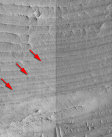
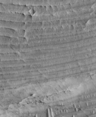

# Level1 HiRISE [¶](#Level1-HiRISE-)

-----

  - [Level1 HiRISE](#Level1-HiRISE-)
      - [HiRISE Radiometric
        Calibration](#HiRISE-Radiometric-Calibration-)
      - [Channel Stitching](#Channel-Stitching-)
      - [Noise Removal](#Noise-Removal-)
          - [Vertical Striping and Channel Tone
            Differences](#Vertical-Striping-and-Channel-Tone-Differences-)

## HiRISE Radiometric Calibration [¶](#HiRISE-Radiometric-Calibration-)

-----

A radiometric calibration product is representative of an ideal image
acquired by a camera system with perfect radiometric properties. Values
in the resulting image represent the reflectance of the surface (I/F).

General Overview of Radiometric Calibration: [Overview of Radiometric
Calibration](Overview_of_Radiometric_Calibration)

The radiometric calibration of HiRISE images has been a challenging work
in progress. The camera has 14 CCDs with separate readouts, and many
different operating modes such as pixel binning and time delay
integration. Understanding and solving the radiometric calibration for
HiRISE is like solving for 28 individual cameras. The HiRISE Science
Team is continually working on the calibration of their instrument, and
updates to the Isis software will be made over time as the calibration
sequence matures.

For now, run hical on each Isis cube in the observation.

The following example shows the command line for calibrating the image
from channel 0, red filter, CCD 5:

    hical from=PSP_002733_1880_RED5_0.cub to=PSP_002733_1880_RED5_0.cal.cub

See the following Isis documentation for information about the
applications you will need to use to perform this procedure:

  - [hical](http://isis.astrogeology.usgs.gov/Application/presentation/Tabbed/hical/hical.html)
    : radiometrically calibrates HiRISE channel images

## Channel Stitching [¶](#Channel-Stitching-)

-----

A special requirement for HiRISE is the reconstruction of the CCD data.
That is, merging the left and right channel data from an individual CCD
into a single image.

Recall the HiRISE instrument reads the data from one CCD into two
separate channels. The next step in level 1 processing is to combine the
two channel cubes back into an individual CCD image. The channels can be
merged using the
[histitch](http://isis.astrogeology.usgs.gov/Application/presentation/Tabbed/histitch/histitch.html)
program as follows:

    histitch from1=PSP_00273_1880_RED5_0.cal.cub from2=PSP_00273_1880_RED5_1.cal.cub \
             to=PSP_00273_1880_RED5.cal.cub

    Left three images: Data from channels 0 (left) and 1 (center) 
    of a red 5 image stitched together to create the full red 5 
    CCD image (right). The images shown here are scaled-down full 
    HiRISE channel images.
    
    Right three images: Close-up on a portion of the images shown 
    on the left. Data from channels 0 (left) and 1 (center) of a 
    red 5 image stitched together to create the full red 5 CCD 
    image (right). Note that in the final image, the data from 
    channel 0 appears on the right, and the data channel 1 appears
    on the left.

  - [histitch](http://isis.astrogeology.usgs.gov/Application/presentation/Tabbed/histitch/histitch.html)
    : combines two HiRISE channels to form a single CCD image

## Noise Removal [¶](#Noise-Removal-)

-----

For HiRISE, systematic noise appears as vertical striping, referred to
as furrows, which occur under certain observing conditions, and tonal
mismatches among the data sets collected by adjacent channels in a CCD.

General Overview: [Overview of Noise And
Artifacts](Overview_of_Noise_And_Artifacts)

### Vertical Striping and Channel Tone Differences [¶](#Vertical-Striping-and-Channel-Tone-Differences-)

This step may be removed as the radiometric calibration matures.

The current radiometric calibration of the HiRISE data may reveal
vertical striping noise in the CCD images. This is especially true for
data collected by CCDs which have shown degradation in data collected
over time (e.g., red 9). Additionally, tone differences caused by the
the electronic read-out of the left/right channels may not be fully
corrected by the calibration program. The
[cubenorm](http://isis.astrogeology.usgs.gov/Application/presentation/Tabbed/cubenorm/cubenorm.html)
application can be used to remove both the striping and left/right
normalization problems. The following example shows the command line for
removing the noise and tone mismatch from the CCD image using cubenorm:

    cubenorm from=PSP_002733_1880_RED5.cal.cub to=PSP_002733_1880_RED5.cal.norm.cub

    Before cubenorm: This image depicts problems with both vertical
    striping (red arrows) and left/right channel tone problem.

    After cubenorm: This image shows the results of the cubenorm 
    application, which removes both problems.

  - [cubenorm](http://isis.astrogeology.usgs.gov/Application/presentation/Tabbed/cubenorm/cubenorm.html)
    : normalizes values in a image

[*Goto* Level2](Level2_HiRISE)

[Merging\_Channel\_Images\_Example.jpg](attachments/download/1024/Merging_Channel_Images_Example.jpg)
[View](attachments/download/1024/Merging_Channel_Images_Example.jpg "View")
 (69.6 KB)   Ian
Humphrey, 2016-05-31 05:43 PM 

[Cubenorm\_Before.png](attachments/download/1025/Cubenorm_Before.png)
[View](attachments/download/1025/Cubenorm_Before.png "View")
 (196 KB)   Ian Humphrey,
2016-05-31 05:43 PM 

[Cubenorm\_After.png](attachments/download/1026/Cubenorm_After.png)
[View](attachments/download/1026/Cubenorm_After.png "View")
 (133 KB)   Ian Humphrey,
2016-05-31 05:43 PM 

