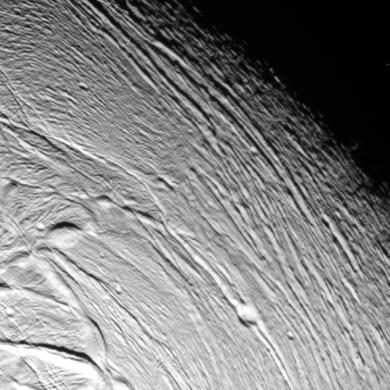

# Level 1 ISS [¶](#Level-1-ISS-)

-----

- [Level 1 ISS ¶](#level-1-iss-)
  - [ISS Radiometric Calibration ¶](#iss-radiometric-calibration-)
  - [Noise Removal ¶](#noise-removal-)
  - [Remove random pixel noise ¶](#remove-random-pixel-noise-)
- [**!!!!!!!!!!!!!!!!ENTER CASSINI ISS JAVASCRIPT WIDGET!!!!!!!!!!!!!!!!** ¶](#enter-cassini-iss-javascript-widget-)
  - [Fill-in NULL pixels ¶](#fill-in-null-pixels-)
  - [Random NULL pixels ¶](#random-null-pixels-)
  - [Truncated lines ¶](#truncated-lines-)
  - [Remove frame-edge noise ¶](#remove-frame-edge-noise-)
- [**!!!!!!!!!!!!!!!!!!!!!!!!!!!!!!ENTER JAVASCRIPT WIDGET!!!!!!!!!!!!!!!!!!!!!!!!!!** ¶](#enter-javascript-widget-)

## ISS Radiometric Calibration [¶](#ISS-Radiometric-Calibration-)

-----

  - [Overview of Radiometric
    Calibration](Overview_of_Radiometric_Calibration)

The application
[cisscal](http://isis.astrogeology.usgs.gov/Application/presentation/Tabbed/cisscal/cisscal.html)
applies the Cassini ISS radiometric calibration correction. ISIS3
*cisscal* was derived from the IDL 'CISSCAL' application developed by
the Cassini Imaging Central Laboratory for Operations (CICLOPS).
*cisscal* works for both the ISS Cameras; Narrow Angle (
[NAC](Working_with_Cassini_ISS_Data_) ) and Wide Angle (
[WAC](Working_with_Cassini_ISS_Data_) ).

  - <http://ciclops.org/index.php>

It is recommeded to specifty the output calibrated image cube units to
be in [I/F Units](Overview_of_Radiometric_Calibration) and
[32-bit](Understanding_Bit_Types) for precision.

Example:

    cisscal from=xxxx.cub to=xxxx_cal.cub fluxunits=I/F

## Noise Removal [¶](#Noise-Removal-)

-----

Occasionally an amount of random noise remains in the ISS image after
the calibration correction.

  - [Overview of Noise and Artifacts](Overview_of_Noise_and_Artifacts)

## Remove random pixel noise [¶](#Remove-random-pixel-noise-)

-----

Example:

    noisefilter from=xxxx_cal.cub to=xxxx_stdz.cub toldef=stddev tolmin=2.5 tolmax=2.5 replace=null samples=5 lines=5

This example runs the
[noisefilter](http://isis.astrogeology.usgs.gov/Application/presentation/Tabbed/noisefilter/noisefilter.html)
application, setting the boxcar size to 5x5 pixels and uses the standard
deviation option, replacing the noise pixels with NULL.

  - Thorough and accurate removal of random noise while retaining valid
    data can be a challenge. Initially, the process can be iterative in
    applying and evaluating results of **noisefilter** with various
    settings for boxcar size and tolerances. Often, noisefilter will be
    applied more than once with optimum settings to consecutive results
    of previous **noisefilter** runs.
  - Replacing the noise with NULL at this stage is recommended in order
    to visually evaluate what is removed. The NULL-ed pixels can be
    filled in later with the average of surrounding valid pixels by
    using the low pass filter application (
    [lowpass](http://isis.astrogeology.usgs.gov/Application/presentation/Tabbed/lowpass/lowpass.html)
    ). See [Filling in random NULL pixels](fixit.wr.usgs.gov) .
  - Replacing NULLs with the low pass filter application should be done
    **BEFORE** removing any frame-edge noise to avoid 'filling in' the
    'trimmed' edges

Hit **refresh** if an image is not displayed in black box

**Close up view of random pixel noise of an ISS-NAC image (Enceladus)**

# **\!\!\!\!\!\!\!\!\!\!\!\!\!\!\!\!ENTER CASSINI ISS JAVASCRIPT WIDGET\!\!\!\!\!\!\!\!\!\!\!\!\!\!\!\!** [¶](#ENTER-CASSINI-ISS-JAVASCRIPT-WIDGET-)

## Fill-in NULL pixels [¶](#Fill-in-NULL-pixels-)

-----

  - **Overview of Spacial Filters:** [The Power of Spatial
    Filters](https://DOI-USGS.github.io/ISIS3/gh-pages/The_Power_of_Spatial_Filters.html)

## Random NULL pixels [¶](#Random-NULL-pixels-)

-----

The resulting NULL-ed pixels from removing random pixel noise can be
filled in with the average of surrounding valid pixels. This is achieved
by applying the low pass filter application (
[lowpass](http://isis.astrogeology.usgs.gov/Application/presentation/Tabbed/lowpass/lowpass.html)
) with specific parameters settings to replace only NULL pixels. See
[Fill-in Null
Pixels](https://DOI-USGS.github.io/ISIS3/gh-pages/The_Power_of_Spatial_Filters.html)
.

  - Filling in the random NULL pixels at this stage will also fill-in
    the [truncated lines](fixit.wr.usgs.gov) that contain NULLs as well.
  - Replacing NULLs with the low pass filter application should be done
    **BEFORE** removing any [frame-edge noise](fixit.wr.usgs.gov) to
    avoid 'filling in' the 'trimmed' edges

**Example for filling-in NULLS:**

    lowpass from=xxx_stdz.cub to=xxxx_fill.cub samples=3 lines=3 filter=outside null=yes hrs=no his=no lrs=no replacement=center

  - If NULL pixels remain, lowpass can be applied consecutively on each
    output until the NULL's are completely filled with surrounding
    averages.

## Truncated lines [¶](#Truncated-lines-)

-----

A number of ISS images have truncated lines. These truncated lines will
contain valid data half way across in the sample direction with lines
above and below containing valid data across the entire sample
direction. The method to [Fill-in Null
Pixels](https://DOI-USGS.github.io/ISIS3/gh-pages/The_Power_of_Spatial_Filters.html)
using the (
[lowpass](http://isis.astrogeology.usgs.gov/Application/presentation/Tabbed/lowpass/lowpass.html)
) application works nicely in this case.

  - Filling in the random NULL pixels at this stage will also fill-in
    any [random NULL pixels](fixit.wr.usgs.gov) as well.
  - Replacing NULLs with the low pass filter application should be done
    BEFORE removing any [frame-edge noise](fixit.wr.usgs.gov) to avoid
    'filling in' the 'trimmed' edges.

**Example:**

|  |  |
| ----------------------------------------------- | ----------------------------------------------------- |

## Remove frame-edge noise [¶](#Remove-frame-edge-noise-)

-----

Many of the ISS calibrated images will still contain invalid data along
the edges within the first 1 to 2 pixels in the line and sample
direction. This edge artifact might not be visibly noticable until the
images are mosaicked together. This messy edge of the individual images
will become evident as this invalid data overlaps valid data of a
neighboring image.

Example:

    trim from=xxxx_fill.cub to=_xxxx_trim.cub top=2 bottom=2 left=2 right=2

The
[trim](http://isis.astrogeology.usgs.gov/Application/presentation/Tabbed/trim/trim.html)
application will replace the specified number of pixels along the edges
with NULL values ( [What Are Special
Pixels?](https://DOI-USGS.github.io/ISIS3/gh-pages/Special_Pixels.html)
).

*Hit* ***refresh*** *if an image is not displayed in black box*

**Close up view of upper left hand corner of an ISS-NAC image
(Enceladus)**

# **\!\!\!\!\!\!\!\!\!\!\!\!\!\!\!\!\!\!\!\!\!\!\!\!\!\!\!\!\!\!ENTER JAVASCRIPT WIDGET\!\!\!\!\!\!\!\!\!\!\!\!\!\!\!\!\!\!\!\!\!\!\!\!\!\!** [¶](#ENTER-JAVASCRIPT-WIDGET-)

Before/After trimming off edge noise

  - Be aware that any boxcar filtering that includes modification of
    NULL values, the resulting trimmed (NULL-ed) edges will also be
    modified.

[DropLines\_sm.png](attachments/download/1036/DropLines_sm.png)
[View](attachments/download/1036/DropLines_sm.png "View")
 (162 KB)   Makayla
Shepherd, 2016-06-01 09:05 AM 

[DropLinesFilled\_sm.png](attachments/download/1037/DropLinesFilled_sm.png)
[View](attachments/download/1037/DropLinesFilled_sm.png "View")
 (149 KB)   Makayla
Shepherd, 2016-06-01 09:05 AM 

