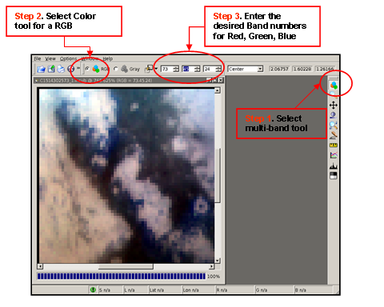

<div id="main">

<div id="content">

<div class="contextual">

</div>

<div class="wiki wiki-page">

<span id="Level1-VIMS"></span>

# Level1 VIMS [¶](#Level1-VIMS-)

-----

  - [Level1 VIMS](#Level1-VIMS-)
      - [VIMS Radiometric Calibration](#VIMS-Radiometric-Calibration-)
      - [Raw Camera Geometry](#Raw-Camera-Geometry-)
      - [Display a VIMS cube](#Display-a-VIMS-cube-)
  - [Qview Plot](#Qview-Plot-)
      - [Load and display a Multi-Band
        Cube](#Load-and-display-a-Multi-Band-Cube-)

<span id="VIMS-Radiometric-Calibration"></span>

## VIMS Radiometric Calibration [¶](#VIMS-Radiometric-Calibration-)

-----

  - [**Overview of Radiometric
    Calibration**](Overview_of_Radiometric_Calibration)

The application
[**vimscal**](http://isis.astrogeology.usgs.gov/Application/presentation/Tabbed/vimscal/vimscal.html)
applies the dark current and flatfield correction to the input VIMS
cube. vimscal requires ingestion into ISIS3 (vims2isis) and spiceinit
[(Level 0 processing)](Level0_VIMS)

Notes:

  - By default, the output calibrated image cube will be in [I/F
    Units](Overview_of_Radiometric_Calibration) and
    [32-bit](Understanding_Bit_Types) for precision.

  - All ISIS3 applications default to 'Tile' for output, regardless of
    the input file format

**Example:**

``` 
  vimscal from=v1514302573_1_ir.cub to=C1514302573_1_ir.cub
  vimscal from=v1514302573_1_vis.cub to=C1514302573_1_vis.cub
```

Sample image (v1514302573\_1) is a VIMS observation of Titan
\[Sequence\_Id=S17; Observation\_Id=VIMS\_019TI\_HDAC001\]

IR Portion: Samples=64 x Lines=64 x Bands=256

VIS Portion: Samples=64 x Lines=64 x Bands=96

<span id="Raw-Camera-Geometry"></span>

## Raw Camera Geometry [¶](#Raw-Camera-Geometry-)

-----

Camera geometry for a Level 1 VIMS observation can be accessed following
a successful spiceinit (Level 0 Processing).  
See [**Raw Camera Geometry**](Camera_Geometry)

<span id="Display-a-VIMS-cube"></span>

## Display a VIMS cube [¶](#Display-a-VIMS-cube-)

-----

<span id="Qview-Plot"></span>

# Qview Plot [¶](#Qview-Plot-)

-----

<span id="Load-and-display-a-Multi-Band-Cube"></span>

## Load and display a Multi-Band Cube [¶](#Load-and-display-a-Multi-Band-Cube-)

  - Qview will load an entire multi-band cube into memory.  

**Display Single Band in Black and White**

Each Band can be selected to view as follows:


**Display a Red, Green, Blue color composite**



</div>

<div style="clear:both;">

</div>

</div>

</div>
