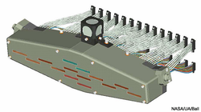
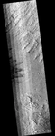
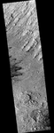
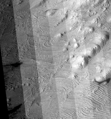
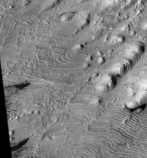

# Level2 HiRISE [¶](#Level2-HiRISE-)

-----

  - [Level2 HiRISE](#Level2-HiRISE-)
      - [Overview](#Overview-)
      - [Map Projecting HiRISE Images](#Map-Projecting-HiRISE-Images-)
      - [Tone Match](#Tone-Match-)
      - [Mosaicking](#Mosaicking-)
      - [Related Isis Applications](#Related-Isis-Applications-)

## Overview [¶](#Overview-)

-----

In this section, we'll discuss how to create a Level 2 HiRISE image.
Following Level0 and Level1, there should be up to 14 CCD images that
have had spiceinit successfully applied, are radiometrically calibrated
and have had noise removed.

    Focal Plane Assembly Each CCD has 2048 pixels in the cross
    scan direction The 14 staggered CCDs overlap by 48 pixels
    at each end. This provides an effective swath width of 
    approximately 20,000 pixels for the red images and 4,048
    pixels for the blue-green and near infrared images. 
    Credit: NASA/UA/Ball

Constructing a map projected HiRISE observation image is much more
difficult than most instruments. There are 14 Charge-Coupled Devices
(CCD) in the camera, ten red, two infrared, and two blue-green. When the
camera electronics read out the image data, each CCD is broken in two
halves (left and right channels). On the ground, the data for one
observation ends up stored in 28 image files (14 CCDs x 2 channels per
CCD). The goal of this lesson is to show the necessary steps to combine
the CCD images into a single mosaic.

The Level2 process involves the following:

  - **Geometric transformation** of each CCD image from spacecraft
    camera orientation to a common map coordinate system
  - **Correction of tonal mismatches** among the projected images. Prior
    to mosaicking the projected CCD images, it is optional to fix tonal
    mismatches among the projected images. As the radiometric
    calibration becomes more accurate, this step could be eliminated.
  - **Creation of a HiRISE observation mosaic** of the tone matched CCD
    images to create a complete HiRISE observation image.

The results of this process will be an uncontrolled observation mosaic,
meaning that the output map will only be as accurate as the original
SPICE allows. Software and procedures for creating controlled (adjusted
SPICE) mosaics are underway. Information and documentation will be
released on our site.

For additional information, refer to:

[Learning About Map Projections](Learning_About_Map_Projections)

[Overview of Map Projecting Images](Overview_of_Map_Projecting_Images)

## Map Projecting HiRISE Images [¶](#Map-Projecting-HiRISE-Images-)

-----

To assemble our HiRISE observation mosaic from the CCD images, we will
use the application
[**cam2map**](http://isis.astrogeology.usgs.gov/Application/presentation/Tabbed/cam2map/cam2map.html)
to convert each CCD image to a map projected image. We'll show here how
to easily match the projection information among the CCD images.
Alternatively, you can define your own map file using the
[**maptemplate**](https://isis.astrogeology.usgs.gov/Application/presentation/Tabbed/maptemplate/maptemplate.html)
application. The first step is to project one of the CCD images, usually
red 5 as it is in the center of the observation:

    cam2map from=PSP_002733_1880_RED5.norm.cub to=PSP_002733_1880_RED5.sinu.cub

The default projection for **cam2map** is sinusoidal, so the resulting
red 5 CCD image is now in sinusoidal projection. As with many Isis
applications, **cam2map** has several parameters, but the default values
for these parameters will result in good projection results.

The output cube contains all the mapping parameters we need for
projecting the remaining CCD images so they can be mosaicked. To process
the remaining CCD images, use the following command:

    cam2map from=PSP_002733_1880_?.norm.cub \
            to=PSP_002733_1880_?.sinu.cub \
            map=PSP_002733_1880_RED5.sinu.cub pixres=map

  - **Quick Tip** : We use the **red 5 sinusoidal cube** as our map
    file. The remaining CCD images will use the same projection
    parameters as red 5, which is required for mosaicking the CCD images
    into our final observation image.

See the following Isis documentation for information about the
applications you will need to use to perform this procedure:

  - [**maptemplate**](https://isis.astrogeology.usgs.gov/Application/presentation/Tabbed/maptemplate/maptemplate.html)
    : generates a map file that can be used to project images
  - [**cam2map**](http://isis.astrogeology.usgs.gov/Application/presentation/Tabbed/cam2map/cam2map.html)
    : geometrically transforms a raw camera image to a map projected
    image

## Tone Match [¶](#Tone-Match-)

-----

Tone matching among the CCD images will be necessary until the
radiometric calibration procedure matures. To illustrate the need for
tone matching, the example images on the right show a mosaic with and
without the CCD image normalization. Here, we will make a mosaic of the
red CCD images. The infrared and blue-green CCD images follow a similar
process.

In order to tone match the CCD images, we use the equalizer application
program to normalize the images.

1.  **Hold** the tone of the red 5 CCD image. That is, the pixel values
    in the red 5 CCD image will not be changed. Create a list containing
    the filenames of the images that will be held. In this example, the
    red 0 through 4 and 6 through 9 CCD images will be normalized to the
    the red 5 image:

<!-- end list -->

    ls *RED5.cub > hold.lis

1.  Create a list containing the filenames of red 5 images to be
    normalized in preparation for creating the mosaic. The contrast and
    brightness of these images will be updated so that tones match the
    red 5 image listed in the hold list. We are effectively normalizing
    to the red 5 calibration. Note the equalizer program does a
    statistical analysis among only the pixels in the overlap regions to
    determine the corrections to the contrast and brightness
    differences.

<!-- end list -->

    ls *RED*.cub > redCCD.lis

1.  Run the
    [**equalizer**](https://isis.astrogeology.usgs.gov/Application/presentation/Tabbed/equalizer/equalizer.html)
    application using the two lists created above as input. *equalizer*
    automatically generates output filenames with the extension
    .equ.cub. The output results will be ten cubes (red CCD 0 through 9
    images) with the extension .equ.cub added to each filename.

<!-- end list -->

    equalizer fromlist=redCCD.lis holdlist=hold.lis

## Mosaicking [¶](#Mosaicking-)

-----

Finally we will construct the mosaic. A new list of the equalized cube
filenames is required as input to
[automos](https://isis.astrogeology.usgs.gov/Application/presentation/Tabbed/automos/automos.html)
.  
**Note** : Make sure you only add filenames for one observation (or
adjacent observations) to the list file, otherwise *all* the images in
the list will be mosaicked into a single output image.

    ls *RED*.equ.cub > mosaic.lis
    automos fromlist=mosaic.lis to=redMosaic.cub

## Related Isis Applications [¶](#Related-Isis-Applications-)

-----

See the following Isis documentation for information about the
applications you will need to use to perform this procedure:

  - [**equalizer**](https://isis.astrogeology.usgs.gov/Application/presentation/Tabbed/equalizer/equalizer.html)
    : tone match overlapping map projected images
  - [**automos**](https://isis.astrogeology.usgs.gov/Application/presentation/Tabbed/automos/automos.html)
    : automatically mosaic a list of map projected images

    Full view of the red 5 mosaic **without** equalization

    Full view of the red 5 mosaic **with** equalization

    Close-up of red 5 mosaic **without** equalization

    Close-up of red 5 mosaic **with** equalization

[Tone\_Matching\_Close\_Up\_With\_EQ.png](attachments/download/1027/Tone_Matching_Close_Up_With_EQ.png)
[View](attachments/download/1027/Tone_Matching_Close_Up_With_EQ.png "View")
 (665 KB)   Ian Humphrey,
2016-05-31 05:45 PM 

[Tone\_Matching\_Close\_Up\_Without\_EQ.png](attachments/download/1028/Tone_Matching_Close_Up_Without_EQ.png)
[View](attachments/download/1028/Tone_Matching_Close_Up_Without_EQ.png "View")
 (605 KB)   Ian Humphrey,
2016-05-31 05:45 PM 

[Tone\_Matching\_With\_EQ.png](attachments/download/1029/Tone_Matching_With_EQ.png)
[View](attachments/download/1029/Tone_Matching_With_EQ.png "View")
 (281 KB)   Ian Humphrey,
2016-05-31 05:45 PM 

[Focalplaneassembly.png](attachments/download/1030/Focalplaneassembly.png)
[View](attachments/download/1030/Focalplaneassembly.png "View")
 (125 KB)   Ian Humphrey,
2016-05-31 05:45 PM 

[Tone\_Matching\_Without\_EQ.png](attachments/download/1073/Tone_Matching_Without_EQ.png)
[View](attachments/download/1073/Tone_Matching_Without_EQ.png "View")
 (249 KB)   Ian Humphrey,
2016-06-01 11:26 AM 

