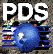
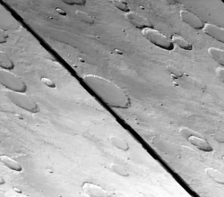
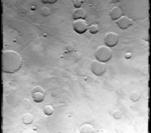

<div id="main">

<div id="content">

<div class="contextual">

</div>

<div class="wiki wiki-page">

<span id="Locating-and-Ingesting-Image-Data"></span>

# Locating and Ingesting Image Data [¶](#Locating-and-Ingesting-Image-Data-)

-----

This lesson will help you locate planetary datasets that are of interest
to you. When you have located the image data, this lesson will help you
prepare the data so you can process it in the ISIS3 system.

  - [Locating and Ingesting Image
    Data](#Locating-and-Ingesting-Image-Data-)
      - [Planetary Image Atlas](#Planetary-Image-Atlas-)
          - [Venus](#Venus-)
          - [Moon](#Moon-)
          - [Mars](#Mars-)
          - [Outer planets](#Outer-planets-)
      - [Power Tips for the PDS Image
        Atlas](#Power-Tips-for-the-PDS-Image-Atlas-)
      - [Using the Cumulative Index and
        Table](#Using-the-Cumulative-Index-and-Table-)
          -   - [Where do I find the Cumulative Index and Table
                files?](#Where-do-I-find-the-Cumulative-Index-and-Table-files-)
      - [Other Planetary Image Data
        Resources](#Other-Planetary-Image-Data-Resources-)
      - [Introduction to Importing](#Introduction-to-Importing-)
      - [General Importers](#General-Importers-)
          - [Planetary Data System (PDS) labeled image
            files](#Planetary-Data-System-PDS-labeled-image-files-)
      - [Raw image files](#Raw-image-files-)
          - [Video Image Communication and Retrieval (VICAR) image
            files](#Video-Image-Communication-and-Retrieval-VICAR-image-files-)
      - [Importing Mission Data](#Importing-Mission-Data-)

<span id="Planetary-Image-Atlas"></span>

## Planetary Image Atlas [¶](#Planetary-Image-Atlas-)

-----

Overview of the Planetary Data System [PDS](http://pds.nasa.gov/) Image
Atlas

Planetary Image Atlas

The internet has greatly improved the ability to locate and download
planetary data. The Planetary Data System (PDS) Planetary Image Atlas is
the most comprehensive source for planetary data from current and past
planetary missions. The web site provides tools to help you find image
data that covers your area of interest in the vast quantities available.

 [Planetary Data System
Image Atlas.](http://pdsimg.jpl.nasa.gov/Atlas)

Data can be found for each planet, some example mission and instrument listed below.

<span id="Venus"></span>

### Venus [¶](#Venus-)

  - *Magellan* : Synthetic Aperature Radar (SAR)

<span id="Moon"></span>

### Moon [¶](#Moon-)

  - *Clementine* : Star Tracker A and B (STAR-A and STAR-B), High
    Resolution (HIRES), Long Wave Infrared (LWIR), Near Infrared (NIR),
    and Ultraviolet/Visible (UVVIS)

<span id="Mars"></span>

### Mars [¶](#Mars-)

  - *Mars Odyssey* : Thermal Emission Imaging System
    [THEMIS](http://themis-data.asu.edu/) , and Gamma Ray Spectrometer
    (GRS)
  - *Mars Exploration Rovers* : Hazard Cameras (HAZCAM), Navigation
    Cameras (NAVCAM), Microscopic Imager (MI), and Panorama Cameras
    (PANCAM),
  - *Mars Global Surveyor* : Mars Orbiter Camera
    [MOC](http://ida.wr.usgs.gov/) , and Mars Orbiter Laser Altimeter
    (MOLA)
  - *Pathfinder* : Imager for Mars Pathfinder (IMP), Rover (navigation
    and hazard avoidance system cameras), Alpha Proton X-Ray
    Spectrometer (APXS), and Meteorology Package (MET)
  - *Viking Landers* : Lander Camera System (LCS)
  - *Viking Orbiter* : Visible (VIS A and B)

<span id="Outer-planets"></span>

### Outer planets [¶](#Outer-planets-)

  - *Voyager* : Imaging Science Subsystem Narrow Angle (ISS-NA)and Wide
    Angle (ISS-WA)
  - *Galileo* : Solid State Imaging (SSI) and Near-Infrared Mapping
    Spectrometer (NIMS)
  - *Cassini* : Imaging Science Subsystem ( [ISS](ISS) ), Visual and
    Infrared Mapping Spectrometer ( [VIMS](VIMS) )

<span id="Power-Tips-for-the-PDS-Image-Atlas"></span>

## Power Tips for the PDS Image Atlas [¶](#Power-Tips-for-the-PDS-Image-Atlas-)

-----

Finding exactly the data you want for your project can be challenging.
The following tips and tools may help to you get the results you want
and weed out the ones you don't.

  - **Increase the size of the latitude and longitude box for search** .
    In your initial searches that use latitudes and longitudes to find
    image coverage, it is a good idea to increase the bounds of your
    search. This will help you find images where the camera pointing
    indicates the image is outside your area of interest but are
    actually within it. For the Viking mission, your data search
    boundaries should be increased by as much as 5 degrees to account
    for pointing errors for the camera.
  - **Use advanced parameters to refine your search, but don't overdo
    it** . For many data sets there are other search parameters that can
    be entered in addition to the basic Quick Search options. Look above
    the main search form for a tool bar with tabs such as Geometry,
    Instrument, Features, and Time. Click one of the tabs to access
    additional search parameters related to that particular category.
    For example, if you're searching for Microscopic Imager images from
    the Mars Exploration Rover mission, the [PDS Image Atlas search
    page](http://pds-imaging.jpl.nasa.gov/search/) has an option under
    the Instrument tab to search for images with the dust filter open or
    closed.
  - **Use the cumulative index to interrogate the collection** .
    Datasets within the Planetary Data System are not limited to digital
    image data. For each mission, there are also text files that contain
    information about the image data. The cumulative index will be
    covered in more detail later in this lesson.

<span id="Using-the-Cumulative-Index-and-Table"></span>

## Using the Cumulative Index and Table [¶](#Using-the-Cumulative-Index-and-Table-)

-----

Use the cumulative index to interrogate the collection. Data sets within
the Planetary Data System are not limited to digital image data. For
each mission, there are also text files that contain information about
the image data. Two files that can prove useful in locating data that
will meet your needs are the Cumulative Index table and the Cumulative
Index label. As the name implies, the "table" is added to throughout the
life of the mission. You will want to find the final volume of the
collection so that all the products will be represented.

  - **Cumulative Index Table** - This file is a table of text that
    contains information about all the images for a mission up to some
    date during the mission. You will probably want to find the final
    volume of a collection so all the products will be represented in
    the table. The format of the table allows you to use word processing
    or spreadsheet programs to view the data. You can also write
    programs or scripts that can interrogate the values and return
    results. There are many types of information for each image in the
    collection. You will find information about the instrument that
    acquired the image, such as the instrument name and the filter used.
    You can also obtain information that may prove useful in the
    calibration of an image. Another useful value is the media volume
    the image data resides on.
  - **Cumulative Index Label** - This file is a text file that describes
    each field in the cumulative index table.

<span id="Where-do-I-find-the-Cumulative-Index-and-Table-files"></span>

#### Where do I find the Cumulative Index and Table files? [¶](#Where-do-I-find-the-Cumulative-Index-and-Table-files-)

These files are included in the directory structure for a mission's
[PDS](http://pds.nasa.gov/) data distribution. The data distribution is
generally designed to be put on CD-ROM, and can be accessed through the
PDS Image Atlas. On the Image Atlas front page, **click Online Data
Volumes** for a particular mission. You'll be presented a list of all
the volumes (effectively, a CD-ROMs worth of data and information).
Click the last volume on the list to get a file list for that volume:
you should see a directory named INDEX - this is where the Cumulative
Index and Table files are stored, as well as the index and table files
for this specific volume.

**Try it\!**

  - [PDS Image Atlas](http://pdsimg.jpl.nasa.gov/Missions/index.html)
    click on the Data Volumes Index link on the upper left
      - [PDS Image Volume](http://pds-imaging.jpl.nasa.gov/volumes/) in
        the By Mission column, click on the Full Resolution UVVIS
        Digital Image Model in the Clementine section
      - [Clementine CD-ROM/Online Data
        Volumes](http://pdsimg.jpl.nasa.gov/Admin/resources/cd_clementine.html#clmUVVIS)
        under the Mission to the Moon: Full Resolution Clementine UVVIS
        Digital Image Model section, find the last volume listed. Click
        on one of the two volume icons.
          - [Final Volume -
            cl\_4078](http://pdsimage.wr.usgs.gov/archive/clem1-l-u-5-dim-uvvis-v1.0/cl_4078/)
            Click on the index folder.
          - [Index
            directory](http://pdsimage.wr.usgs.gov/archive/clem1-l-u-5-dim-uvvis-v1.0/cl_4078/index/)
              - [Cumulative Index
                cumindex.lbl](http://pdsimage.wr.usgs.gov/archive/clem1-l-u-5-dim-uvvis-v1.0/cl_4078/index/cumindex.lbl)
              - [Cumulative Table
                cumindex.tab](http://pdsimage.wr.usgs.gov/archive/clem1-l-u-5-dim-uvvis-v1.0/cl_4078/index/cumindex.tab)

<span id="Other-Planetary-Image-Data-Resources"></span>

## Other Planetary Image Data Resources [¶](#Other-Planetary-Image-Data-Resources-)

-----

The following are just a few sites distributing planetary data.

  - The [ASU Mars 2001 Odyssey THEMIS](http://themis-data.asu.edu/) data
    distribution web site provides another source for THEMIS imagery.
  - MGS MOC data can be found on [USGS PDS Mars Global Surveyor Mars
    Orbiter Camera (MOC) Image Collection](http://ida.wr.usgs.gov/) .
  - [JMARS](http://jmars.asu.edu/)

<span id="Introduction-to-Importing"></span>

## Introduction to Importing [¶](#Introduction-to-Importing-)

-----

The job of ingestion programs is to convert the image from another file
format to one ISIS3 applications understand (i.e., the ISIS3 cube
format). Once a file has been imported, you can use ISIS3 programs to
view and manipulate the data. When ingesting data into ISIS3, there are
multiple applications in two major categories which can be used to
import a file -- choose the one that is best for your data set:

  - **General Importers** - are used to convert image files in non-ISIS3
    cube format such as PDS, JPEG or PNG to standard ISIS3 cube format.
  - **Mission Data Importers** - are used to convert specific mission
    image files such as [MOC](http://ida.wr.usgs.gov/) Wide Angle or
    [THEMIS](http://themis-data.asu.edu/) IR to ISIS3 cube format.

<span id="General-Importers"></span>

## General Importers [¶](#General-Importers-)

-----

These applications output an ISIS3 formatted cube with an ISIS3 header
that contains the minimum required basic keywords for general ISIS3
processing. A few examples of general processing are stretching,
filters, and generating histograms. It is important to note that these
import applications neither create the necessary labels for mission
specific applications such as radiometric calibration and noise removal,
nor can the cubes created by them be projected.

<span id="Planetary-Data-System-PDS-labeled-image-files"></span>

### Planetary Data System (PDS) labeled image files [¶](#Planetary-Data-System-PDS-labeled-image-files-)

**pds2isis**

This application will import a [PDS](http://pds.nasa.gov/) labeled image
file into an ISIS3 cube. Only a minimal set of label keywords required
by ISIS3 will be put into the output file. No translation of mission
specific keywords will be done. Read the help page for
[**pds2isis**](https://isis.astrogeology.usgs.gov/Application/presentation/Tabbed/pds2isis/pds2isis.html)
.

*Example command line* :

``` 
 pds2isis FROM=mars_viking.pds TO=mars_viking.cub
```

**Try it\!**

Download a sample PDS file (
[Mars\_viking.pds.gz](attachments/download/1048/Mars_viking.pds.gz) ),
convert it to an ISIS3 cube, and view it using qview.

<span id="Raw-image-files"></span>

## Raw image files [¶](#Raw-image-files-)

-----

**raw2isis**

This application imports raw image files into an ISIS3 cube. Bytes can
be swapped if necessary and there are options to create special pixels.
It is very important the *correct number of lines and samples is
provided* to the application -- incorrect values will result in a
garbled output image.

| [](attachments/download/901/incorrect.png "Raw2isis")                                      |
| ----------------------------------------------------------------------------------------------------------------------------------------- |
| Incorrect use of **raw2isis** to import an image from raw format. We provided 1203 instead of 1204 for samples parameter                  |
| [](attachments/download/902/correct.png "Raw2isis")                                          |
| Correct use of **raw2isis** to import an image from raw format. This time, we provided the correct value (1204) for the samples parameter |

You must also know if the incoming raw file has a header and what the
size of the header is. If the raw file has a header, you must use the
parameter "skip" to skip over any header information that is in the raw
file. Read the help page for
[**raw2isis**](https://isis.astrogeology.usgs.gov/Application/presentation/Tabbed/raw2isis/raw2isis.html)
for more about the parameters and use of **raw2isis** .

*Example command line:*

    raw2isis FROM=image.raw TO=image.cub
             samples=1204 lines=1056
             bittype=UNSIGNEDBYTE skip=2137

**Try it\!**

Download a sample RAW file (
[Mars\_viking.raw.gz](attachments/download/1046/Mars_viking.raw.gz) ),
convert it to an ISIS3 cube, and view it using qview. Hint: the image is
1024 lines by 1024 samples, and has a 4019 byte header.

<span id="Video-Image-Communication-and-Retrieval-VICAR-image-files"></span>

### Video Image Communication and Retrieval (VICAR) image files [¶](#Video-Image-Communication-and-Retrieval-VICAR-image-files-)

**vicar2isis**

This application imports VICAR formatted image files into ISIS3 cubes.
No translation of mission specific VICAR labels is done. Read the help
page for
[**vicar2isis**](http://isis.astrogeology.usgs.gov/Application/presentation/Tabbed/vicar2isis/vicar2isis.html)
.

*Example command line:*

    vicar2isis FROM=mexpress_vicar.img TO=mexpress_vicar.cub

**Try it\!**

Download a sample VICAR file (
[Mexpress\_vicar.img.gz](attachments/download/1047/Mexpress_vicar.img.gz)
), convert it to an ISIS3 cube, and view it using qview.

<span id="Importing-Mission-Data"></span>

## Importing Mission Data [¶](#Importing-Mission-Data-)

-----

Mission-specific ingestion applications are used to ingest data
distributed for specific missons. These applications will output ISIS3
formatted cube files that have mission-specific keywords in the labels.
These keywords are required for calibration and projection processing
tasks. Often, there will be mission specific applications for
calibrating, correcting, analyzing, and enhancing a mission data set.
These programs require the keywords from the mission-specific ingestion
applications and will not work properly if a general ingestion
application is used.

  - [**ciss2isis**](https://isis.astrogeology.usgs.gov/Application/presentation/Tabbed/ciss2isis/ciss2isis.html)
    : Import a Cassini ISS VICAR image file into ISIS
  - [**moc2isis**](https://isis.astrogeology.usgs.gov/Application/presentation/Tabbed/moc2isis/moc2isis.html)
    : Import [PDS](http://pds.nasa.gov/) formatted
    [MOC](http://ida.wr.usgs.gov/) image cube into ISIS3 format cube
  - [**thm2isis**](https://isis.astrogeology.usgs.gov/Application/presentation/Tabbed/thm2isis/thm2isis.html)
    : Import a [THEMIS](http://themis-data.asu.edu/) IR/VIS RDR or
    [EDR](EDR)
  - [**hi2isis**](https://isis.astrogeology.usgs.gov/Application/presentation/Tabbed/hi2isis/hi2isis.html)
    : Import [HiRISE](HiRISE) [EDR](EDR) images into ISIS3 cube format
  - [**vik2isis**](https://isis.astrogeology.usgs.gov/Application/presentation/Tabbed/vik2isis/vik2isis.html)
    : Import [PDS](http://pds.nasa.gov/) formatted Viking [EDR](EDR)
    into ISIS3 format cube

**Try it\!**

  - [Find and download a Mars Global Surveyor Mars Orbiter Camera
    image](http://ida.wr.usgs.gov/graphical.htm) (hint: the "Download
    Standard Compressed Data Product" link will give you a file ending
    in .imq - this is a [PDS](http://pds.nasa.gov/) formatted
    [MOC](http://ida.wr.usgs.gov/)
  - Convert the MOC file to an ISIS3 cube using
    [**moc2isis**](http://isis.astrogeology.usgs.gov/Application/presentation/Tabbed/moc2isis/moc2isis.html)
  - View the imported file using
    [**qview**](http://isis.astrogeology.usgs.gov/Application/presentation/Tabbed/qview/qview.html)

</div>

<div class="attachments">

<div class="contextual">

</div>

[Pds.gif](attachments/download/900/Pds.gif)
[View](attachments/download/900/Pds.gif "View") <span class="size">
(3.01 KB) </span> <span class="author"> Ian Humphrey, 2016-05-31 01:55
PM </span>

[incorrect.png](attachments/download/901/incorrect.png)
[View](attachments/download/901/incorrect.png "View")
<span class="size"> (344 KB) </span> <span class="author"> Ian Humphrey,
2016-05-31 01:58 PM </span>

[correct.png](attachments/download/902/correct.png)
[View](attachments/download/902/correct.png "View") <span class="size">
(349 KB) </span> <span class="author"> Ian Humphrey, 2016-05-31 01:58 PM
</span>

[Mars\_viking.raw.gz](attachments/download/1046/Mars_viking.raw.gz)
<span class="size"> (502 KB) </span> <span class="author"> Ian Humphrey,
2016-06-01 10:44 AM </span>

[Mexpress\_vicar.img.gz](attachments/download/1047/Mexpress_vicar.img.gz)
<span class="size"> (1.16 MB) </span> <span class="author"> Ian
Humphrey, 2016-06-01 10:44 AM </span>

[Mars\_viking.pds.gz](attachments/download/1048/Mars_viking.pds.gz)
<span class="size"> (502 KB) </span> <span class="author"> Ian Humphrey,
2016-06-01 10:44 AM </span>

</div>

<div style="clear:both;">

</div>

</div>

</div>
