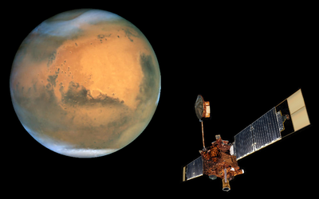

# Mars Global Surveyor Mission [¶](#Mars-Global-Surveyor-Mission-)

-----

  - [Mars Global Surveyor Mission](#Mars-Global-Surveyor-Mission-)
      - [Brief Mission Summary](#Brief-Mission-Summary-)
          - [Science Goals](#Science-Goals-)
          - [Science Instruments](#Science-Instruments-)
      - [References & Related
        Resources](#References--Related-Resources-)
          - [Mars Global Surveyor (MGS) Mission and
            Instrument](#Mars-Global-Surveyor-MGS-Mission-and-Instrument-)
          - [Mars Orbiter Camera (MOC)](#Mars-Orbiter-Camera-MOC-)
          - [Planetary Data System (PDS) Information and Data Search
            Tools](#Planetary-Data-System-PDS-Information-and-Data-Search-Tools-)

## Brief Mission Summary [¶](#Brief-Mission-Summary-)

-----

Mars Global Surveyor (MGS) was launched in 1996 with a successful Mars
Orbit Insertion in September, 1997. In November, 2006, the spacecraft
stopped transmitting. (See also:
[mars.jpl.nasa.gov](http://mars.jpl.nasa.gov/mgs/) )

|  |
| ------------------------------------------------------------------------------------------------------------------------------------------------ |
| Mars Global Surveyor Artist's concept                                                                                                            |

### Science Goals [¶](#Science-Goals-)

The primary science goals of MGS were to determine whether life ever
existed on Mars, to characterize the climate of Mars, to characterize
the geology of Mars, and to prepare for human exploration. The
instruments onboard the spacecraft were designed to help achieve these
goals.

### Science Instruments [¶](#Science-Instruments-)

The instruments on the MGS spacecraft were:

  - [**Mars Orbiter Camera**
    (MOC)](Working_with_Mars_Orbiter_Camera_Data_)
  - **Mars Orbiter Laser Altimeter** (MOLA)
  - **Thermal Emission Spectrometer** (TES)
  - **Electron Reflectometer** (MAGNETOMETER)
  - **Gravity Field Experiment** (RADIO SCIENCE)

## References & Related Resources [¶](#References--Related-Resources-)

-----

### Mars Global Surveyor (MGS) Mission and Instrument [¶](#Mars-Global-Surveyor-MGS-Mission-and-Instrument-)

  - [Mission Overview](http://mars.jpl.nasa.gov/mgs/)

### Mars Orbiter Camera (MOC) [¶](#Mars-Orbiter-Camera-MOC-)

  - [Instrument
    Overview](http://mars.jpl.nasa.gov/mgs/mission/sc_instruments.html)
  - [Instrument
    Team](http://www.msss.com/all_projects/mgs-mars-orbiter-camera.php)
  - [Online data
    volumes](http://pds-imaging.jpl.nasa.gov/volumes/mgs.html#mgsMOCDSDP)

### Planetary Data System (PDS) Information and Data Search Tools [¶](#Planetary-Data-System-PDS-Information-and-Data-Search-Tools-)

  - [PDS Geosciences Node, Lead Node for
    MGS](http://geo.pds.nasa.gov/missions/mgs/index.htm)
      - [Mars Orbital Data Explorer](http://ode.rsl.wustl.edu/mars/)
  - PDS Imaging Node:
      - [MGS
        Mission](http://pds-imaging.jpl.nasa.gov/portal/mgs_mission.html)
      - [Photojournal](http://photojournal.jpl.nasa.gov/mission/MGS)
      - [Planetary Image Atlas](http://pds-imaging.jpl.nasa.gov/search)
      - [Planetary Image Locator Tool
        (PILOT)](http://pilot.wr.usgs.gov/index.php?view=map&target=mars)
  - PDS Engineering Node:
      - [Global data search engine](http://pds.nasa.gov/)
  - PDS Navigation and Ancillary Information Node:
      - [Spice Kernels](http://geo.pds.nasa.gov/missions/mgs/spice.html)
      - [Toolkit](ftp://naif.jpl.nasa.gov/pub/naif/toolkit/)

[Mars\_global\_surveyor.png](attachments/download/977/Mars_global_surveyor.png)
[View](attachments/download/977/Mars_global_surveyor.png "View")
 (222 KB)   Jesse Mapel,
2016-05-31 04:22 PM 

