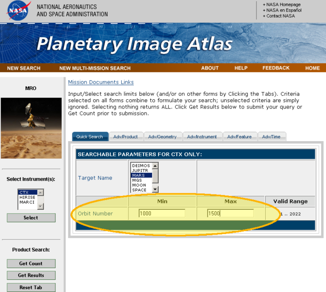

# Orbit Location [¶](#Orbit-Location-)

Orbit parameter location

[670px-OrbitLocation.png](attachments/download/1079/670px-OrbitLocation.png)
[View](attachments/download/1079/670px-OrbitLocation.png "View")
 (247 KB)   Makayla
Shepherd, 2016-06-01 01:03 PM 

