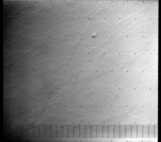
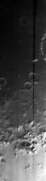
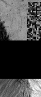
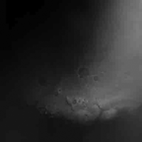

# Overview of Noise and Artifacts [¶](#Overview-of-Noise-and-Artifacts-)

-----

Noise and artifact are terms used to describe speckles, spikes, reseaus,
missing data, and other marks, blemishes, defects, and abnormalities in
image data created during the acquisition, transmission, and processing
of image data. The line between the definitions of artifact and noise is
fuzzy (and often subject to opinion), and often the terms are used
interchangeably. Some noise and artifacts are expected, even
purposefully added, and can be removed during the radiometric
calibration process.

## What is noise? [¶](#What-is-noise-)

-----

In image processing, noise is a type of flaw or blemish in the image
caused by:

  - Telemetry data dropouts or transmission errors
  - Malfunctioning or dead detectors
  - Read noise native to the CCD system
  - Coherent noise caused by spurious electronic signals from the
    operation of instruments onboard the spacecraft

Noise can take the appearance of speckling, missing data, random or
orderly patterns, and other variations that cause the image to have a
muddled appearance, or visually distracting blemishes or patterns. There
are three categories of noise:

  - **Fixed-location noise** always exists at the same location in the
    image array, with predictable positions. Fixed location noise can be
    cosmetically corrected by replacing the bad pixels with the weighted
    average of the unaffected neighborhood pixels. Fixed-location noise
    can result from malfunctioning or dead detectors.
  - **Randomly occurring noise** results from data transmission errors
    causing data bits to be altered at random intervals in the image.
    The random noise produces discrete, isolated pixel variations or
    "spikes" and gives an image a "salt-and-pepper" appearance.
    Additionally, telemetry drop-outs can cause portions of an image to
    be completely missing. This type of noise is generally corrected
    using filtering techniques that recognize missing or anomalous data
    pixels and replaces these data points with a weighted average of the
    unaffected neighborhood pixels.
  - **Coherent noise** can be introduced by spurious electronic signals
    produced by the operation of instruments onboard the spacecraft
    during image observations. The spurious signals interfere with the
    electronics of the imaging system causing coherent noise patterns to
    be electronically "added" to the images. For example, the shuttering
    electronics of the Viking cameras introduced a spurious
    "herring-bone" pattern at the top and bottom of the image.
    Noise-removal algorithms are designed to correct specific coherent
    noise problems such as this one.

## What are artifacts? [¶](#What-are-artifacts-)

-----

Generally, image artifacts are a type of flaw or blemish in the image
introduced during processing, intentionally introduced due to the design
of system, or unintentional introduction of debris or energy external to
the system. Examples of artifacts include:

  - reseaus etched on the camera lens
  - reseaus exposed on photographic film during pre-flight preparations
    for a mission
  - minute dust specks located in the optical path or on the focal plane
    array
  - cosmic rays and other charged particles impacting the sensor
    (particularly CCDs)
  - fringe, ring, or visible patterns created during filtering, ratio
    analysis, and other enhancement processes
  - quantization, checkerboarding, and other artifacts introduced by
    image compression algorithms during conversion from Isis cube format
    to a lossy image format or bit-type reductions that reduce the tonal
    resolution of the data

Most artifacts fit neatly into the categories of noise listed earlier
and are corrected using many of the same processes. For example, dust
specks create fixed-location blemishes, and cosmic rays cause random
spikes. Reseaus are useful blemishes that are removed once they are
analyzed for their locations within an image and the information saved
for later processing.

  - 

**Reseaus, dropped data, and salt-and-pepper** This example shows a
number of noise and artifact types.  
The large, regularly spaced black dots across the image are caused by
the reseaus on the camera lens.  
The pattern of vertical black lines across the bottom of the image was
caused by transmission data loss.  
The black and white speckles, called salt-and-pepper, are random noise.

  - 

**Instrument error** The black streak running down the right side of
this image may have been caused  
by an unusual error in the line-scanner camera that acquired this image.

  - 

**Transmission error** A glitch during the transmission of this image
caused the data to become  
garbled (upper right) and some data was completely lost (the black area
across the middle).

  - 

**Image compression** Exporting the image to a lossy, compressed image
format (using very high compression),  
the compression algorithm introduced a tiled pattern across the image.

[30px-Noise\_Instrument\_Error.png](attachments/download/1038/30px-Noise_Instrument_Error.png)
[View](attachments/download/1038/30px-Noise_Instrument_Error.png "View")
 (5.12 KB)   Makayla
Shepherd, 2016-06-01 09:20 AM 

[50px-Noise\_Transmission\_Error.png](attachments/download/1039/50px-Noise_Transmission_Error.png)
[View](attachments/download/1039/50px-Noise_Transmission_Error.png "View")
 (7.31 KB)   Makayla
Shepherd, 2016-06-01 09:20 AM 

[120px-Noise\_Compression.png](attachments/download/1040/120px-Noise_Compression.png)
[View](attachments/download/1040/120px-Noise_Compression.png "View")
 (6.09 KB)   Makayla
Shepherd, 2016-06-01 09:20 AM 

[120px-Noise\_Dropped\_Salt\_Pepper.png](attachments/download/1041/120px-Noise_Dropped_Salt_Pepper.png)
[View](attachments/download/1041/120px-Noise_Dropped_Salt_Pepper.png "View")
 (10.5 KB)   Makayla
Shepherd, 2016-06-01 09:20 AM 

[Noise\_Instrument\_Error.png](attachments/download/1093/Noise_Instrument_Error.png)
[View](attachments/download/1093/Noise_Instrument_Error.png "View")
 (92 KB)   Kristin Berry,
2016-06-01 02:22 PM 

[Noise\_Transmission\_Error.png](attachments/download/1094/Noise_Transmission_Error.png)
[View](attachments/download/1094/Noise_Transmission_Error.png "View")
 (130 KB)   Kristin
Berry, 2016-06-01 02:22 PM 

[Noise\_Dropped\_Salt\_Pepper.png](attachments/download/1095/Noise_Dropped_Salt_Pepper.png)
[View](attachments/download/1095/Noise_Dropped_Salt_Pepper.png "View")
 (343 KB)   Kristin
Berry, 2016-06-01 02:22 PM 

[Noise\_Compression.png](attachments/download/1096/Noise_Compression.png)
[View](attachments/download/1096/Noise_Compression.png "View")
 (34.3 KB)   Kristin
Berry, 2016-06-01 02:22 PM 

