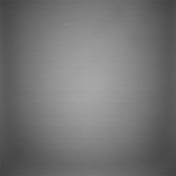

# Overview of Radiometric Calibration [¶](#Overview-of-Radiometric-Calibration-)

-----

  - [Overview of Radiometric
    Calibration](#Overview-of-Radiometric-Calibration-)
      - [Why perform radiometric
        calibration?](#Why-perform-radiometric-calibration-)
      - [What is radiometric
        calibration?](#What-is-radiometric-calibration-)
      - [How is the image changed by radiometric
        calibration?](#How-is-the-image-changed-by-radiometric-calibration-)

## Why perform radiometric calibration? [¶](#Why-perform-radiometric-calibration-)

-----

Both vidicon cameras (such as those carried on-board the Viking and
Voyager missions), and charge coupled device (CCD) cameras (such as on
the Clementine, Mars Reconnaissance Orbiter, and other contemporary
missions) produce digital images with the inherent artifact known as
camera shading. Camera shading results from the non-uniform sensitivity
across the field-of-view of the imaging instrument.

This image (acquired during pre-flight calibration by a Mars Exploration
Rover Microscopic Imager) illustrates camera shading. Ideally, every
pixel in the image should have the same DN. Radiometric calibration
corrects this type of non-uniform brightness:

|  |
| ------------------------------------------------------------------------------------------------------------------------ |
| Flat field                                                                                                               |

Perhaps the best way to illustrate camera shading is to imagine
acquiring a digital image of a target of uniform brightness, say a
screen that has been painted a uniform shade of gray. If the camera
sensitivity across the fields-of-view were ideal (and the flat-field
target exactly the same brightness everywhere), then the acquired
digital image would have the same DN value for all the pixels in the
image. However, because of the non-uniform sensitivity of the camera,
the DN values of the resulting image will vary throughout the image
array (see the example to the right). A typical camera may have as much
as 20% variation across the field-of-view. Camera shading corrections
are applied to an image that correct for the non-uniform sensitivity so
that, in our flat-field observation example, the radiometrically
corrected image would contain pixels of identical value.

## What is radiometric calibration? [¶](#What-is-radiometric-calibration-)

-----

Radiometric calibration recalculates the DNs in an image based on
numerous factors, such as the exposure time, known values for the camera
shading based on flat-field observations, dark current (output current
of a detector when no energy is incident on the detector, such as when
the shutter is closed), and other factors describing the unique
electronics design and characteristics of an imaging system. Camera
sensitivity may be time dependent because of the drift of the camera
sensitivity throughout the course of the mission. The camera sensitivity
is also dependent on the filter, operating modes of the instrument, and
temperature of the cameras. Additionally, the camera response may be
non-linear at various brightness levels.

## How is the image changed by radiometric calibration? [¶](#How-is-the-image-changed-by-radiometric-calibration-)

-----

A radiometrically calibrated image has DNs in radiometric units that are
proportional to the brightness of a scene. Radiometric calibration
applications in Isis produce output values that represent either:

  - **Radiance** - The amount of electromagnetic energy emitted or
    reflected from an area of a planet, in units of µw/(cm2\*sr)
  - **Reflectance** - The ratio of reflected energy to incoming energy
    (i.e. irradiance/solar flux, often simply called **I/F** ). A
    reflectance would be 1.0 for an ideal 100% reflector where the sun
    and camera orientations are perpendicular to the reflecting surface.

Generally, Isis radiometric calibration applications that offer both
reflectance and radiance output will output reflectance (I/F) by
default. Due to the fact that radiometric calibration is mission
dependent, each mission supported by Isis has its own radiometric
calibration application. A few examples of radiometric calibration
applications in Isis are:

  - [**vikcal**](https://isis.astrogeology.usgs.gov/Application/presentation/Tabbed/vikcal/vikcal.html)
    : Viking Orbiter Visual Imaging System
  - [**moccal**](https://isis.astrogeology.usgs.gov/Application/presentation/PrinterFriendly/moccal/moccal.html)
    : Mars Global Surveyor Mars Orbiter Camera

See Also: [Mission Specific
Programs](http://isis.astrogeology.usgs.gov/Application/index.html)

[Flat\_Field\_MERMI.png](attachments/download/1035/Flat_Field_MERMI.png)
[View](attachments/download/1035/Flat_Field_MERMI.png "View")
 (238 KB)   Kristin
Berry, 2016-05-31 09:57 PM 

