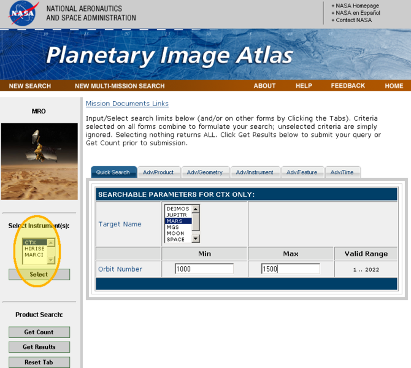

# Select Instrument Location [¶](#Select-Instrument-Location-)

Select Instrument parameter location on the PDS Planetary Image Atlas.

[670px-InstLocation.png](attachments/download/1077/670px-InstLocation.png)
[View](attachments/download/1077/670px-InstLocation.png "View")
 (243 KB)   Makayla
Shepherd, 2016-06-01 01:02 PM 

