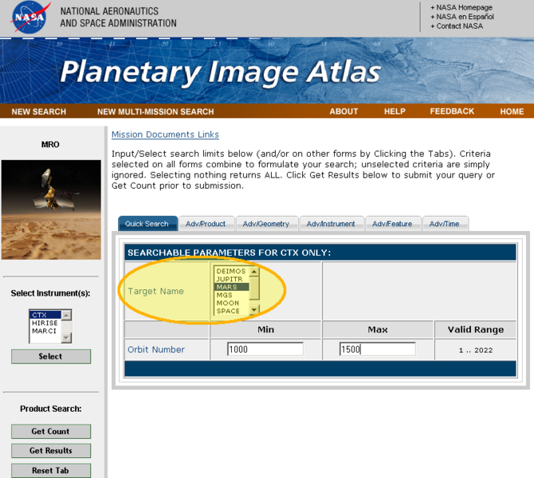

# Target Location [¶](#Target-Location-)

Target parameter location

[670px-TargetLocation.png](attachments/download/1078/670px-TargetLocation.png)
[View](attachments/download/1078/670px-TargetLocation.png "View")
 (246 KB)   Makayla
Shepherd, 2016-06-01 01:03 PM 

