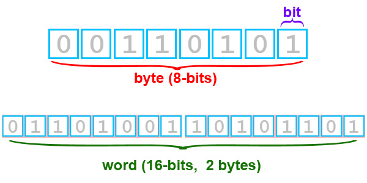

<div id="main">

<div id="content">

<div class="contextual">

</div>

<div class="wiki wiki-page">

<span id="Understanding-Bit-Types"></span>

# Understanding Bit Types [¶](#Understanding-Bit-Types-)

  - [Understanding Bit Types](#Understanding-Bit-Types-)
  - [Bit Type Basics](#Bit-Type-Basics-)
      -   - [Glossary & Review](#Glossary--Review-)
    
      - [What's the bit type of my
        image?](#Whats-the-bit-type-of-my-image-)
    
      - [How does the bit type affect my
        file?](#How-does-the-bit-type-affect-my-file-)
    
      - [How big will my cube file be?](#How-big-will-my-cube-file-be-)
        
          - [Image data size Calculator (THIS IS
            MISSING)](#Image-data-size-Calculator-THIS-IS-MISSING-)
    
      - [How do I set the bit type?](#How-do-I-set-the-bit-type-)
        
          - [Increasing the Bit Type of a
            Cube](#Increasing-the-Bit-Type-of-a-Cube-)
          - [Decreasing the Bit Type of a
            Cube](#Decreasing-the-Bit-Type-of-a-Cube-)
    
      - [Tips](#Tips-)

<span id="Bit-Type-Basics"></span>

# Bit Type Basics [¶](#Bit-Type-Basics-)

-----

Computers store values in base-2 or binary (see glossary below). Values
are generally limited to 8, 16, or 32 binary digits, or bits. We refer
to the number of bits per value as the bit type. Understanding the bit
type and related attributes of an ISIS image cube is important for a
variety of reasons. For instance, changing the bit type affects the file
size, and a cube's bit type determines the range and number of values
that can be stored in a cube.

There are three bit types utilized in ISIS:

| Bit Type | Name          | Number of Bytes | Range                        |
| -------- | ------------- | --------------- | ---------------------------- |
| 8        | Unsigned Byte | 1               | 0 to 255                     |
| 16       | Signed Word   | 2               | \-32768 to 32767             |
| 32       | Real          | 4               | \-3.40282E+38 to 3.04282E+38 |

As shown in the illustration below, there are 8 bits in 1 byte, and 16
bits in 2 bytes. A 16-bit value is called a word.



There are 8 bits in 1 byte, and 16 bits in 2 bytes. A 16-bit value is
called a word.

There are 256 possible values (called digital numbers, or DNs) that can
be represented in an 8-bit file. If all the bits above are set to 1, the
output DN value would be 255. The values 0 to 255 are derived by setting
different bit positions to 0 or 1. The example below shows the binary
number stored by the computer, and the corresponding DN value the user
would see on a computer monitor.

| Binary Number | DN Value |
| ------------- | -------- |
| 00000000      | 0        |
| 00000001      | 1        |
| 00000010      | 2        |
| ...           | ...      |
| 11111110      | 254      |
| 11111111      | 255      |

As you increase the number of bits, the number of possible DN values
that can be represented also increases.

<span id="Glossary-amp-Review"></span>

### Glossary & Review [¶](#Glossary--Review-)

  - **Binary** : Refers to the base-2 numeral system. For an in depth
    discussion of the binary numeral system, see [this Wikipedia
    encyclopedia entry for Binary numeral
    system](http://en.wikipedia.org/wiki/Binary_numeral_system) .
  - **Bit** : Is short for binary digit, which in a computer is the
    smallest unit of storage. Bits are either "0" or "1".
  - **Byte** : Is short for binary term. A byte is a collection of
    computer bits. On many modern computers, a byte is a group of eight
    bits. Typically, computers handle and store information in binary
    (base-2), and a group of eight bits represents an eight digit binary
    number.
  - **Bit type** : Refers to how many bits there are per single
    meaningful value in an image cube file.
  - **DN** : An abbreviation of digital number. For images, particularly
    ISIS cubes, a DN is also referred to as a pixel.

<span id="Whats-the-bit-type-of-my-image"></span>

## What's the bit type of my image? [¶](#Whats-the-bit-type-of-my-image-)

-----

The **Type** keyword in the Pixels group of an image label will be set
to UnsignedByte for 8-bit cubes, SignedWord for 16-bit cubes, or Real
for 32-bit cubes. The figure below shows a portion of an 8-bit cube
label highlighting the bit type.

``` 
 Object = IsisCube
  Object = Core
  ...
    Group = Pixels
      Type       = UnsignedByte
      ByteOrder  = Lsb
      Base       = -128.00395256917
      Multiplier = 1.00395256917
    End_Group
  End_Object
 End_Object
```

<span id="How-does-the-bit-type-affect-my-file"></span>

## How does the bit type affect my file? [¶](#How-does-the-bit-type-affect-my-file-)

-----

The file size for the output file increases as the bit type increases
because each pixel in the data portion of the file requires an
increasing number of bytes to hold the value of that pixel, regardless
of what that value is. While the data portion of the cube is the lion's
share of the file size, the text portions of a cube (the labels and
history) can add substantially to the file size. The minimum label size
is 64 kilobytes. The following sizes are for a file that is 100 samples
by 100 lines:

| Bit Type   | Data Size (bytes) | Label & History Size (bytes) | File size (bytes) | Possible DNs    | DN Range                     |
| ---------- | ----------------- | ---------------------------- | ----------------- | --------------- | ---------------------------- |
| 8-bit.cub  | 10,000            | 72,348                       | 82,348            | 256             | 0 to 255                     |
| 16-bit.cub | 20,000            | 78,736                       | 98,736            | 65,535          | \-32768 to 32767             |
| 32-bit.cub | 40,000            | 91,507                       | 131,507           | about 4 billion | \-3.40282E+38 to 3.40282E+38 |

<span id="How-big-will-my-cube-file-be"></span>

## How big will my cube file be? [¶](#How-big-will-my-cube-file-be-)

-----

The following simple calculator will show you how big the data portion
of a single band cube file will be. Keep in mind, there a numerous
factors(such as labels and additional bands) that can increase the file
size of your cube. However, the data portion will usually represent the
majority of the file size.

<span id="Image-data-size-Calculator-THIS-IS-MISSING"></span>

### Image data size Calculator (THIS IS MISSING) [¶](#Image-data-size-Calculator-THIS-IS-MISSING-)

<div id="isis-calculator" class="app-container">

</div>

<span id="How-do-I-set-the-bit-type"></span>

## How do I set the bit type? [¶](#How-do-I-set-the-bit-type-)

-----

Many of the ISIS3 programs allow the user to set the bit type by setting
the bit type attribute for an output file.

| Number of Bytes | Output Bit Type |
| --------------- | --------------- |
| 1               | 8-bit           |
| 2               | 16-bit          |
| 4               | 32-bit          |

<span id="Increasing-the-Bit-Type-of-a-Cube"></span>

### Increasing the Bit Type of a Cube [¶](#Increasing-the-Bit-Type-of-a-Cube-)

Increasing the bit type of a cube is a fairly straightforward matter
because the range of data in a smaller bit type cube fits easily in the
increased range offered by the larger bit type.

Example - create a 16-bit (signed word) cube from an 8-bit (unsigned
byte) cube using
[cubeatt](http://isis.astrogeology.usgs.gov/Application/presentation/Tabbed/cubeatt/cubeatt.html)
by appending the attributes you wish to change to the file name:

``` 
 cubeatt from=8bit.cub to=16bit.cub+SignedWord
                         OR
 cubeatt from=8bit.cub to=16bit.cub+16-bit
```

In the
[cubeatt](http://isis.astrogeology.usgs.gov/Application/presentation/Tabbed/cubeatt/cubeatt.html)
graphical user interface (GUI), simply hit the ATT (attributes) button
next to the output file selection box and select the desired bit type in
the Attributes dialog. Notice when you change the attributes through the
ATT dialog, the attributes are appended to the output filename in the
main application window in the same fashion as the command line. Most
ISIS3 applications allow you to change key cube attributes through the
Attributes dialog.

<span id="Decreasing-the-Bit-Type-of-a-Cube"></span>

### Decreasing the Bit Type of a Cube [¶](#Decreasing-the-Bit-Type-of-a-Cube-)

Decreasing the bit type of a cube is a bit trickier because the range of
data in a larger bit type cube probably does not fit easily in the
decreased range of the smaller bit type. In this case, you must supply
the minimum and maximum values of the input file to convert to valid DNs
in the output file. The values will then be stretched (scaled) as
necessary to fit into the reduced data range. To perform this operation,
you must know the range of the input data and provide that information
to the application that is used to reduce the bit type.

1.  Get statistics for your image: Run **stats** to get the data range:

<!-- end list -->

``` 
 stats from=32bit.cub
```

stats produces:

``` 
 Group = Results
   From              = 32bit.cub
   Average           = 3386367.6610505
   StandardDeviation = 7446.038790893
   Variance          = 55443493.675484
   Median            = 3385719.8387097
   Mode              = 3382280.056696
   Skew              = 0.26100683557387
   Minimum           = 3372788.0
   Maximum           = 3417331.0
   TotalPixels       = 265420800
   ValidPixels       = 265420800
   NullPixels        = 0
   LisPixels         = 0
   LrsPixels         = 0
   HisPixels         = 0
   HrsPixels         = 0
  End_Group
```

1.  **Change the bit-type attribute of your image** : Run **cubeatt** ,
    using the minimum and maximum values from stats (refer to the output
    from stats above) for the data range attribute. Append the attribute
    **3372788.0:3417331.0** to the output filename create the 16-bit
    cube:

<!-- end list -->

``` 
 cubeatt from=32bit.cub to=16bit.cub+UnsignedWord+3372788.0:3417331.0
                         OR
 cubeatt from=32bit.cub to=16bit.cub+16-bit+3372788.0:3417331.0
```

1.  **Voila\!** The resulting output cube will have the values from
    3372788.0 to 3417331.0 from the original cube scaled to the range of
    -32752 to 32767. Note the use of -32752 instead of -32768. This is
    because the values below -32752 to -32768 are reserved for special
    pixels in ISIS3

<span id="Tips"></span>

## Tips [¶](#Tips-)

  - Increasing the bit type of a cube will increase the file size.
  - When reducing the bit type, the original values may be stretched (or
    scaled) to fit in the range of the target bit type. This may not
    only shift the DN values to the new range, but may actually merge
    ranges of DNs into a single value if the number of distinct values
    in the original file is greater than the range of the output bit
    type.

</div>

<div class="attachments">

<div class="contextual">

</div>

[8-bit.cub](attachments/download/1043/8-bit.cub) <span class="size">
(80.4 KB) </span> <span class="author"> Ian Humphrey, 2016-06-01 10:41
AM </span>

[16-bit.cub](attachments/download/1044/16-bit.cub) <span class="size">
(96.4 KB) </span> <span class="author"> Ian Humphrey, 2016-06-01 10:41
AM </span>

[32-bit.cub](attachments/download/1045/32-bit.cub) <span class="size">
(128 KB) </span> <span class="author"> Ian Humphrey, 2016-06-01 10:41 AM
</span>

</div>

<div style="clear:both;">

</div>

</div>

</div>
