

# Working with Mars Orbiter Camera Data [¶](#Working-with-Mars-Orbiter-Camera-Data-)

-----

  - [Working with Mars Orbiter Camera
    Data](#Working-with-Mars-Orbiter-Camera-Data-)
      - [The Mars Orbiter Camera
        Instrument](#The-Mars-Orbiter-Camera-Instrument-)
          - [Related Resources](#Related-Resources-)
      - [Processing MOC Data Overview](#Processing-MOC-Data-Overview-)
      - [Level 0 Processing - Data
        Ingestion](#Level-0-Processing-Data-Ingestion-)
          - [Acquiring MOC Data](#Acquiring-MOC-Data-)
              - [PDS Planetary Image Atlas](#PDS-Planetary-Image-Atlas-)
              - [USGS/PDS Mars Orbiter Camera Image
                Collection](#USGSPDS-Mars-Orbiter-Camera-Image-Collection-)
              - [ASU JMARS Geographic Information
                System](#ASU-JMARS-Geographic-Information-System-)
              - [Related Resources](#Related-Resources-2-)
          - [Data Acquisition Tool: Planetary Image
            Atlas](#Data-Acquisition-Tool-Planetary-Image-Atlas-)
              - [Search](#Search-)
              - [Browsing by Volume](#Browsing-by-Volume-)
          - [Data Acquisition Tool: USGS/PDS MOC Image
            Collection](#Data-Acquisition-Tool-USGSPDS-MOC-Image-Collection-)
              - [Web Graphical Access](#Web-Graphical-Access-)
              - [Browsing via FTP](#Browsing-via-FTP-)
          - [Data Acquisition Tool: JMARS](#Data-Acquisition-Tool-JMARS-)
          - [Give it a Whirl\!](#Give-it-a-Whirl-)
          - [Importing MOC Data](#Importing-MOC-Data-)
          - [Using moc2isis to ingest MOC images into
            ISIS3](#Using-moc2isis-to-ingest-MOC-images-into-ISIS3-)
              - [Decompressing MOC Images](#Decompressing-MOC-Images-)
          - [MOC Problem Data](#MOC-Problem-Data-)
      - [Level 1 Processing - Noise Removal and Radiometric
        Calibration](#Level-1-Processing-Noise-Removal-and-Radiometric-Calibration-)
          - [Radiometric Calibration of MOC
            Data](#Radiometric-Calibration-of-MOC-Data-)
          - [Noise Removal: MOC Wide Angle Versus Narrow
            Angle](#Noise-Removal-MOC-Wide-Angle-Versus-Narrow-Angle-)
              - [50-pixel Noise Spike (MOC Narrow
                Angle)](#50-pixel-Noise-Spike-MOC-Narrow-Angle-)
              - [Related ISIS3
                Applications](#Related-ISIS3-Applications-)
              - [About Crosstrack Summing
                Modes](#About-Crosstrack-Summing-Modes-)
              - [Even-Odd Noise Removal (MOC Narrow and Wide
                Angle)](#Even-Odd-Noise-Removal-MOC-Narrow-and-Wide-Angle-)
              - [Gap Noise Removal (MOC Wide
                Angle)](#Gap-Noise-Removal-MOC-Wide-Angle-)
      - [Level 2 Processing - Geometry](#Level-2-Processing-Geometry-)
      - [Level 3 Processing - Photometric
        Correction](#Level-3-Processing-Photometric-Correction-)
      - [Level 4 Processing -
        Mosaicking](#Level-4-Processing-Mosaicking-)
      - [Exporting ISIS3 Data](#Exporting-ISIS3-Data-)
      - [Staying Organized](#Staying-Organized-)

## The Mars Orbiter Camera Instrument [¶](#The-Mars-Orbiter-Camera-Instrument-)

-----

The Mars Orbiter Camera (MOC) onboard
[**MGS**](Mars_Global_Surveyor_Mission) produces a daily wide-angle
image of Mars similar to weather photographs of the Earth, and also
takes narrow angle images. Malin Space Sciences is responsible for MOC
operations.

The MOC consists of three cameras: a **narrow angle camera greyscale** ,
and **red and blue wide angle cameras** . ISIS3 supports processing of
the data acquired by all three cameras.

The MOC narrow angle camera (NA) data obtains high resolution greyscale
images, ranging from 1.5 to 12 meters/pixel resolution. The red and blue
wide angle cameras (WA) collect context images at approximately 240
meters/pixel resolution, and low-resolution **global images** at
approximately 7.5 kilometers/pixel resolution.

The cameras are **pushbroom scanners** (also called **along-track
scanners** ), acquiring one line of data at a time as the spacecraft
orbits the planet. For details about the MGS mission and the MOC cameras
refer to the PDS MOC archive documents that are distributed with the
image data. Information can be found on the [Mars Global Surveyor
Science Sampler Data Set
Collection](http://mars.jpl.nasa.gov/mgs/sci/CDsampler/document/volinfo.htm)
.

[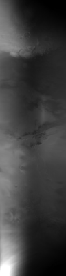](attachments/download/991/Mars_Orbital_Camera_Wide_Red.png "Mars_Orbital_Camera_Wide_Red.png")

> **Wide Angle, Red Band**
> 
> This image was collected using summing mode 27,  
> and has a resolution of approximately  
> 6.7 kilometers/pixel. This image is mirrored  
> and will need to be flipped during processing.

[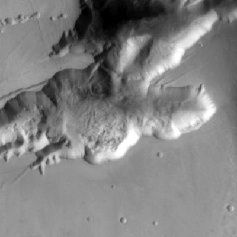](attachments/download/988/Mars_Orbital_Camera_High_Wide_Red.png "Mars_Orbital_Camera_High_Wide_Red.png")

> **Higher Resolution Wide Angle, Red Band**
> 
> This image was collected using summing mode 1,  
> and has a resolution of approximately  
> 250 meters/pixel. In summing mode 1, detector  
> readings are not combined. This image is mirrored  
> and will need to be flipped during processing.

[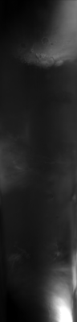](attachments/download/990/Mars_Orbital_Camera_Wide_Blue.png "Mars_Orbital_Camera_Wide_Blue.png")

> **Wide Angle, Blue Band**
> 
> This image was collected using summing mode 27,  
> and has a resolution of approximately  
> 6.7 kilometers/pixel. Summing modes are utilized  
> on-board the spacecraft to average detector  
> readings to combine them into a single output  
> pixel value.

[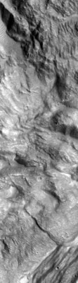](attachments/download/997/Mars_Orbital_Camera_Narrow.png "Mars_Orbital_Camera_Narrow.png")

> **Narrow Angle**
> 
> This image has a resolution of approximately  
> 1.5 meters/pixel.

### Related Resources [¶](#Related-Resources-)

  - [MOC
    specification](http://mars.jpl.nasa.gov/mgs/sci/CDsampler/document/volinfo.htm#4.1%20Mars%20Orbiter%20Camera%20MOC)
  - [MGS
    Spacecraft](http://mars.jpl.nasa.gov/mgs/mission/spacecraft.html) ,
    and [MGS Science
    Instruments](http://mars.jpl.nasa.gov/mgs/mission/sc_instruments.html)
  - [Malin Space Science
    Systems](http://www.msss.com/all_projects/mgs-mars-orbiter-camera.php)

## Processing MOC Data Overview [¶](#Processing-MOC-Data-Overview-)

-----

  - **Level 0** - Data Ingestion
      - The MOC images are downloaded to a local workstation. The labels
        are updated with ISIS3 keywords, and the filenames containing
        information about the geometry of the image is added to the
        labels.
  - **Level 1** – Radiometric Calibration and Noise Removal
      - The noise and pixel spikes that are introduced during image
        acquisition are removed to create an ideal grayscale image
        representing reflectance values (ranging from 0 to 1 DN value).
  - **Level 2** - Projection
      - Geodetic corrections are performed and the images projected to a
        map projection.
  - **Level 3** – Photometric Correction and Enhancement
      - The effect of sun angle on the image is corrected, and the
        images are tone matched.
  - **Level 4** – Building a Mosaic
      - A seamless mosaic is created.

## Level 0 Processing - Data Ingestion [¶](#Level-0-Processing-Data-Ingestion-)

-----

This is the starting point for the production of a MOC mosaic. The steps
within the level zero processing provide the gateway into ISIS3
processing. Running the following applications will **ingest the MOC
Standard Data Products** (and MOC Standard Decompressed Data Products)
and place necessary information into the labels of the image.

### Acquiring MOC Data [¶](#Acquiring-MOC-Data-)

There are numerous online resources and desktop tools for searching for
and acquiring Mars Global Surveyor Mars Orbiter Camera image data.

#### PDS Planetary Image Atlas [¶](#PDS-Planetary-Image-Atlas-)

The Planetary Data System (PDS) [Planetary Image
Atlas](http://pdsimg.jpl.nasa.gov/Missions/) , hosted by the Jet
Propulsion Laboratory and USGS Astrogeology Research Program, allows
users to search through the MOC database and select images based on
requirements entered by the user. There are both a basic and an advanced
search feature.

#### USGS/PDS Mars Orbiter Camera Image Collection [¶](#USGSPDS-Mars-Orbiter-Camera-Image-Collection-)

Our [PDS MGS MOC Image Collection](http://ida.wr.usgs.gov/) offers a
additional search tools, such as [Web Graphical
Access](http://ida.wr.usgs.gov/graphical.htm) , which allows you to
locate data by navigating an image map of Mars.

#### ASU JMARS Geographic Information System [¶](#ASU-JMARS-Geographic-Information-System-)

The [JMARS Geographic Information System (GIS)](http://jmars.asu.edu/) ,
offered by the Arizona State University's Mars Spaceflight Facility is a
useful desktop tool for searching for and viewing MOC images.

#### Related Resources [¶](#Related-Resources-2-)

  - [Planetary Image Atlas](http://pds-imaging.jpl.nasa.gov/holdings/)
  - [USGS/PDS MGS MOC Image Collection](http://ida.wr.usgs.gov/)
  - [JMARS Geographic Information System (GIS)](http://jmars.asu.edu/)

### Data Acquisition Tool: Planetary Image Atlas [¶](#Data-Acquisition-Tool-Planetary-Image-Atlas-)

The Planetary Data System (PDS) Imaging Node houses data from several
planetary missions, and offers a variety of methods for accessing their
holdings. For now we will concentrate on acquiring Mars Global Surveyor
Mars Orbiter Camera (MGS MOC) data.

#### Search [¶](#Search-)

The PDS [Planetary Image
Atlas](http://pds-imaging.jpl.nasa.gov/holdings/) provides a Product
Search search tool to interrogate the collection of MGS MOC imagery.
This tool lets us query information about each image and ignores the
data that we have no interest in. A good way to reduce the number of
images to look at is by defining an area of interest with latitude and
longitude ranges. You can also restrict the search by choosing a minimum
and maximum resolution. Remember to keep in mind the coordinate system
(areographic west for MGS MOC) and units (generally meters for
distances) required by the search tool. Launch the [MGS MOC Product
Search](http://pdsimg.jpl.nasa.gov/cgi-bin/Atlas/search.pl?INSTRUMENT_HOST_NAME=MARS_GLOBAL_SURVEYOR)
to give it a try.

The table below lists the primary search parameters that can help you
narrow down the number of images that are returned by a search of the
PDS MGS MOC image collection. The images to the right show screen shots
of the [MGS MOC Product
Search](http://pdsimg.jpl.nasa.gov/cgi-bin/Atlas/search.pl?INSTRUMENT_HOST_NAME=MARS_GLOBAL_SURVEYOR)
. Note there are two categories (the tabs above the search form) where
these search parameters are found: *Quick Search* and *Instrument* .

| Parameter              |              | Notes                                                                                                                                                                                |
| ---------------------- | ------------ | ------------------------------------------------------------------------------------------------------------------------------------------------------------------------------------ |
| **INSTRUMENT**         | Quick Search | Generally, if you want to work with both Wide Angle and Narrow Angle data, select both the MOC\_WIDE\_ANGLE and MOC\_NARROW\_ANGLE values to search for both at the same time.       |
| **CENTER\_LATITUDE**   | Quick Search | Enter *minimum* latitude and *maximum* latitude values that encompass the latitude range of your area of interest, in areographic west coordinates.                                  |
| **CENTER\_LONGITUDE**  | Quick Search | Enter *minimum* longitude and *maximum* longitude values that encompass the longitude range of your area of interest, in areographic west coordinates.                               |
| **TARGET\_NAME**       | Quick Search | Since we're interested in creating a mosaic of Mars, choose Mars so you don't have to wade through listings for other bodies.                                                        |
| **FILTER\_NAME**       | Instrument   | When searching for Wide Angle data, make sure to check the Blue and/or Red values to search for either or both these bands.                                                          |
| **MOC\_ORBIT\_NUMBER** | Instrument   | If you'd like to focus your search on a particular phase of the mission, filling in appropriate values here can help (for example, the mapping phase ranges from orbit 306 to 8505). |

[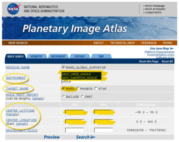](attachments/download/1006/PIA_ScreenShot_1.png "PIA_ScreenShot_1.png")

> **Quick Search**
> 
> Screenshot of the Image Atlas *Quick Search*  
> options for Mars Global Surveyor

[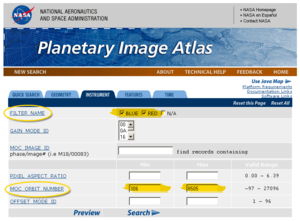](attachments/download/1007/PIA_ScreenShot_2.png "PIA_ScreenShot_2.png")

> **Instrument**
> 
> Screenshot of the Image Atlas *Instrument*  
> Search options for Mars Global Surveyor

#### Browsing by Volume [¶](#Browsing-by-Volume-)

You can also go to the online data and Browse Online Data Volumes, which
offers FTP access to the CDs (compact discs) used to archive and
distribute the data. This allows you to look at the image and text files
on the CDs, where you can find more helpful information. To give it a
try, launch the [Planetary Image
Atlas](http://pds-imaging.jpl.nasa.gov/holdings/) in a new browser
window. Now click the [Mars Global Surveyor Browse Online Data
Volumes](http://pdsimg.jpl.nasa.gov/Admin/resources/cd_mgs.html) and
choose a CD volume to look at. When you know the images that you would
like to work with, you can go to this area with an FTP tool and download
that image or download it using your browser.

### Data Acquisition Tool: USGS/PDS MOC Image Collection [¶](#Data-Acquisition-Tool-USGSPDS-MOC-Image-Collection-)

The Planetary Data System(PDS) Imaging Node houses all the released MOC
data. The data can be accessed via the [USGS/PDS Mars Global Surveyor
Mars Orbiter Camera(MOC) Image Collection](http://ida.wr.usgs.gov/) web
site. There is a direct [FTP](ftp://ida2.wr.usgs.gov/) link to all the
data that is currently released to the public, and also [Web Graphical
Access](http://ida.wr.usgs.gov/graphical.htm) that allows the user to
select a region of interest, and evaluate the images by browsing through
a list of images.

#### Web Graphical Access [¶](#Web-Graphical-Access-)

This interactive page allows the user to select a 15 degree by 15 degree
area of interest. The page displays the different types of data products
as color coded square boxes overlain on a map of Mars. The browse images
can be displayed from the list that is generated by clicking on Listing,
or by clicking on a colored box.

To get started, let's launch the [USGS/PDS Mars Global Surveyor Mars
Orbiter Camera (MOC) Image Collection](http://ida.wr.usgs.gov/) web site
in a new browser window.

  - Click on [Web Graphical
    Access](http://ida.wr.usgs.gov/graphical.htm) , a global map of Mars
    divided into 15 degree by 15 degree rectangular boxes will be
    displayed. If you click in one of the boxes, a zoomed-in view
    showing MOC footprints of available data will appear.
  - [Click on the grid in the box for Latitude 0° to 15°, Longitude 0°
    to 15°](http://ida.wr.usgs.gov/html/areasl/c_07n007.htm) .
  - **Now, you have two choices:**
      - If you click on one of the colored boxes on the zoomed-in view,
        the browse image and image information will be displayed. If you
        click on a narrow angle MOC image, grayscale and color Viking
        context images may also be displayed. The Standard Compressed
        image can be downloaded by clicking Download. (Read the
        [Download Note](http://ida.wr.usgs.gov/docs/downnote.htm) if
        problems are encountered.) [Click on one of the red boxes (like
        m0704913 , closest to the upper left
        corner)](http://ida.wr.usgs.gov/html/m07049/m0704913.html) .
      - If you click on
        [Listing](http://ida.wr.usgs.gov/html/regionsl/07n007.htm) (on
        the top of the page, above the zoomed-in image with the colored
        boxes), a list of the MOC image number, center latitude, center
        longitude, resolution, and camera will be listed in tabular
        form. If you click on one the MOC image numbers the browse image
        and information page will be displayed.

[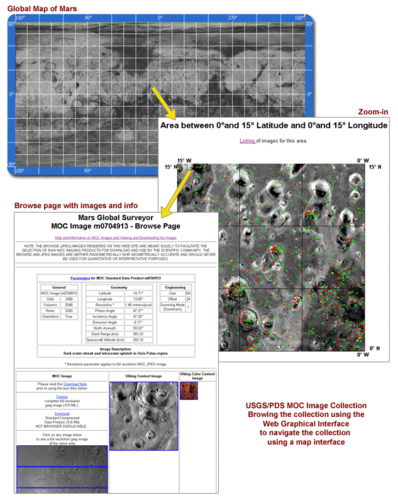](attachments/download/1003/MOC_Web_Graphical_Access.png "MOC_Web_Graphical_Access.png")

> **Web Graphical Access**
> 
> This illustration shows using the MOC Image  
> Collection's Web Graphical Access to locate  
> MOC images by zooming in on a map of Mars

#### Browsing via FTP [¶](#Browsing-via-FTP-)

In order to use the ftp access, you must already know which image you
will be working with, and which CD volume the image is archived on. For
example, I would like to download m0103072.imq, which is archived on
volume MGSC\_1015. The data are divided into folders labeled using the
first six digits of the MOC image numbers.

To get *m0103072.imq* from the site, lets launch the [USGS/PDS Mars
Global Surveyor Mars Orbiter Camera (MOC) Image
Collection](http://ida.wr.usgs.gov) web site in a new browser window.

  - Click on [FTP access](http://ida.wr.usgs.gov/d_access.htm)
  - Select [MGSC\_1015](ftp://ida2.wr.usgs.gov/cdroms/MGSC_1015/)
  - Select the [m01030
    folder](ftp://ida2.wr.usgs.gov/cdroms/MGSC_1015/m01030/)
  - Right click on the filename (m0103072.imq) and select Save link
    as... (your browser may also call it "Save target as" or "copy to
    folder"). A pop-up window will appear to allow you to select or
    create a folder where the file is to be saved on your local
    workstation.

### Data Acquisition Tool: JMARS [¶](#Data-Acquisition-Tool-JMARS-)

JMARS is a useful Geographic Information System (GIS) tool to evaluate
MOC images that cover an area of interest before the images are
downloaded. The tool displays MOC footprints and a variety of other Mars
data. JMARS can be used to:

  - Query the database of MOC images
  - Select browse images to display on-screen and download via the web
  - Generate a list of MOC images (great for creating scripts)
  - Save the displayed map as an image

[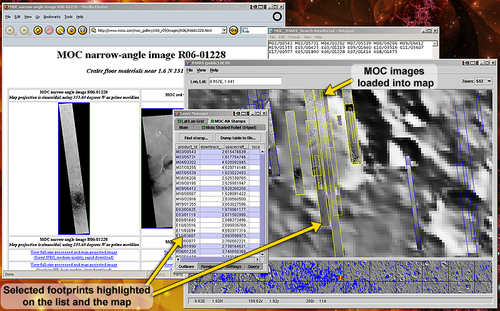](attachments/download/989/Jmars_Screenshot.png "Jmars_Screenshot.png")

> **Screenshot of JMARS displaying MOC footprints**
> 
> The MOC footprints (called stamps in JMARS) are displayed as blue
> polygons on the map.  
> Several footprints are shown selected in the Layers Manager MOC-NA
> Stamps list and  
> highlighted yellow on the map. Several MOC images are displayed the
> map, filling in  
> those footprints with a preview of the actual image data. The web page
> for one image  
> has been launched and is open behind JMARS, and the image names for
> the selected  
> footprints have been copied from JMARS to our text editor.

### Give it a Whirl\! [¶](#Give-it-a-Whirl-)

If you have JMARS installed, launch it and log in. We'll run through a
quick and easy exercise in displaying MOC Narrow Angle footprints.

  - In the *Main* tab of the **Layer Manger** , hit the **Add new
    layer** button, which opens a menu.
  - Select **Moc** from the **Stamp** menu.
  - In the **Add Moc stamp layer** window, just hit the Okay button,
    leaving all the fields blank.
  - A new tab named **MOC-NA stamps** will appear in the Layer Manager.
    When it's done loading the footprints, its drawing status indicator
    will turn from red to green, the footprints will be displayed on the
    map and the images shown on the map are list in the Layer Manager.
  - Try right-clicking on a listing the image list and on the footprints
    displayed on the screen -- there's lots of options for working with
    and accessing information and data. For example, **Render** and
    **Load Selected Stamps** will download and display the MOC images
    for the selected footprints on the map, giving you the ability to
    preview the data. **Web Browse** will launch an image's web page in
    your browser so you can access the information and data.

Of course, there's many other options in JMARS to help you search for
MOC data, such as the tools for narrowing your search and modifying your
display in the **Settings** , **Query** , and **Render** tabs in the
Layer Manager, using the various tools in the main menus, and adding
other useful data layers to the display.

Related Resources

  - [Download JMARS](http://jmars.asu.edu/) (free, registration required
    to use JMARS' full functionality)

### Importing MOC Data [¶](#Importing-MOC-Data-)

The **Standard Decompressed Data Products** , which have an .img
extension and are in PDS image format, can be ingested directly into
ISIS3. The **Standard Data Products** , which have an .imq extension,
are compressed PDS format images and are decompressed before ingesting
into ISIS3.

### Using moc2isis to ingest MOC images into ISIS3 [¶](#Using-moc2isis-to-ingest-MOC-images-into-ISIS3-)

The following examples show the use of
[**moc2isis**](https://isis.astrogeology.usgs.gov/Application/presentation/Tabbed/moc2isis/moc2isis.html)
to ingest (or import) a MOC image into ISIS3. The resulting output file
will be an ISIS3 cube.

**Example** : Ingesting an Uncompressed Standard Decompressed Data
Products MOC image

    moc2isis from=r0700563.img to=r0700563.lev0.cub

**Example** : Ingesting a Compressed Standard Data Products MOC image

    moc2isis from=r0700563.imq to=r0700563.lev0.cub

The decompression software for the .imq images is included within
**moc2isis** , you don't need to worry about the extra step of
decompressing the image.

> **MOC Narrow Angle Raw Image (subarea)**
> 
> Original image is 512 samples by 13,824 lines.  
> This image is a subarea that was cropped from  
> lines 11,800-12,312 of the original (full  
> width, i.e. 512 samples across) image, r0700563

[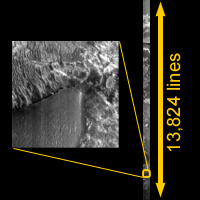](attachments/download/999/MOC_Narrow_Angle_Raw_Full_Thumb.png "MOC_Narrow_Angle_Raw_Full_Thumb.png")

> **MOC Narrow Angle Raw Image (full scene)**
> 
> This illustration shows where the subarea (left)  
> was pulled from the original image (r0700563).

#### Decompressing MOC Images [¶](#Decompressing-MOC-Images-)

If you'd like to decompress the MOC image outside of the ISIS3
**moc2isis** application, use the **mocuncompress** application.
**mocuncompress** is not an ISIS3 application, and you must enter this
command exactly as shown below. There is no GUI available for this
application. (This application is supplied by Planetary Data System).

**mocuncompress Syntax:**

    mocuncompress [input file] [output file]

**mocuncompress Example** : . *img* is the recommended file extension
for the uncompressed output file.

mocuncompress e2000929.imq e2000929.img

If you'd like to import the resulting uncompressed image into ISIS3,
simply run **moc2isis** on the uncompressed file. For example:

    moc2isis   from=e2000929.img  to=e2000929.lev0.cub

[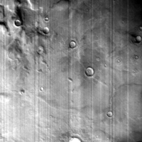](attachments/download/1004/MOC_Wide_Red.png "MOC_Wide_Red.png")

> **MOC Wide Angle, Red Band (e2000929)**

### MOC Problem Data [¶](#MOC-Problem-Data-)

Many of the problems with the MGS MOC data sets are due to either
transmission errors or environmental conditions that existed when the
image was acquired. To find these poor quality images, you must visually
inspect the images. While many predicted problems are easily handled
through standard MOC processing procedures, **missing data** ,
**corrupted data** , and other random data acquisition and transmission
issues may require special processing, manual editing, or simply cannot
be corrected. **Clouds** and **airborne dust** are two elements, caused
by environmental conditions, that will degrade the quality of your
images. The amount of image degradation will vary. In either case,
whether or not you use the image is a judgment based on how much
information will be gained verses how much the image will degrade the
final product.

[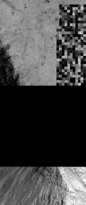](attachments/download/1005/Noise_Transmission_Error.png "Noise_Transmission_Error.png")

> **Transmission error**
> 
> A glitch during the transmission of this image  
> caused the data to become garbled (upper right)  
> and some data was completely lost  
> (the black area across the middle)

Refer to: ( [Adding SPICE](Adding_SPICE) )

## Level 1 Processing - Noise Removal and Radiometric Calibration [¶](#Level-1-Processing-Noise-Removal-and-Radiometric-Calibration-)

-----

To create a Level 1 MOC image, we'll clean up noise and other problems
and radiometrically correct the data so we have an image representing
the reflectance of the surface. We'll start by removing image defects
caused by malfunctioning detectors, dust specks, transmission noise, and
so forth. We'll finish up our Level 1 image with radiometric calibration
in order to create an image that is representative of an ''ideal'' image
acquired by a camera system with perfect radiometric properties.

(Refer to: [Overview of Radiometric
Calibration](Overview_of_Radiometric_Calibration) )

### Radiometric Calibration of MOC Data [¶](#Radiometric-Calibration-of-MOC-Data-)

The radiometric calibration application moccal corrects an image so the
output resembles an "ideal" grayscale image where the digital numbers
(DNs) are proportional to scene brightness. The images are corrected
for:

  - Global gain and offset instrument operating modes
  - Variable sensitivity of each detector in push broom array
  - Even/odd detector offset
  - Normalize sun-target distance
  - Low-high-low spike at 50 pixel intervals caused by power supply
    synchronization pulse

Occasionally, corrupted pixels need to be set to null pixel values.

[**moccal**](https://isis.astrogeology.usgs.gov/Application/presentation/Tabbed/moccal/moccal.html)
is intended to run on MOC Narrow Angle and Wide Angle images. The
default output image is a 32-bit cube where the pixels have been
adjusted to represent **reflectance** (i.e. albedo), with valid pixel
values between 0 and 1. (Alternatively, you can create a radiance image,
with units in DN/msec, by setting the IOF parameter to "NO").

Default coefficients for the MOC calibration correction can be found in
$ISIS3DATA/mgs/calibration/moccal.ker.\# (\#=version number, moccal will
refer to the highest version number as most recent).

**Example Command Line** : This will perform radiometric corrections to
our image (r0700563.lev0.cub) and create an output cube
(r0700563\_cal.cub) where the DNs represent reflectance (I/F, ratio of
reflected radiation and the amount of incident radiation ).

    moccal from=r0700563.lev0.cub to=r0700563_cal.cub

[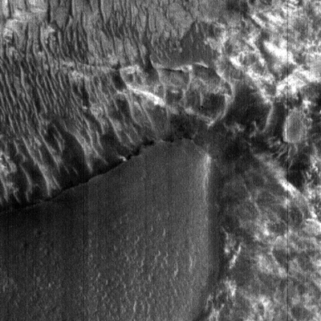](attachments/download/1002/MOC_Pre_Calibration.png "MOC_Pre_Calibration.png")

> **Pre-Calibration**

[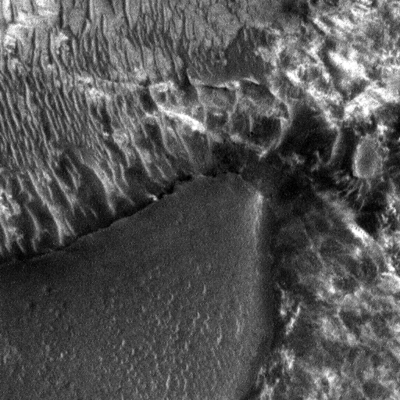](attachments/download/1001/MOC_Post_Calibration.png "MOC_Post_Calibration.png")

> **Post-Calibration**

### Noise Removal: MOC Wide Angle Versus Narrow Angle [¶](#Noise-Removal-MOC-Wide-Angle-Versus-Narrow-Angle-)

(Refer to: [Overview of Noise And
Artifacts](Overview_of_Noise_And_Artifacts)

So far, we've been handling MOC Wide Angle and MOC Narrow Angle images
the same. Now, we need to diverge and do some special processing to some
of our images, and images from both cameras will be handled differently.

The different MOC camera characteristics resulted in images that have
varying noise patterns. There are different noise issues among The MOC
Wide Angle and MOC Narrow Angle images, and processing depends on the
cameras' acquisition mode, and whether an image is the blue or red band
for MOC Wide Angle. These common noise issues are straightforward to
correct, and some images may not have noise problems, and processing can
continue with projecting the image to a map projection.

#### 50-pixel Noise Spike (MOC Narrow Angle) [¶](#50-pixel-Noise-Spike-MOC-Narrow-Angle-)

The images acquired by MOC Narrow Angle (NA) when the camera was in
**crosstrack summing mode 1** contain a noise spike pattern every 50
pixels.

To find out if your image has this issue, extract the CrosstrackSumming
and InstrumentId keywords from your MOC image to determine camera
(Narrow Angle or Wide Angle) and camera crosstrack summing mode (modes
range from 1 to 8 for MOC NA):

    getkey from=r0700563_cal.cub grpn=Instrument keyword=CrosstrackSumming
    getkey from=r0700563_cal.cub grpn=Instrument keyword=InstrumentId

If the values returned are CrosstrackSumming=1, and
InstrumentId=MOC\_NA, run the **mocnoise50** application to remove the
noise spikes.  
*Note:* ***mocnoise50*** *will check the InstrumentId and
CrosstrackSumming keywords for you and only run on images that have the
correct values.*

    mocnoise50 from=r0700563_cal.cub to=r0700563_noise.cub

The images below have been cropped and magnified to show the results of
mocnoise50 program.

[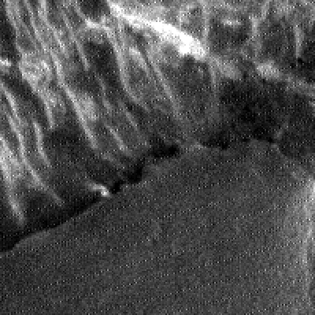](attachments/download/995/MOC_Before_Mocnoise50.png "MOC_Before_Mocnoise50.png")

> **Before mocnoise50**
> 
> The bright pixels forming a pattern of parallel lines that appear to  
> run towards the upper right is the spike noise we want to remove.

> **After mocnoise50**
> 
> The noise spike pattern has been removed.

#### Related ISIS3 Applications [¶](#Related-ISIS3-Applications-)

See the following ISIS3 documentation for information about the
applications you will need to use to perform this procedure:

  - [**mocnoise50**](https://isis.astrogeology.usgs.gov/Application/presentation/Tabbed/mocnoise50/mocnoise50.html)
    : removes diagonal spike noise from MOC Narrow Angle images with
    Crosstrack Summing mode of 1
  - [**getkey**](https://isis.astrogeology.usgs.gov/Application/presentation/Tabbed/getkey/getkey.html)
    : outputs the value of a requested keyword from a cube label

#### About Crosstrack Summing Modes [¶](#About-Crosstrack-Summing-Modes-)

There are special **summing modes** that are utilized on-board the
spacecraft to average detector pixels to combine them into a single
output pixel value. Both MOC NA and WA detectors can utilize crosstrack
(sample) and downtrack (line) summing modes. The value of these modes
indicate the number of samples and lines, respectively, that were summed
and averaged to result in the pixel values stored in the raw file.

#### Even-Odd Noise Removal (MOC Narrow and Wide Angle) [¶](#Even-Odd-Noise-Removal-MOC-Narrow-and-Wide-Angle-)

The Narrow Angle (NA) and Wide Angle (WA) images contain a noise pattern
across even and odd pixels whenever the cameras were in crosstrack
summing mode 1. The application **mocevenodd** gathers an average of the
pixels to remove the noise pattern. The changes are very subtle, so it
is very hard to see the differences visually. The pixel values are
different if viewed with an interactive display program like qview.

To find out if your image has this issue, extract the CrosstrackSumming
keyword from your MOC image to determine the camera crosstrack summing
mode (modes range from 1 to 8 for MOC NA and 1 to 127 for MOC WA):

    getkey from=e2000929_cal.cub grpn=Instrument  keyword=CrosstrackSumming

If the crosstrack summing mode is 1 (i.e. CrosstrackSumming=1), run the
**mocevenodd** application.  
*Note:* ***mocevenodd*** *will check the CrosstrackSumming keyword for
you and only run on images that have the correct value.*

**Narrow Angle** : If you're working with a MOC NA image, run
**mocevenodd** on the output of **mocnoise50** :

    mocevenodd from=r0700563_noise.cub to=r0700563.lev1.cub

**Wide Angle** :If you're working with a MOC WA image, run
**mocevenodd** on the output of **moccal** :

    mocevenodd from=e2000929_cal.cub to=e2000929.lev1.cub

The images below have been cropped and magnified to show the results of
mocevenodd program.

> **MOC NA image, before mocevenodd**

> **MOC NA image, after mocevenodd**

[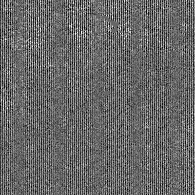](attachments/download/996/MOC_Mocevenodd_Difference.png "MOC_Mocevenodd_Difference.png")

> **Difference image**
> 
> This image illustrates the difference between the before and after  
> images. Note the vertical "pin-striping" -- this is the even-odd  
> noise pattern that was fixed by mocevenodd. This image is a literal  
> subtraction of the two images, contrast stretched to exaggerate  
> the differences. In this images, dark tones are pixels that became  
> darker after mocevenodd, and the lighter tones are pixels that became
> lighter after mocevenodd.

#### Gap Noise Removal (MOC Wide Angle) [¶](#Gap-Noise-Removal-MOC-Wide-Angle-)

The Wide Angle camera that acquired images in the blue filter contains a
gap at detector 371. This gap can be filled in with the average of
surrounding pixels (five pixels on a line centered on detector 371).
Referring to the extracted label information, if InstrumentId = MOC\_WA,
then determine if it is a blue filter:

    getkey from=file_mocevenodd.cub grpn=Archive  keyword=FilterName

If FilterName = BLUE then apply
[**mocgap**](https://isis.astrogeology.usgs.gov/Application/presentation/Tabbed/mocgap/mocgap.html)
to the appropriate output from the steps above:

If MOC\_WA / CrosstrackSumming = 1

    mocgap  from=file_mocevenodd.cub  to=file.lev1.cub

Or… if MOC\_WA / CrosstrackSumming not equal 1:

    mocgap from=file_cal.cub to=file.lev1.cub

## Level 2 Processing - Geometry [¶](#Level-2-Processing-Geometry-)

-----

Producing a mosaic requires **geometric processing** on the individual
images that make up the desired mosaic. The individual images are
geometrically transformed from *spacecraft camera orientation to a
common map coordinate system* . ISIS3 has generic software applications
that are applied to all supported mission data. Based on the information
in the image labels that was added in our earlier steps, the software
recognizes the instrument and performs accordingly.

Within ISIS3, the geometric software includes correcting **camera
distortions** for each supported instrument. The camera distortion
correction and geometric transformation are performed simultaneously so
that an image is resampled only once and resolution loss is minimal. The
transformation is based on the original viewing geometry of the
observation, relative position of the target and the definition of the
map projection.

(Refer to: [Overview of Map Projecting
Images](Overview_of_Map_Projecting_Images) )

## Level 3 Processing - Photometric Correction [¶](#Level-3-Processing-Photometric-Correction-)

-----

**Currently, ISIS3 photometric correction capabilities are under
development. When the applications are released, we will develop a page
here in this lesson providing you with examples and tips for using ISIS3
photometric correction tools.**

*Photometric normalization* is applied to all images that make up a
mosaic in order to adjust and balance the brightness levels among the
images that were acquired under the different lighting conditions.

Generally, radiometrically calibrated spacecraft images measure the
brightness of a scene under specific angles of illumination, emission,
and phase. For a planetary body that doesn't have a significant
atmosphere, this brightness is controlled by two basic classes of
information: the *intrinsic properties of the surface materials* ,
(including composition, grain size, roughness, and porosity), and *local
topography of the surface* .

## Level 4 Processing - Mosaicking [¶](#Level-4-Processing-Mosaicking-)

-----

**Currently, ISIS3 mosaicking capabilities are under development. When
the applications are released, we will finish developing this lesson and
provide you with tips for using ISIS3 to create your final, seamless
mosaic using mapmos and tone matching procedures and applications.**

The final steps in our processing will produce a *seamless mosaic* of
all the images in our region of interest. In spite of best efforts at
radiometric calibration and photometric normalization, small residual
discrepancies in image brightnesses are likely to remain. These
brightness differences appear as seams in a mosaic. There are a couple
of methods that will minimize the seams resulting in an improved
aesthetic result for a final mosaic. The accuracy and quality of the
radiometric calibration and photometric normalization effects how well
the seams can be minimized.

## Exporting ISIS3 Data [¶](#Exporting-ISIS3-Data-)

-----

[Exporting ISIS Data](Exporting_ISIS_Data)

## Staying Organized [¶](#Staying-Organized-)

The recommended filename convention at various phases of processing for
level0, and level1 file are as follows:

The final output from **moc2isis** is considered a level0 image and
should have **.lev0.cub** as the file extension.

**Example:**

    moc2isis from= r700563.imq to=r700563.lev0.cub

For the level1 file it depends on whether only **moccal** will be run or
not. If only **moccal** needs to be run, the output should have the
**.lev1.cub** extension.

**Example:**

    moccal from=r700563.lev0.cub to=r700563.lev1.cub

If **mocevenodd** needs to be run, the final output from **mocevenodd**
should have the **.lev1.cub** extension.

**Example:**

    mocevenodd from=r700563.noise.cub to=r700563.lev1.cub

If **mocgap** needs to be run for MOC-WA images, then the final output
from **mocgap** should have the **.lev1.cub** extension.

**Example:**

    mocgap from=r700563_cal.cub to=r700563.lev1.cub

[Mars\_Orbital\_Camera\_High\_Wide\_Red.png](attachments/download/988/Mars_Orbital_Camera_High_Wide_Red.png)
[View](attachments/download/988/Mars_Orbital_Camera_High_Wide_Red.png "View")
 (105 KB)   Jesse Mapel,
2016-05-31 04:48 PM 

[Jmars\_Screenshot.png](attachments/download/989/Jmars_Screenshot.png)
[View](attachments/download/989/Jmars_Screenshot.png "View")
 (442 KB)   Jesse Mapel,
2016-05-31 04:48 PM 

[Mars\_Orbital\_Camera\_Wide\_Blue.png](attachments/download/990/Mars_Orbital_Camera_Wide_Blue.png)
[View](attachments/download/990/Mars_Orbital_Camera_Wide_Blue.png "View")
 (165 KB)   Jesse Mapel,
2016-05-31 04:48 PM 

[Mars\_Orbital\_Camera\_Wide\_Red.png](attachments/download/991/Mars_Orbital_Camera_Wide_Red.png)
[View](attachments/download/991/Mars_Orbital_Camera_Wide_Red.png "View")
 (179 KB)   Jesse Mapel,
2016-05-31 04:48 PM 

[MOC\_After\_Mocevenodd.png](attachments/download/992/MOC_After_Mocevenodd.png)
[View](attachments/download/992/MOC_After_Mocevenodd.png "View")
 (67.2 KB)   Jesse Mapel,
2016-05-31 04:48 PM 

[MOC\_After\_Mocnoise50.png](attachments/download/993/MOC_After_Mocnoise50.png)
[View](attachments/download/993/MOC_After_Mocnoise50.png "View")
 (67.4 KB)   Jesse Mapel,
2016-05-31 04:48 PM 

[MOC\_Before\_Mocevenodd.png](attachments/download/994/MOC_Before_Mocevenodd.png)
[View](attachments/download/994/MOC_Before_Mocevenodd.png "View")
 (67.4 KB)   Jesse Mapel,
2016-05-31 04:48 PM 

[MOC\_Before\_Mocnoise50.png](attachments/download/995/MOC_Before_Mocnoise50.png)
[View](attachments/download/995/MOC_Before_Mocnoise50.png "View")
 (68.7 KB)   Jesse Mapel,
2016-05-31 04:48 PM 

[MOC\_Mocevenodd\_Difference.png](attachments/download/996/MOC_Mocevenodd_Difference.png)
[View](attachments/download/996/MOC_Mocevenodd_Difference.png "View")
 (72.4 KB)   Jesse Mapel,
2016-05-31 04:48 PM 

[Mars\_Orbital\_Camera\_Narrow.png](attachments/download/997/Mars_Orbital_Camera_Narrow.png)
[View](attachments/download/997/Mars_Orbital_Camera_Narrow.png "View")
 (7.01 MB)   Jesse Mapel,
2016-05-31 04:48 PM 

[MOC\_Narrow\_Angle\_Raw\_Full\_Thumb.png](attachments/download/999/MOC_Narrow_Angle_Raw_Full_Thumb.png)
[View](attachments/download/999/MOC_Narrow_Angle_Raw_Full_Thumb.png "View")
 (34.6 KB)   Jesse Mapel,
2016-05-31 04:48 PM 

[MOC\_Narrow\_Angle\_Raw\_Subarea.png](attachments/download/1000/MOC_Narrow_Angle_Raw_Subarea.png)
[View](attachments/download/1000/MOC_Narrow_Angle_Raw_Subarea.png "View")
 (205 KB)   Jesse Mapel,
2016-05-31 04:48 PM 

[MOC\_Post\_Calibration.png](attachments/download/1001/MOC_Post_Calibration.png)
[View](attachments/download/1001/MOC_Post_Calibration.png "View")
 (211 KB)   Jesse Mapel,
2016-05-31 04:48 PM 

[MOC\_Pre\_Calibration.png](attachments/download/1002/MOC_Pre_Calibration.png)
[View](attachments/download/1002/MOC_Pre_Calibration.png "View")
 (205 KB)   Jesse Mapel,
2016-05-31 04:48 PM 

[MOC\_Web\_Graphical\_Access.png](attachments/download/1003/MOC_Web_Graphical_Access.png)
[View](attachments/download/1003/MOC_Web_Graphical_Access.png "View")
 (133 KB)   Jesse Mapel,
2016-05-31 04:48 PM 

[MOC\_Wide\_Red.png](attachments/download/1004/MOC_Wide_Red.png)
[View](attachments/download/1004/MOC_Wide_Red.png "View")
 (108 KB)   Jesse Mapel,
2016-05-31 04:48 PM 

[Noise\_Transmission\_Error.png](attachments/download/1005/Noise_Transmission_Error.png)
[View](attachments/download/1005/Noise_Transmission_Error.png "View")
 (130 KB)   Jesse Mapel,
2016-05-31 04:48 PM 

[PIA\_ScreenShot\_1.png](attachments/download/1006/PIA_ScreenShot_1.png)
[View](attachments/download/1006/PIA_ScreenShot_1.png "View")
 (69 KB)   Jesse Mapel,
2016-05-31 04:48 PM 

[PIA\_ScreenShot\_2.png](attachments/download/1007/PIA_ScreenShot_2.png)
[View](attachments/download/1007/PIA_ScreenShot_2.png "View")
 (65.1 KB)   Jesse Mapel,
2016-05-31 04:48 PM 

