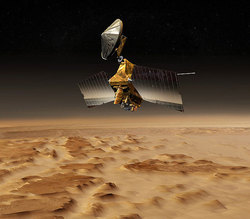
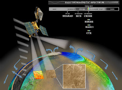

# Working with Mars Reconnaissance Orbiter (MRO) Data [¶](#Working-with-Mars-Reconnaissance-Orbiter-MRO-Data-)

-----

# MRO [¶](#MRO-)

-----

  - [Working with Mars Reconnaissance Orbiter (MRO)
    Data](#Working-with-Mars-Reconnaissance-Orbiter-MRO-Data-)
  - [MRO](#MRO-)
      -   - [Brief Mission Summary](#Brief-Mission-Summary-)
          - [Science Goals](#Science-Goals-)
          - [Science Instruments](#Science-Instruments-)
    
      - [References & Related
        Resources](#References--Related-Resources-)
        
          - [Mars Reconnaissance Orbiter (MRO) Mission and
            Instrument](#Mars-Reconnaissance-Orbiter-MRO-Mission-and-Instrument-)
              - [High Resolution Imaging Science Experiment
                (HiRISE)](#High-Resolution-Imaging-Science-Experiment-HiRISE-)
              - [Context Imager (CTX)](#Context-Imager-CTX-)
              - [Mars Color Imager (MARCI)](#Mars-Color-Imager-MARCI-)
          - [Planetary Data System (PDS) Information and Data Search
            Tools](#Planetary-Data-System-PDS-Information-and-Data-Search-Tools-)

### Brief Mission Summary [¶](#Brief-Mission-Summary-)

NASA's Mars Reconnaissance Orbiter, launched in 2005, is searching for
evidence that water persisted on the surface of Mars for a long period
of time. While other Mars missions have shown that water flowed across
the surface in Mars' history, it remains a mystery whether water was
ever around long enough to provide a habitat for life.

> **Mars Reconnaissance Orbiter** Artist's concept. Credit: NASA/JPL

### Science Goals [¶](#Science-Goals-)

Mars Reconnaissance Orbiter seeks to obtain science data that will
provide researchers with information for locating safe landing sites for
future missions and tell researchers about the history of water on Mars.
The spacecraft instruments will zoom in for extreme close-up images of
the Martian surface in order to analyze minerals, look for subsurface
water, trace how much dust and water are distributed in the atmosphere,
and monitor daily global weather.

These studies will help determine if there are deposits of minerals that
form in water over long periods of time, detect any shorelines of
ancient seas and lakes, and analyze deposits placed in layers over time
by flowing water. It will also be able to tell if the underground ice
discovered by the Mars Odyssey orbiter is the top layer of a deep ice
deposit, or if it is a shallow layer in equilibrium with the current
atmosphere and its seasonal cycle of water vapor.

The orbiter's primary mission ended about three Earth years after
launch, in November 2008, and currently it is on its second extended
mission. For details on all mission stages, see the [Mission Timeline
(NASA)](http://mars.jpl.nasa.gov/mro/mission/timeline/) .

### Science Instruments [¶](#Science-Instruments-)

During its two-year primary science mission, the Mars Reconnaissance
Orbiter conducted eight different science investigations at Mars. The
investigations are functionally divided into three purposes: global
mapping, regional surveying, and high-resolution targeting of specific
spots on the surface.

> **Mars Reconnaissance Orbiter Instruments** Artist's concept showing
> spacecraft instruments monitoring water cycle on Mars. Credit:
> NASA/JPL

  - **[HiRISE (High Resolution Imaging Science Experiment)](HiRISE)**
    This high-resolution, visible-range camera can reveal small objects
    in the debris blankets of mysterious gullies and details of geologic
    structure of canyons, craters, and layered deposits.
  - **[CTX (Context Camera)](CTX)** This camera provides wide area views
    to help provide a context for high-resolution analysis of key spots
    on Mars provided by HiRISE and CRISM.
  - **MARCI (Mars Color Imager)** This weather camera monitors clouds
    and dust storms.
  - **CRISM (Compact Reconnaissance Imaging Spectrometer for Mars)**
    This spectrometer covers the range of visible and near-infrared
    light, useful for identifying minerals, especially those likely
    formed in the presence of water.
  - **MCS (Mars Climate Sounder)** This atmospheric profiler detects
    vertical variations of temperature, dust, and water vapor
    concentrations in the Martian atmosphere.
  - **SHARAD (Shallow Radar)** This sounding radar probes beneath the
    Martian surface to see if water ice is present at depths greater
    than one meter.

## References & Related Resources [¶](#References--Related-Resources-)

-----

### Mars Reconnaissance Orbiter (MRO) Mission and Instrument [¶](#Mars-Reconnaissance-Orbiter-MRO-Mission-and-Instrument-)

  - Mission Overview: <http://mars.jpl.nasa.gov/mro/>

#### High Resolution Imaging Science Experiment (HiRISE) [¶](#High-Resolution-Imaging-Science-Experiment-HiRISE-)

  - Instrument Overview:
    <http://mars.jpl.nasa.gov/mro/mission/instruments/hirise/>
  - Instrument Team: <http://hirise.lpl.arizona.edu/>
  - Online data volumes:
    <http://pds-imaging.jpl.nasa.gov/volumes/mro.html>

#### Context Imager (CTX) [¶](#Context-Imager-CTX-)

  - Instrument Overview:
    <http://mars.jpl.nasa.gov/mro/mission/instruments/ctx/>
  - Instrument Team: <http://www.msss.com/all_projects/mro-ctx.php>
  - Online data volumes:
    <http://pds-imaging.jpl.nasa.gov/volumes/mro.html>

#### Mars Color Imager (MARCI) [¶](#Mars-Color-Imager-MARCI-)

  - Instrument Overview:
    <http://mars.jpl.nasa.gov/mro/mission/instruments/marci/>
  - Instrument Team: <http://www.msss.com/all_projects/mro-marci.php>
  - Online data volumes:
    <http://pds-imaging.jpl.nasa.gov/volumes/mro.html>

### Planetary Data System (PDS) Information and Data Search Tools [¶](#Planetary-Data-System-PDS-Information-and-Data-Search-Tools-)

  - PDS Geosciences Node, Lead Node for MRO:
    <http://geo.pds.nasa.gov/missions/mro/default.htm>
      - Mars Orbital Data Explorer: <http://ode.rsl.wustl.edu/mars/>
  - PDS Imaging Node:
      - Data Release Calendar:
        <http://pds-imaging.jpl.nasa.gov/schedules/mro_release.html>
      - MRO Mission:
        <http://pds-imaging.jpl.nasa.gov/portal/mro_mission.html>
      - Photojournal: <http://photojournal.jpl.nasa.gov/mission/MRO>
      - Planetary Image Atlas:
        <http://pds-imaging.jpl.nasa.gov/search/search.html#QuickSearch>
      - Planetary Image Locator Tool (PILOT):
        <http://pilot.wr.usgs.gov/index.php?view=map&target=mars>
  - PDS Engineering Node:
      - Global data search engine: <http://pds.nasa.gov/>
  - PDS Atmospheres:
      - Accelerometer Data:
        <http://pds-atmospheres.nmsu.edu/data_and_services/atmospheres_data/Mars/Mars.html>
      - Climate Sounder Data:
        <http://pds-atmospheres.nmsu.edu/data_and_services/atmospheres_data/Mars/Mars.html>
  - PDS Navigation and Ancillary Information Node:
      - Spice Kernels:
        <ftp://naif.jpl.nasa.gov/pub/naif/pds/data/mro-m-spice-6-v1.0/mrosp_1000>
      - Toolkit: <ftp://naif.jpl.nasa.gov/pub/naif/toolkit/>

