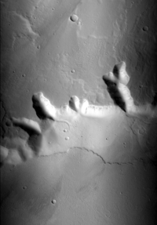
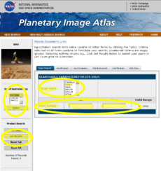
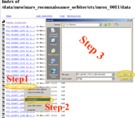

# Working with Mars Reconnaissance Orbiter CTX Data [¶](#Working-with-Mars-Reconnaissance-Orbiter-CTX-Data-)

-----

  - [Working with Mars Reconnaissance Orbiter CTX
    Data](#Working-with-Mars-Reconnaissance-Orbiter-CTX-Data-)
      - [About MRO CTX](#About-MRO-CTX-)
          - [Instrument Overview](#Instrument-Overview-)
          - [Technical Details](#Technical-Details-)
          - [Reference & Related
            Resources](#Reference--Related-Resources-)
      - [Processing CTX Data](#Processing-CTX-Data-)
      - [Level 0 Processing - Data Acquisition &
        Ingestion](#Level-0-Processing-Data-Acquisition--Ingestion-)
      - [File Naming Convention](#File-Naming-Convention-)
      - [Planetary Image Atlas](#Planetary-Image-Atlas-)
          - [Search](#Search-)
          - [Browsing by Volume](#Browsing-by-Volume-)
      - [Downloading CTX images](#Downloading-CTX-images-)
          - [From the PDS website](#From-the-PDS-website-)
          - [Use ISIS3 edrget
            Application](#Use-ISIS3-edrget-Application-)
          - [Related ISIS3 Applications](#Related-ISIS3-Applications-)
      - [Importing CTX Data](#Importing-CTX-Data-)
          - [Ingesting CTX EDR image into
            ISIS3](#Ingesting-CTX-EDR-image-into-ISIS3-)
          - [Related ISIS3 Applications](#Related-ISIS3-Applications-2-)
      - [Adding SPICE](#Adding-SPICE-)
          - [Related ISIS3 Applications](#Related-ISIS3-Applications-3-)
      - [Level 1 Processing](#Level-1-Processing-)
      - [Overview of Radiometric
        Calibration](#Overview-of-Radiometric-Calibration-)
      - [Radiometric Calibration of CTX
        Data](#Radiometric-Calibration-of-CTX-Data-)
          - [Related ISIS3 Applications](#Related-ISIS3-Applications-4-)
      - [Overview of Noise And
        Artifacts](#Overview-of-Noise-And-Artifacts-)
      - [Removing Vertical Striping Due to Even/Odd Dectector
        Readout](#Removing-Vertical-Striping-Due-to-EvenOdd-Dectector-Readout-)
      - [Overview of Map Projecting
        Images](#Overview-of-Map-Projecting-Images-)
          - [The Map Template](#The-Map-Template-)
          - [Projecting the Image](#Projecting-the-Image-)

## About MRO CTX [¶](#About-MRO-CTX-)

-----

[The Mars Reconnaissance Orbiter
Mission](Working_with_Mars_Reconnaissance_Orbiter_\(MRO\)_Data)

### Instrument Overview [¶](#Instrument-Overview-)

CTX collects data simultaneously with the HiRISE camera and CRISM
spectrometer. As the name suggests, CTX provides the wider context for
the data collected by the other two instruments. Scientists use images
from the other instruments to examine the details of Mars, but CTX
allows a better understanding of the terrain that encompasses these
details.

From an altitude of approximately 300 kilometers above Mars, CTX returns
surface images that are 30 kilometers across with pixels representing 6
meters of the Martian surface.

### Technical Details [¶](#Technical-Details-)

The CTX camera obtains grayscale images of the martian surface. A
typical CTX image is maybe as wide as 30 kilometers and as long as 160
kilometers, or more. The instrument has a 350 mm focal length and 6
degree field of view that images onto a 5064 pixels-wide charge coupled
device line array. The CCD detects a broad band of visible light from
500 to 800 nanometers in wavelength.

The team lead and supplier of CTX is Mike Malin from
[MSSS](http://www.msss.com/all_projects/mro-ctx.php) .

    CTX Observation: This is the CTX image 
    that will be used in this lesson. 
    The observation was taken on orbit 
    1472 and the image has been reduced 
    to 1/5th of its original resolution.

### Reference & Related Resources [¶](#Reference--Related-Resources-)

  - [CTX instrument
    description](http://mars.jpl.nasa.gov/mro/mission/instruments/ctx/)
  - [Malin Space Science Systems CTX web
    site](http://www.msss.com/all_projects/mro-ctx.php)
  - [Mars Reconnaissance Orbiter mission web
    site](http://mars.jpl.nasa.gov/mro/)

## Processing CTX Data [¶](#Processing-CTX-Data-)

-----

Because the CTX instrument has only one CCD, the processing of the data
is similar to many other instruments.

The process of constructing an uncontrolled CTX observation mosaic
includes the following steps:

**Level 0 - Data Ingestion**

  - Acquire and convert CTX image data files to the ISIS3 image format.
  - Add information to the ISIS3 image in order to compute geometric
    properties such as latitude/longitude range and illumination angles
    of the image.

**Level 1 – Radiometric Calibration and Noise Removal**

  - Convert raw pixel numbers to reflectance (irradiance/solar flux or
    I/F).
  - Remove noise.

**Level 2 - Projection**

  - Geometrically rectify to a map projection.

## Level 0 Processing - Data Acquisition & Ingestion [¶](#Level-0-Processing-Data-Acquisition--Ingestion-)

-----

There are three major components of level zero processing which are:

1.  **Acquisition** of raw CTX image data for an observation. The
    Planetary Data System ( [PDS](https://pds.nasa.gov/) ) archives
    these raw images in a standard format called the Experiment Data
    Record (EDR).
2.  **Ingestion** of the PDS EDR formatted images. That is, the
    conversion from PDS EDR image format to the ISIS3 image format.
3.  **Initialization of each ISIS3 image with SPICE** (Spacecraft and
    Planetary ephemeredes, Instrument C-matrix and Event) kernel data.
    Recall this information is used to compute geometric properties
    about the CTX observation, such as the latitude/longitude range or
    illumination angles.

## File Naming Convention [¶](#File-Naming-Convention-)

-----

Deciphering the filename can be helpful both when searching for data and
also when managing files on your system. The PDS naming convention for
EDRs is.

    PPP_XXXXXX_YYYY_"X"X_AAHBBB"W".IMG

Where:

  - **PPP** is the mission phase
  - **XXXXXX** is the orbit number
  - **YYYY** is a representation of center latitude in units of 0.1
    degree. 0 degrees is the decending equator crossing; 90 is the south
    pole; 180 is ascending equator crossing; and 270 is the north pole.
  - **X** is the command mode
      - **I** is ITL
      - **N** is NIFL
  - **AA** is the planned center latitude of the image
  - **H** designate is latitude is north or south
      - **N** north
      - **S** south
  - **B** is the planned center longitude of the image in posative west
    values

## Planetary Image Atlas [¶](#Planetary-Image-Atlas-)

-----

The PDS [Planetary Image
Atlas](http://pds-imaging.jpl.nasa.gov/Missions/) , managed by the Jet
Propulsion Laboratory (JPL) and USGS Astrogeology Research Program,
allows the user to search through the CTX database and identify images
based on parameters entered by the user. This tool includes both basic
and advanced search capabilities.

The PDS Imaging Node houses data from several planetary missions, and
offers a variety of methods for accessing their holdings. Within this
lesson, we will focus on CTX data.

    Screenshot of the Image Atlas 
    'Quick Search' options for 
    CTX. The yellow highlights are 
    areas of the page that are 
    useful when executing a quick 
    search of CTX data

### Search [¶](#Search-)

The PDS Planetary Image Atlas provides a *Product Search* tool to
interrogate the collection of CTX images. This tool lets us query
information about each image and ignores the data that we have no
interest in. A good way to reduce the number of images to look at is by
defining an area of interest with latitude and longitude ranges. You can
also restrict the search by choosing a minimum and maximum resolution.
Remember to keep in mind the coordinate system ( *areocentric west* for
CTX) and units (generally meters for distances) required by the search
tool. Launch the [Mars Reconnaissance Orbiter Product
Search](http://pds-imaging.jpl.nasa.gov/search/mro/) to give it a try.

The table below lists the primary search parameters that can help you
narrow down the number of images that are returned by a search of the
PDS CTX image collection. The image above shows a screenshot of the [MRO
Product Search](http://pds-imaging.jpl.nasa.gov/search/mro/) . Note
there are two categories (the tabs above the search form) where these
search parameters are found: Quick Search and Instrument.

| **Parameter**                            | **Notes**                                                                                                                              | **Page Location**                                        |
| ---------------------------------------- | -------------------------------------------------------------------------------------------------------------------------------------- | -------------------------------------------------------- |
| General: **Instrument**                  | Select CTX from the selection choices on the left side of the window.                                                                  | [Select Instrument Location](Select_Instrument_Location) |
| Quick Search: **Target Name**            | Since we're interested in working with images of Mars, choose Mars so you don't have to wade through listings for other bodies.        | [Target Location](Target_Location)                       |
| Quick Search: **Orbit Number**           | Enter minimum and maximum orbit number range.                                                                                          | [Orbit Location](Orbit_Location)                         |
| Geometry: **Latitude** and **Longitude** | You can be helpful to use the latitude and longitude parameters in the "Adv/Geometry" tab to define you search to an area of interest. | [Lat/Lon Location](LatLon_Location)                      |

Once you've made your search parameter selections, click the *Get Count*
to see how many results your search will return, or Get Results to
perform the search and access the results.

### Browsing by Volume [¶](#Browsing-by-Volume-)

You can also go to the online data and Browse Online Data Volumes, which
offers FTP access to the image data archive. This allows you to look at
the image and text files in the archive, where you can find more helpful
information. To give it a try, launch the Planetary Image Atlas in a new
browser window. Now click the [Mars Reconnaissance
Orbiter](http://pds-imaging.jpl.nasa.gov/Admin/resources/cd_mro.html)
Browse Online Data Volumes and choose a volume to look at.

## Downloading CTX images [¶](#Downloading-CTX-images-)

-----

When you know the CTX images that you would like to work with, two ways
to download the data are:

### From the PDS website [¶](#From-the-PDS-website-)

**Step One** : Right click on the image of interest.

**Step Two** : Select "Save Link As..." from the pop-up box.

**Step Three** : Choose a location on you system to save to  
file to, then click the Save button in the Lower right corner  
of the Save As box.

### Use ISIS3 edrget Application [¶](#Use-ISIS3-edrget-Application-)

The ISIS3 application
[**edrget**](http://isis.astrogeology.usgs.gov/Application/presentation/Tabbed/edrget/edrget.html)
can also be used to download a CTX file of interest.

Example: downloading a CTX EDR prodct:

    edrget \
    url=http://pdsimg.jpl.nasa.gov/data/mro/mars_reconnaissance_orbiter/ctx/mrox_0011/data/P01_001472_1747_XI_05S146W.IMG

### Related ISIS3 Applications [¶](#Related-ISIS3-Applications-)

See the following ISIS3 documentation for information about the
applications you will need to use to perform this procedure:

  - [**edrget**](http://isis.astrogeology.usgs.gov/Application/presentation/Tabbed/edrget/edrget.html)
    : downloads a CTX file when given the full URL

## Importing CTX Data [¶](#Importing-CTX-Data-)

-----

In order to work with CTX data in ISIS3, the CTX EDR file must be
converted to an ISIS3 cube file so ISIS3 programs can read and process
the data.

EDR files should always have a file extension of IMG. These files
contain the image data as well as text describing the image data and the
state of the instrument at the time the image was taken. The text is in
the form of a standard [PDS label (click to view example label
file)](CTXPDSLabel) located at the beginning of the file. Only the
information needed by other ISIS3 programs is transferred from the PDS
label to the [ISIS3 cube label (click to view example label
file)](CTXCubLabel) .

### Ingesting CTX EDR image into ISIS3 [¶](#Ingesting-CTX-EDR-image-into-ISIS3-)

The program used to convert CTX EDR files to ISIS3 cube files is
[**mroctx2isis**](http://isis.astrogeology.usgs.gov/Application/presentation/Tabbed/mroctx2isis/mroctx2isis.html)
. The following example shows the command line usage. The resulting
output file will be an ISIS3 cube.

Example: ingesting a CTX EDR product into ISIS3:

    mroctx2isis from=P01_001472_1747_XI_05S146W.IMG to=P01_001472_1747_XI_05S146W.cub

The **mroctx2isis** program also converts the image header, prefix and
suffix data to ISIS3 Binary Large OBject (BLOBs) and has other
parameters.

### Related ISIS3 Applications [¶](#Related-ISIS3-Applications-2-)

See the following ISIS3 documentation for information about the
applications you will need to use to perform this procedure:

  - [**mroctx2isis**](https://isis.astrogeology.usgs.gov/Application/presentation/Tabbed/mroctx2isis/mroctx2isis.html)
    : converts a CTX EDR to ISIS3 cube format

## Adding SPICE [¶](#Adding-SPICE-)

-----

An important capability of ISIS3 is the ability to *geometrically* and
*photometrically* characterize pixels in raw planetary instrument
images. Information such as latitude, longitude, phase angle, incidence
angle, emission angle, local solar time, sun azimuth, and a many other
pixel characteristics can be computed.

To compute this information, the SPICE ( **S** pacecraft and **P**
lanetary ephemeredes, **I** nstrument **C** -matrix and **E** vent
kernel) kernels must first be determined for the particular raw
instrument image. These kernels maintain the spacecraft position and
orientation over time as well as the target position and instrument
specific operating modes.

To add SPICE information to your cube, run the
[**spiceinit**](http://isis.astrogeology.usgs.gov/Application/presentation/Tabbed/spiceinit/spiceinit.html)
application on the image so that camera/instrument specific applications
(e.g., **cam2map** , **campt** , **qview** ) will have the information
they need to work properly. Generally, you can simply run **spiceinit**
with your input filename and no other parameters:

    spiceinit FROM=P01_001472_1747_XI_05S146W.cub

### Related ISIS3 Applications [¶](#Related-ISIS3-Applications-3-)

See the following ISIS3 documentation for information about the
applications you will need to use to perform this procedure:

  - [**spiceinit**](https://isis.astrogeology.usgs.gov/Application/presentation/Tabbed/spiceinit/spiceinit.html)
    : adds SPICE information to the input cube

## Level 1 Processing [¶](#Level-1-Processing-)

-----

*Radiometric Calibration and Noise Removal*

In this section we discuss how to create a level 1 CTX image. The
process of generating a level 1 image involves:

  - **Radiometric calibration** of the data so we have an image
    representative of an ideal image acquired by a camera system with
    perfect radiometric properties. Values in the resulting image
    represent the reflectance of the surface (I/F).
  - **Removal of systematic noise** from the image. For CTX, this noise
    appears as vertical striping, referred to as furrows, which occur
    under certain observing conditions, and tonal mismatches among the
    data sets collected by adjacent channels in a CCD.

## Overview of Radiometric Calibration [¶](#Overview-of-Radiometric-Calibration-)

-----

[Overview\_of\_Radiometric\_Calibration](Overview_of_Radiometric_Calibration)

## Radiometric Calibration of CTX Data [¶](#Radiometric-Calibration-of-CTX-Data-)

-----

The CTX detector has a total of 5000 pixels, divided among an A channel
and a B channel. The pixels alternate between the two channels:
ABABABAB, etc. Images from CTX may or may not include all pixels in the
acquired image. There are special summing modes that are utilized
on-board the spacecraft to average detector pixels to combine them into
a single output pixel value. The value of the ISIS3 label keyword,
SpatialSumming, indicated the number of samples that were summed and
averaged to result in the pixel values stored in the file. Dark current
pixels are taken for each line and stored in the ISIS3 cube as a table,
named "CTX Prefix Dark Pixels". During the calibration process, a dark
current value is subtracted from the pixels in the image. The exact dark
current value that is applied is dependent on the summing mode. You can
also select the IOF parameter and output the pixel values as relative
reflectance.

The following example shows the command line for calibrating a CTX
image.

    ctxcal from=P01_001472_1747_XI_05S146W.cub to=P01_001472_1747_XI_05S146W.cal.cub

### Related ISIS3 Applications [¶](#Related-ISIS3-Applications-4-)

See the following ISIS3 documentation for information about the
applications you will need to use to perform this procedure:

  - [**ctxcal**](http://isis.astrogeology.usgs.gov/Application/presentation/Tabbed/ctxcal/ctxcal.html)
    : radiometrically calibrates CTX images

## Overview of Noise And Artifacts [¶](#Overview-of-Noise-And-Artifacts-)

-----

[Overview of Noise And Artifacts](Overview_of_Noise_And_Artifacts)

## Removing Vertical Striping Due to Even/Odd Dectector Readout [¶](#Removing-Vertical-Striping-Due-to-EvenOdd-Dectector-Readout-)

-----

**If the image of interest has a summing mode of 2 then you will not run
ctxevenodd.**

## Overview of Map Projecting Images [¶](#Overview-of-Map-Projecting-Images-)

-----

### The Map Template [¶](#The-Map-Template-)

In order to project an image to a specific map projection, you'll need
to set up a list of parameters based on the projection you wish to use.
Use the
[maptemplate](http://isis.astrogeology.usgs.gov/Application/presentation/Tabbed/maptemplate/maptemplate.html)
application program (or your favorite text editor)to set up a **map
template** defining the mapping parameters for the projection. The
following is a an example of a map template for defining the projection
of an image of Mars to the sinusoidal projection:

    Group = Mapping
     TargetName         = Mars
     EquatorialRadius   = 3396190.0 <meters>
     PolarRadius        = 3376200.0 <meters>
     LatitudeType       = Planetocentric
     LongitudeDirection = PositiveEast
     LongitudeDomain    = 360
    
     ProjectionName     = Sinusoidal
     CenterLongitude    = 227.95679808356
    
     MinimumLatitude    = 10.766902750622
     MaximumLatitude    = 34.44419678224
     MinimumLongitude   = 219.7240455337
     MaximumLongitude   = 236.18955063342
    
     PixelResolution    = 426.87763879023 <meters/pixel>
    End_Group

### Projecting the Image [¶](#Projecting-the-Image-)

The
[**cam2map**](http://isis.astrogeology.usgs.gov/Application/presentation/Tabbed/cam2map/cam2map.html)
application converts a camera (instrument) image to a map projected
image. **cam2map** will automatically compute defaults for most of the
mapping parameters, so you only need to define a subset of the
parameters in your map template (e.g. ProjectionName).

  - **Your cube must be data from an ISIS3-supported mission** --
    **cam2map** depends on camera/instrument information in the ISIS3
    system to perform map projections.
  - If you are projecting several images with the same projection
    parameters, **you can reuse the same map template** for all your
    images simply by removing the latitude longitude range parameters
    (MinimumLatitude, MaximumLatitude, MinimumLongitude, and
    MaximumLongitude) from your map template.
  - **cam2map will automatically calculate parameter values for you** --
    all you really need is the projection name in your map template.
  - If you're planning on mosaicking your projected images, make sure
    the **PixelResolution** is the same for all images. Some projections
    also require the **CenterLongitude** and **CenterLatitude** to be
    the same when creating a mosaic.

[200px-P01\_001472\_1747\_XI\_05S146W\_small.png](attachments/download/1074/200px-P01_001472_1747_XI_05S146W_small.png)
[View](attachments/download/1074/200px-P01_001472_1747_XI_05S146W_small.png "View")
 (44.2 KB)   Makayla
Shepherd, 2016-06-01 11:47 AM 

[230px-PDSQuickSearch.png](attachments/download/1075/230px-PDSQuickSearch.png)
[View](attachments/download/1075/230px-PDSQuickSearch.png "View")
 (51.7 KB)   Makayla
Shepherd, 2016-06-01 12:00 PM 

[190px-CTXWebDownload.png](attachments/download/1076/190px-CTXWebDownload.png)
[View](attachments/download/1076/190px-CTXWebDownload.png "View")
 (29 KB)   Makayla
Shepherd, 2016-06-01 12:24 PM 

