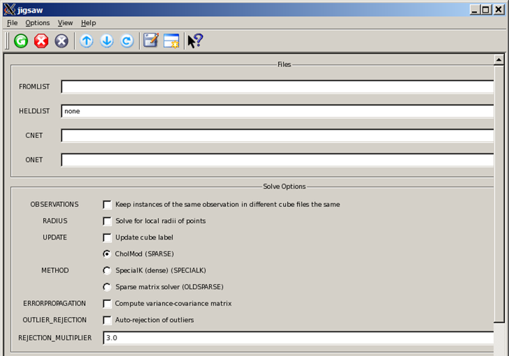
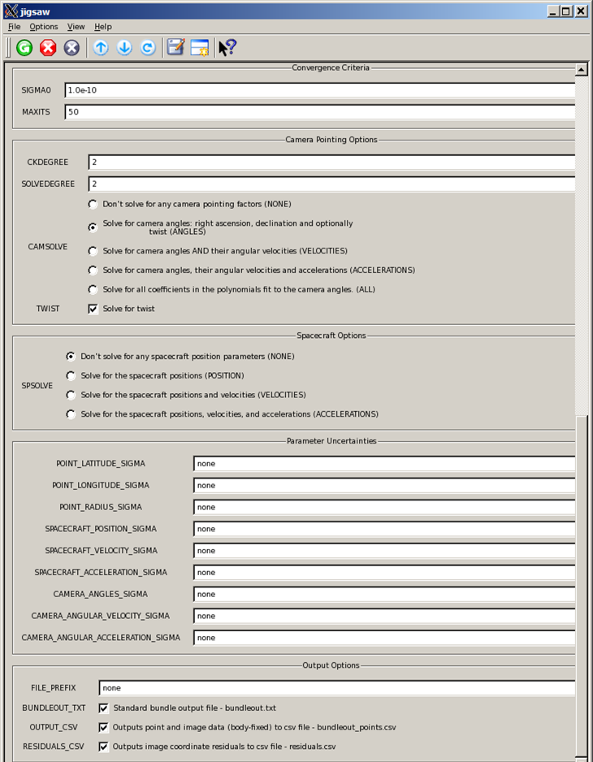

<div id="main">

<div id="content">

<div class="contextual">

</div>

<div class="wiki wiki-page">

<span id="Working-with-Mars-Reconnaissance-Orbiter-HiRISE-Data"></span>

# Working with Mars Reconnaissance Orbiter HiRISE Data [¶](#Working-with-Mars-Reconnaissance-Orbiter-HiRISE-Data-)

-----

  - [Working with Mars Reconnaissance Orbiter HiRISE
    Data](#Working-with-Mars-Reconnaissance-Orbiter-HiRISE-Data-)
      - [About MRO HiRISE](#About-MRO-HiRISE-)
  - [HiRISE](#HiRISE-)
      -   - [Instrument Overview](#Instrument-Overview-)
          - [Technical Details](#Technical-Details-)
          - [References & Related
            Resources](#References--Related-Resources-)
    
      - [Cartographic Processing HiRISE
        Data](#Cartographic-Processing-HiRISE-Data-)
        
          - [Level 0 Processing](#Level-0-Processing-)
          - [Level 1 Processing](#Level-1-Processing-)
          - [Level 2 Processing](#Level-2-Processing-)
    
      - [Batch Processing](#Batch-Processing-)
        
          - [Related ISIS3 Applications &
            Documentation](#Related-ISIS3-Applications--Documentation-)
    
      - [Exporting ISIS3 Data](#Exporting-ISIS3-Data-)
        
          - [Exporting large HiRISE
            images](#Exporting-large-HiRISE-images-)
          - [Related ISIS3 Applications](#Related-ISIS3-Applications-)
    
      - [Create a HiRISE Anaglyph](#Create-a-HiRISE-Anaglyph-)
    
      - [HiRISE-to-HiRISE Geometric
        Control](#HiRISE-to-HiRISE-Geometric-Control-)
        
          - [Collect tiepoints for each
            observations](#Collect-tiepoints-for-each-observations-)
          - [Evaluate the results of automatic seeding and
            registration](#Evaluate-the-results-of-automatic-seeding-and-registration-)
          - [Add and register control measures between the two
            observations to link them
            together](#Add-and-register-control-measures-between-the-two-observations-to-link-them-together-)
          - [Use qnet to constrain
            tiepoints](#Use-qnet-to-constrain-tiepoints-)
          - [Bundle adjustment](#Bundle-adjustment-)
          - [Map projection and mosaic](#Map-projection-and-mosaic-)
          - [Related ISIS3 Applications](#Related-ISIS3-Applications-2-)

<span id="About-MRO-HiRISE"></span>

## About MRO HiRISE [¶](#About-MRO-HiRISE-)

-----

<span id="HiRISE"></span>

# HiRISE [¶](#HiRISE-)

-----

[The Mars Reconnaissance Orbiter Mission](MRO)

<span id="Instrument-Overview"></span>

### Instrument Overview [¶](#Instrument-Overview-)

HiRISE has acquired more than 20,000 images of the martian surface in
unprecedented detail.

HiRISE operates in visible wavelengths with a telescope that will
produce images at resolutions never before possible in planetary
exploration. These high resolution images will enable scientists to
resolve 1-meter (about 3-foot) sized objects on Mars and to study the
morphology (surface structure) in a much more comprehensive manner than
ever before.

From an altitude of approximately 300 kilometers above Mars, HiRISE will
return surface images comprised of pixels representing 30 centimeters of
the martian surface.

These high-resolution images provide unprecedented views of layered
materials, gullies, channels, and other science targets, as well as
possible future landing sites.

[](attachments/download/920/MRO_HiRISE.jpg "MRO_HiRISE.jpg")

    A comparison between the resolution of a camera aboard
    Mars Global Surveyor and the HiRISE camera on 
    Mars Reconnaissance Orbiter. Credit: NASA/JPL 

<span id="Technical-Details"></span>

### Technical Details [¶](#Technical-Details-)

This telescopic camera has a primary mirror diameter of 50 centimeters
and a field of view of 1.15°. At its focal plane, the instrument holds
an array of 14 electronic detectors, each covered by a filter in one of
three wavelength bands: 400 to 600 nanometers (blue-green), 550 to 850
nanometers (red), or 800 to 1000 nanometers (near-infrared). Ten red
detectors are positioned in a line totaling 20,028 pixels across to
cover the whole width of the field of view. Typical red images are
20,000 pixels wide by 40,000 lines high. Two each of the blue-green and
near-infrared detectors lie across the central 20% of the field. Pixel
size in images taken from an altitude of 300 kilometers will be 30
centimeters across, about a factor of two better than the
highest-resolution down-track imaging possible from any earlier Mars
orbiter and a factor of five better than any extended imaging to date.
Generally, at least three pixels are needed to show the shape of a
feature, so the smallest resolvable features in the images will be about
a meter across for an object with reasonable contrast to its
surroundings. The instrument uses a technology called time delay
integration to accomplish a high signal-to-noise ratio for unprecedented
image quality.

The Principal Investigator (lead scientist) for HiRISE is Alfred McEwen
from the [Lunar and Planetary Laboratory](http://www.lpl.arizona.edu/)
at the [University of Arizona](http://www.arizona.edu/) .

[](attachments/download/919/HiRISE_Sample_Observation.png "HiRISE_Sample_Observation.png")

    This image is one half (vertically) of a HiRISE observation
    scaled down to approximately 1/50th of its original resolution.
    It is of a small area inside Eberswalde crater in
    Margaritifer Sinus. Taken on November 8, 2006, the image is a 
    composite of all 10 red detectors and the 2 blue-green detectors.

[](attachments/download/918/HiRISE_Sample_Full_Resolution_Subarea.png "HiRISE_Sample_Full_Resolution_Subarea.png")

    This is a full resolution sub-area of the image on the right
    (indicated by the red outline). One pixel represents 25.6 cm 
    on the surface of Mars.

-----

<span id="References-amp-Related-Resources"></span>

### References & Related Resources [¶](#References--Related-Resources-)

  - [HiRISE instrument
    description](http://mars.jpl.nasa.gov/mro/mission/instruments/hirise/)
  - [HiRISE instrument technical
    description](http://marsoweb.nas.nasa.gov/HiRISE/papers/6th_mars_conf/Delemere_HiRISE_InstDev.pdf)
    (PDF)
  - [HiRISE mission web site](http://marsoweb.nas.nasa.gov/HiRISE/)
  - [en.wikipedia.org/wiki/HiRISE](http://en.wikipedia.org/wiki/HiRISE)
  - [Mars Reconnaissance Orbiter mission web
    site](http://mars.jpl.nasa.gov/mro/)

<span id="Cartographic-Processing-HiRISE-Data"></span>

## Cartographic Processing HiRISE Data [¶](#Cartographic-Processing-HiRISE-Data-)

-----

<span id="Level-0-Processing"></span>

### **[Level 0 Processing](Level0_HiRISE)** [¶](#Level-0-Processing-)

1.  [Data Acquisition](Level0_HiRISE)
2.  [Ingestion](Level0_HiRISE)
3.  [SPICE](Level0_HiRISE)
4.  [Raw Camera Geometry](Level0_HiRISE)

<span id="Level-1-Processing"></span>

### **[Level 1 Processing](Level1_HiRISE)** [¶](#Level-1-Processing-)

1.  [Radiometric Calibration](Level1_HiRISE)
2.  [Channel Stitching](Level1_HiRISE)
3.  [Noise Removal](Level1_HiRISE)

<span id="Level-2-Processing"></span>

### **[Level 2 Processing](Level2_HiRISE)** [¶](#Level-2-Processing-)

1.  [Overview](Level2_HiRISE)
2.  [Map Projection](Level2_HiRISE)
3.  [Tone Match](Level2_HiRISE)
4.  [Mosaic](Level2_HiRISE)

<span id="Batch-Processing"></span>

## Batch Processing [¶](#Batch-Processing-)

-----

The ingestion, SPICE initialization, calibration, merging, and
normalization must be run for each channel image. This would be
incredibly tedious to run each application for every file\! Luckily,
batch processing is easy to do in ISIS3. Using the [Isis -batchlist
command line
option](https://isis.astrogeology.usgs.gov/documents/CommandLine/CommandLine.html#-batchlist%20Parameter)
, a set of CCD images for a single observation can easily be processed
through level 1 processing.

The commands shown below create file lists to use as inputs to the
applications and run those applications using the batchlist option:

    1. create a single column list of images without the file extension
        ls *.IMG | sed s/.IMG// > cube.lis
    
    2. run hi2isis on the list of files, adding the input/output extensions 
       in the command line
        hi2isis from=\$1.IMG to=\$1.cub -batchlist=cube.lis
    
    3. apply spiceinit to the hi2isis output cube files
        spiceinit from=\$1.cub -batchlist=cube.lis
    
    4. apply hical with the appropriate input/output file extensions
        hical from=\$1.cub to=\$1.cal.cub -batchlist=cube.lis
    
    5. create a list of one of the channels without file extensions
        ls *_0.IMG | sed s/_0.IMG// > cube2.lis
    
    6. stitch together the channels specifying each appropriate extension 
        in the command line
        histitch from1=\$1_0 from2=\$1_1 to=\$1 -batchlist=cube2.lis
    
    7. normalize, tone-match across the channels (if necessary)
        cubenorm from=\$1 to=\$1.norm.cub -batch=cube2.lis

<span id="Related-ISIS3-Applications-amp-Documentation"></span>

### Related ISIS3 Applications & Documentation [¶](#Related-ISIS3-Applications--Documentation-)

See the following ISIS3 documentation for information about the
applications  
you will need to use to perform this procedure:

  - [Isis Command Line
    Usage](https://isis.astrogeology.usgs.gov/documents/CommandLine/CommandLine.html)
    : how to run ISIS3 programs on the command line
  - [**hi2isis**](https://isis.astrogeology.usgs.gov/Application/presentation/Tabbed/hi2isis/hi2isis.html)
    : converts a HiRISE EDR to ISIS3 cube format
  - [**spiceinit**](http://isis.astrogeology.usgs.gov/Application/presentation/Tabbed/spiceinit/spiceinit.html)
    : adds SPICE information to the input cube
  - [**hical**](http://isis.astrogeology.usgs.gov/Application/presentation/Tabbed/hical/hical.html)
    : radiometrically calibrates HiRISE channel images
  - [**histitch**](http://isis.astrogeology.usgs.gov/Application/presentation/Tabbed/histitch/histitch.html)
    : combines two HiRISE channel images to form a single CCD image
  - [**cubenorm**](http://isis.astrogeology.usgs.gov/Application/presentation/Tabbed/cubenorm/cubenorm.html)
    : normalizes values in a image

<span id="Exporting-ISIS3-Data"></span>

## Exporting ISIS3 Data [¶](#Exporting-ISIS3-Data-)

-----

[**Overview for exporting ISIS3 data**](Exporting_Isis_Data)

<span id="Exporting-large-HiRISE-images"></span>

### Exporting large HiRISE images [¶](#Exporting-large-HiRISE-images-)

HiRISE mosaics are very large and our export application
[**isis2std**](http://isis.astrogeology.usgs.gov/Application/presentation/Tabbed/isis2std/isis2std.html)
does not handle large PNG or JPEG images. You will need to decrease the
size of the image to export by either cropping or reducing.

<span id="Related-ISIS3-Applications"></span>

### Related ISIS3 Applications [¶](#Related-ISIS3-Applications-)

See the following ISIS3 documentation for information about the
applications you will need to use to perform this procedure:

  - [**reduce**](https://isis.astrogeology.usgs.gov/Application/presentation/Tabbed/reduce/reduce.html)
    : scale down a cube
  - [**crop**](https://isis.astrogeology.usgs.gov/Application/presentation/Tabbed/crop/crop.html)
    : pull a region out of a cube

<span id="Create-a-HiRISE-Anaglyph"></span>

## Create a HiRISE Anaglyph [¶](#Create-a-HiRISE-Anaglyph-)

-----

See: [HiRISE Anaglyphs](HiRISE_Anaglyphs)

<span id="HiRISE-to-HiRISE-Geometric-Control"></span>

## HiRISE-to-HiRISE Geometric Control [¶](#HiRISE-to-HiRISE-Geometric-Control-)

-----

Two HiRISE observation of red filter images will be geometrically
controlled by shifting one observation set relative to a master
observation. A collection of tiepoints that links all the images is
needed to accomplish this task. A few tiepoints will be constrained
heavily to tack down the control points when the bundle adjustment is
performed. After the camera pointing has been updated the images will be
projected, tone matched, and mosaicked together.

<span id="Collect-tiepoints-for-each-observations"></span>

### Collect tiepoints for each observations [¶](#Collect-tiepoints-for-each-observations-)

    1.  Generate normalized cube files for each observation by running steps 1 to 7
        See steps under Batch Processing (above section)
    
    2.  Create a list of all the normalized cube files for both observations
         ls  *norm.cub > normalized.lis
    
    3.  Add footprint polygons to the image labels of each normalized cube file
         footprintinit from=\$1 linc=100 sinc=50 incre=true -batch=normalized.lis
    
    4.  Add camera statistics information to the image labels of each normalized cube file
         camstats from=\$1 linc=100 sinc=50 attach=true -batch=normalized.lis
    
    5.  Create separate lists of the normalized cubes for each observation
         ls PSP_004339_1890*norm.cub > set1.lis
         ls PSP_00568*norm.cub > set2.lis
    
    6.  Find image overlaps and record the information to an output file for each 
        observation separately
         findimageoverlaps froml=set1.lis over=set1_overlaps.txt
         findimageoverlaps froml=set2.lis over=set2_overlaps.txt
    
    7.  Automatically seed tiepoints along the overlaps, run separately to avoid 
         seeding too many points in the overlap areas between the two sets
         autoseed fromlist=set1.lis deffile=hirise_ccd_sets_seed.def 
         overlaplist=set1_overlaps.txt onet=hirise_set_autoseed.net 
         errors=hirise_set1_autoseed.err networkid=Hirise_set1 
         pointid=hirise_set1_\?\?\?\? description="HiRise set1 images autoseed
         with hirise_ccd_sets_seed.def"
         autoseed''' fromlist=set2.lis deffile=hirise_ccd_sets_seed.def
         overlaplist=set2_overlaps.txt onet=hirise_set _autoseed.net
         errors=hirise_set2_autoseed.err networkid=Hirise_set2
         pointid=hirise_set2_\?\?\?\? description="HiRise set2 images autoseed 
         with hirise_ccd_sets_seed.def"
    
    8.  Merge the two output networks produced by the autoseed program
         cnetmerge inputtype=cnets base=hirise_set1_autoseed.net
         cnet2=hirise_set2_autoseed.net onet=hirise_autoseed_merged_sets.net
         networkid=HiRiseSets description="Hirise merge set1 and set2 networks"
    
    9.  Perform automatic sub-pixel registration between the measures for each 
         control point.  A registration template is required that defines what 
         the tolerances should be for the program pointreg.  The input list 
         should contain all the images included in the two control networks that 
         were merged previously in step 8
         pointreg fromlist=all_norm.lis cnet=hirise_autoseed_merged_sets.net
         deffile=hires_p51x151_s151x251.def
         onet=hirise_autoseed_merged_sets_ptreg.net
         flatfile=hirise_autoseed_merged_sets_ptreg.txt points=all

For more information see [Automatic seeding of tiepoints](Autoseed)
and  
[Pattern Matching](Automatic_Registration)

<span id="Evaluate-the-results-of-automatic-seeding-and-registration"></span>

### Evaluate the results of automatic seeding and registration [¶](#Evaluate-the-results-of-automatic-seeding-and-registration-)

Display the result with **qmos** to see the distribution of control
points and the point types (blue=successful, red=failed)

``` 
 qmos
 Under file, select "Open Cube List"
 Select the file list, and then press "Open"
 Click on the "Control Net" button
 Select the control network file (output of pointreg), and press "Open"
```

The example below shows the footprint plot with the tiepoints in the
control network. Additional work is required to convert some ignored
tiepoints to valid tiepoints with qnet or pointreg.


After fixing critical tiepoints that link the images together with qnet
or pointreg, the result should look like the example below:


Note: The ignored points and measures were deleted in the plot above

<span id="Add-and-register-control-measures-between-the-two-observations-to-link-them-together"></span>

### Add and register control measures between the two observations to link them together [¶](#Add-and-register-control-measures-between-the-two-observations-to-link-them-together-)

``` 
 1.  Remove all the ignored points and measures before adding additional 
     measures. The input network should be the output from qnet or 
     pointreg in the previous step.
      cnetedit cnet=hirise_autoseed_merged_sets_ptreg.net
      onet=hirise_autoseed_merged_sets_ptregedit.net

 2.  Add new control measures in order to link the two observations 
     together.
      cnetadd fromlist=all_norm.lis addlist=all_norm.lis
      cnet=hirise_autoseed_merged_sets_ptregedit.net
      onet=hirise_autoseed_merged_sets_ptregedit_add.net
      log=hirise_autoseed_merged_sets_ptregedit_add.log polygon=yes

 3.  Automatically register the new measures to the reference measures
     which were set in the previous steps.  The registration template
     must be modified to allow for the offset between the two sets.
     In most cases, the search area needs to be increased and some of
     the other settings may need to be adjusted also.

     IMPORTANT: set "measures=candidates"  

      pointreg fromlist=all_norm.lis points=all measures=candidates
      cnet=hirise_autoseed_merged_sets_ptregedit_add.net
      deffile=hirise_p151x501_s651x1501.def
      onet=hirise_autoseed_merged_sets_ptregedit_addptreg1.net
      flatfile=hirise_autoseed_merged_sets_ptregedit_addptreg1.txt

 4.  Remove all ignored measures from the control network.
      cnetedit cnet=hirise_autoseed_merged_sets_ptregedit_addptreg1.net
      onet=hirise_autoseed_merged_sets_ptregedit_addptreg1edit.net

 5.  Check the network for missing links, single measures, no control 
     points, or problems with the latitude and longitude.
      cnetcheck fromlist=all_norm.lis prefix=cknet1_
      cnet=hirise_autoseed_merged_sets_ptregedit_addptreg1edit.net

 6.  Check the output results and fix any problems reported. If the 
     network is good, continue to the next step.
```

See **[Automatic Registration](Automatic_Registration)** for additional
information.

<span id="Use-qnet-to-constrain-tiepoints"></span>

### Use qnet to constrain tiepoints [¶](#Use-qnet-to-constrain-tiepoints-)

We will be adjusting all the images relative to one image instead of to
actual ground coordinates. Use the interactive program
**[qnet](https://isis.astrogeology.usgs.gov/Application/presentation/Tabbed/qnet/qnet.html)**
to constrain a set of tiepoints to a specified geographic location. The
amount of movement allowed will be defined by setting the apriori
latitude, longitude, and radius values by some amount. In our example,
the apriori sigma values for (lat, lon, radius) will be set to (1.0,
1.0, and 100.0) for the selected tiepoints. Make sure the latitude,
longitude values are obtained from the same image.

[**qnet**](http://isis.astrogeology.usgs.gov/Application/presentation/Tabbed/qnet/qnet.html)
- click for more information on the interactive program.

``` 
 qnet

 Select "Open control network cube list"
 Select "all_norm.lis"
 Select "hirise_autoseed_merged_sets_ptregedit_addptreg1edit.net"

 In the "Control Network Navigator" window go to the drop-down menu 
  next to "Points", and select "Cubes"

 Select both "RED5" cubes, ''hold down "Ctrl" button while selecting the 
  files (PSP_004339_1890_RED5_norm.cub and PSP_005684_1890_RED5_norm.cub)

 Click on "View Cubes" button 
```

The two images should be displayed in the qnet window. The image shows
green cross-hair where there are valid control points, magenta for
constrained points, and yellow for ignored points. Do not use yellow
points to constain control points. Select 3 points, one at top, center,
and bottom of the same image to constrain the latitude and logitude
coordinates. Make sure  
the left image in the "Qnet Tool" or editor window has the "RED5" image
displayed on the left. A DEM is required in order to constrain the
points, the file must have been run through
[**demprep**](https://isis.astrogeology.usgs.gov/Application/presentation/Tabbed/demprep/demprep.html)
.

Find the location where the DEM is stored before going to the next step.
The dems are normally stored in $ISIS3DATA/base/dems directory.

``` 
 Go to "File" and select "Open ground source"
 Select "$base/dems/molaMarsPlanetaryRadius0005.cub"

 Go to "File" and select "Open radius source"
 Select "$base/dems/molaMarsPlanetaryRadius0005.cub"

 In the qnet window, select the "Control point editor" button (the last 
 button with two arrow points)

 Click on the uppermost green crosshair in the qnet window for one of 
 the RED5 images.  The point will be displayed in the editor window.

 Next, Select "Points" in the control network navigator window

 In the editor window:
  Select "Constrained" using the drop-down menu next to "Free"
  Click "Save Measure" in the editor window
  Click "Save Point" in the editor window
  Click "Floppy disk icon" to save the changes to the file 
     (Do not skip this step)

 In the control navigator window:
  Click "Set Apriori/Sigmas"
  Enter Latitude Sigma=1.0 Longitude Sigma=1.0, and Radius Sigma=100.0
  Click "Set Apriori"
  Click "Save network" Point should change color from green to magenta
```

REPEAT previous STEPS for center and bottom points.  
Save the control network file.

<span id="Bundle-adjustment"></span>

### Bundle adjustment [¶](#Bundle-adjustment-)

After constraining at least 3 tiepoints, run the bundle adjustment
program
[**jigsaw**](https://isis.astrogeology.usgs.gov/Application/presentation/Tabbed/jigsaw/jigsaw.html)
. *Do not check "update" and "error propagation" until an acceptable
solution is reached* . After each run check the output file showing the
residuals to determine if there are bad measures in the control network.

Sample of jigsaw GUI showing parameter names:  




Our settings are very basic since our primary purpose is to shift one
observation to match another, and we are not actually including accurate
ground points. For advanced users, the steps and parameters used may be
adjusted to fit your particular needs.

Command line entry:

    jigsaw fromlist=all_norm.lis onet=jigtest1.net \
    cnet=hirise_autoseed_merged_sets_ptregedit_addptreg1edit.net \
    radius=yes sigma0=1.0e-6 maxits=10 point_radius_sigma=1000 \
    camera_angles_sigma=3 file_prefix=jig1
    
    Check the output files:
     sort -k8,8nr jig1_residuals.csv|more 
     (The residuals should be less than 5 pixels, check large residuals 
      using qnet, or create a list of pointid's and delete with cnetedit)
    
     egrep -a cub jig1_bundleout.txt |more
    
    The last 3 columns next to the filenames should be small
    
    Final run:
     jigsaw fromlist=all_norm.lis onet=jigtest1.net update=yes \
     cnet=hirise_autoseed_merged_sets_ptregedit_addptreg1edit.net \
     radius=yes sigma0=1.0e-6 maxits=10 point_radius_sigma=1000 \
     camera_angles_sigma=3 file_prefix=jig1 errorpro=yes

For additional information on Jigsaw, refer to a discussion PowerPoint
as presented in June 26, 2012 at the Planetary Data Workshop:
[Jigsaw\_demo.pdf](attachments/download/998/Jigsaw_demo.pdf)

<span id="Map-projection-and-mosaic"></span>

### Map projection and mosaic [¶](#Map-projection-and-mosaic-)

The final step is to project the images, tone match the set, and mosaic
the files together. A map template is needed in order to project the
images. Our map template contains the following parameter settings:

    #mars_equi.map 
    Group = Mapping
       TargetName         = Mars
       ProjectionName     = Equirectangular
       CenterLongitude    = 0.0
       CenterLatitude     = 0.0
       #EquatorialRadius   = 3396190.0 <meters>
       #PolarRadius        = 3376200.0 <meters>
       LatitudeType       = Planetocentric
       LongitudeDirection = PositiveEast
       LongitudeDomain    = 180
       PixelResolution    = .5 <meters/pixel>
    End_Group

Create Level2 images:

    ls *norm.cub > lev1.lis
    cam2map from=\$1 to=lev2_\$1 map=mars_equi.map -batch=lev1.lis

Tone match images:

    ls lev2_*norm.cub > lev2.lis
    ls lev2_PSP_004339_1890_RED5_norm.cub > hold.lis
    equalizer fromlist=lev2.lis holdlist=hold.lis outstats=stats.txt

Mosaic

    ls lev2*equ.cub > lev2equ.lis
    automos froml=lev2equi.lis mosaic=hirise_set_mosaic.cub

Final mosaic of two observations:


<span id="Related-ISIS3-Applications-2"></span>

### Related ISIS3 Applications [¶](#Related-ISIS3-Applications-2-)

See the following ISIS3 documentation for information about the
applications you will need to use to perform this procedure:

  - [footprintinit](https://isis.astrogeology.usgs.gov/Application/presentation/Tabbed/footprintinit/footprintinit.html)
    : Add footprint polygons to image labels
  - [camstats](https://isis.astrogeology.usgs.gov/Application/presentation/Tabbed/camstats/camstats.html)
    : Add camera statistics to image labels
  - [findimageoverlaps](https://isis.astrogeology.usgs.gov/Application/presentation/Tabbed/findimageoverlaps/findimageoverlaps.html)
    : Find overlaps between a set of images
  - [autoseed](https://isis.astrogeology.usgs.gov/Application/presentation/Tabbed/autoseed/autoseed.html)
    : Automatically create a network file by seeding tiepoints
  - [cnetmerge](https://isis.astrogeology.usgs.gov/Application/presentation/Tabbed/cnetmerge/cnetmerge.html)
    : Merge different control network files
  - [pointreg](https://isis.astrogeology.usgs.gov/Application/presentation/Tabbed/pointreg/pointreg.html)
    : Sub-pixel register control measures for a control point
  - [qmos](https://isis.astrogeology.usgs.gov/Application/presentation/Tabbed/qmos/qmos.html)
    : Display image footprints and control point networks
  - [qnet](https://isis.astrogeology.usgs.gov/Application/presentation/Tabbed/qnet/qnet.html)
    : Interactive program to collect and modify control measures and
    ground points
  - [cnetedit](https://isis.astrogeology.usgs.gov/Application/presentation/Tabbed/cnetedit/cnetedit.html)
    : Delete control points and measures from a control network
  - [cnetadd](https://isis.astrogeology.usgs.gov/Application/presentation/Tabbed/cnetadd/cnetadd.html)
    : Add control measures to an existing control network
  - [cnetcheck](https://isis.astrogeology.usgs.gov/Application/presentation/Tabbed/cnetcheck/cnetcheck.html)
    : Check control network file before running jigsaw
  - [jigsaw](https://isis.astrogeology.usgs.gov/Application/presentation/Tabbed/jigsaw/jigsaw.html)
    : Bundle adjustment program to update camera pointing information
  - [cam2map](https://isis.astrogeology.usgs.gov/Application/presentation/Tabbed/cam2map/cam2map.html)
    : Map project level 1 images
  - [equalizer](https://isis.astrogeology.usgs.gov/Application/presentation/Tabbed/equalizer/equalizer.html)
    : Tone match a set of images
  - [automos](https://isis.astrogeology.usgs.gov/Application/presentation/Tabbed/automos/automos.html)
    : Create a mosaic

</div>

<div class="attachments">

<div class="contextual">

</div>

[HiRISE\_equalizer\_automos.png](attachments/download/983/HiRISE_equalizer_automos.png)
[View](attachments/download/983/HiRISE_equalizer_automos.png "View")
<span class="size"> (61.8 KB) </span> <span class="author"> Ian
Humphrey, 2016-05-31 04:44 PM </span>

[HiRISE\_jigsaw2.png](attachments/download/984/HiRISE_jigsaw2.png)
[View](attachments/download/984/HiRISE_jigsaw2.png "View")
<span class="size"> (186 KB) </span> <span class="author"> Ian Humphrey,
2016-05-31 04:45 PM </span>

[HiRISE\_jigsaw1.png](attachments/download/985/HiRISE_jigsaw1.png)
[View](attachments/download/985/HiRISE_jigsaw1.png "View")
<span class="size"> (78 KB) </span> <span class="author"> Ian Humphrey,
2016-05-31 04:45 PM </span>

[Hirise\_qmos\_demo2.png](attachments/download/986/Hirise_qmos_demo2.png)
[View](attachments/download/986/Hirise_qmos_demo2.png "View")
<span class="size"> (228 KB) </span> <span class="author"> Ian Humphrey,
2016-05-31 04:45 PM </span>

[Hirise\_qmos\_demo1.png](attachments/download/987/Hirise_qmos_demo1.png)
[View](attachments/download/987/Hirise_qmos_demo1.png "View")
<span class="size"> (242 KB) </span> <span class="author"> Ian Humphrey,
2016-05-31 04:45 PM </span>

[Jigsaw\_demo.pdf](attachments/download/998/Jigsaw_demo.pdf)
<span class="size"> (8.24 MB) </span> <span class="author"> Ian
Humphrey, 2016-05-31 04:48 PM </span>

</div>

<div style="clear:both;">

</div>

</div>

</div>
