<div id="main">

<div id="content">

<div class="contextual">

</div>

<div class="wiki wiki-page">

<span id="Working-with-Mars-Viking-Orbiter-Data"></span>

# Working with Mars Viking Orbiter Data [¶](#Working-with-Mars-Viking-Orbiter-Data-)

  - [Working with Mars Viking Orbiter
    Data](#Working-with-Mars-Viking-Orbiter-Data-)
      - [About the Viking Mission to
        Mars](#About-the-Viking-Mission-to-Mars-)
      - [Processing Viking Orbiter VIS
        Data](#Processing-Viking-Orbiter-VIS-Data-)
      - [Level 0 Processing - Data
        Ingestion](#Level-0-Processing-Data-Ingestion-)
      - [Acquiring Viking Orbiter Data](#Acquiring-Viking-Orbiter-Data-)
      - [Data Acquisition Tool: Planetary Image
        Atlas](#Data-Acquisition-Tool-Planetary-Image-Atlas-)
          - [Browsing by Volume](#Browsing-by-Volume-)
          - [Related Resources](#Related-Resources-)
      - [Data Acquisition Tool: USGS Planetary GIS Web
        Server](#Data-Acquisition-Tool-USGS-Planetary-GIS-Web-Server-)
          - [Related Resources](#Related-Resources-2-)
      - [Data Acquisition Tool: JMARS](#Data-Acquisition-Tool-JMARS-)
          - [Give it a Whirl\!](#Give-it-a-Whirl-)
          - [Resources](#Resources-)
      - [Importing Viking Orbiter Data](#Importing-Viking-Orbiter-Data-)
          - [Using vik2isis to ingest VIS images into
            ISIS3](#Using-vik2isis-to-ingest-VIS-images-into-ISIS3-)
      - [Viking VIS Problem Data](#Viking-VIS-Problem-Data-)
      - [Adding SPICE](#Adding-SPICE-)
          - [Related ISIS Applications](#Related-ISIS-Applications-)
      - [Level 1 Processing - Noise Removal and Radiometric
        Calibration](#Level-1-Processing-Noise-Removal-and-Radiometric-Calibration-)
      - [Overview of Noise And
        Artifacts](#Overview-of-Noise-And-Artifacts-)
      - [Removing Salt Noise](#Removing-Salt-Noise-)
          - [Related ISIS3 Applications](#Related-ISIS3-Applications-)
      - [Removing Reseaus](#Removing-Reseaus-)
          - [Finding Reseaus with findrx](#Finding-Reseaus-with-findrx-)
          - [Removing Reseaus with remrx](#Removing-Reseaus-with-remrx-)
      - [Removing Pepper Noise](#Removing-Pepper-Noise-)
          - [Related ISIS3 Applications](#Related-ISIS3-Applications-2-)
      - [Remove Missing Track Noise](#Remove-Missing-Track-Noise-)
      - [Overview of Radiometric
        Calibration](#Overview-of-Radiometric-Calibration-)
      - [Radiometric Calibration of Viking VIS
        Data](#Radiometric-Calibration-of-Viking-VIS-Data-)
          - [Related ISIS3 Applications](#Related-ISIS3-Applications-3-)
      - [Level 2 Processing - Geometry](#Level-2-Processing-Geometry-)
      - [Level 3 Processing - Photometric
        Correction](#Level-3-Processing-Photometric-Correction-)
      - [Level 4 Processing -
        Mosaicking](#Level-4-Processing-Mosaicking-)
      - [Exporting ISIS3 Data](#Exporting-ISIS3-Data-)

<span id="About-the-Viking-Mission-to-Mars"></span>

## [About the Viking Mission to Mars](Viking_Orbiter_Mission) [¶](#About-the-Viking-Mission-to-Mars-)

-----

<span id="Processing-Viking-Orbiter-VIS-Data"></span>

## Processing Viking Orbiter VIS Data [¶](#Processing-Viking-Orbiter-VIS-Data-)

-----

  - **Level 0: Data Ingestion**  
    Acquire Viking VIS data from one of numerous sources, import it into
    ISIS3, and initialize it with SPICE information.

  - **Level 1: Noise Removal and Radiometric Calibration**  
    Remove the salt-and-pepper noise, reseau marks, and missing track
    noise in the data, then radiometrically calibrate the image data so
    the DNs represent reflectance (ranging from 0 to 1).

  - **Level 2 - Projection**  
    Geodetic corrections are performed and the images projected to a map
    projection.

  - **Level 3 – Photometric Correction and Enhancement**  
    The effect of sun angle on the image is corrected, and the images
    are tone matched.

  - **Level 4 – Building a Mosaic**  
    A seamless mosaic is created.

<span id="Level-0-Processing-Data-Ingestion"></span>

## Level 0 Processing - Data Ingestion [¶](#Level-0-Processing-Data-Ingestion-)

-----

This is the starting point for the production of a Viking mosaic. The
steps within the level zero processing provide the gateway into ISIS3
processing. Running the following applications will **ingest the
Engineering Data Record (EDR)** and place necessary information into the
labels of the image. Viking Obiter information has been around for quite
awhile so problems with the dataset have been discovered and accounted
for, allowing this process to run smoothly.

<span id="Acquiring-Viking-Orbiter-Data"></span>

## Acquiring Viking Orbiter Data [¶](#Acquiring-Viking-Orbiter-Data-)

-----

  - [Planetary Data System](https://pds.nasa.gov/) : The Planetary Data
    System (PDS) [Planetary Image
    Atlas](http://pds-imaging.jpl.nasa.gov/holdings/) , hosted by the
    Jet Propulsion Laboratory and USGS Astrogeology Research Program.

  - [USGS Planetary GIS Web Server](http://webgis.wr.usgs.gov/) : The
    USGS Planetary GIS Web Server allows a user to view Viking
    footprints and verify image coverage.

  - [JMARS](https://jmars.mars.asu.edu/) Geographic Information System:
    The JMARS Geographic Information System (GIS), offered by the
    Arizona State University's Mars Spaceflight Facility.

**Hint** : When searching for Viking orbiter data that covers your area
of interest, it can be useful to widen you search area by as much as
five degrees to each value in your latitude and longitude search values.
The camera pointing for Viking images may be off by as much as a half
frame so expanding your search will help insure that you get all the
images that were acquired for that area.

<span id="Data-Acquisition-Tool-Planetary-Image-Atlas"></span>

## Data Acquisition Tool: Planetary Image Atlas [¶](#Data-Acquisition-Tool-Planetary-Image-Atlas-)

-----

The Planetary Data System [PDS](https://pds.nasa.gov/) Imaging Node
houses data from several planetary missions, and offers a variety of
methods for accessing their holdings. For now we will concentrate on
acquiring Viking Orbiter data.

**Search**  
The PDS [Planetary Image
Atlas](http://pds-imaging.jpl.nasa.gov/holdings/) provides a *Product
Search* search tool to interrogate the collection of Viking Orbiter
Imagery. This tool lets us query information about each image and
ignores the data that we have no interest in. A good way to reduce the
number of images to look at is by defining an area of interest with
latitude and longitude ranges. You can also restrict the search by
choosing a minimum and maximum resolution. Remember to keep in mind the
coordinate system ( *areographic west* for Viking) and units (generally
kilometers for distances) required by the search tool. Launch the
[Viking Orbiter Product
Search](http://pdsimg.jpl.nasa.gov/cgi-bin/Atlas/search.pl?INSTRUMENT_HOST_NAME=VIKING_ORBITER)
to give it a try.

The table below lists the search parameters that can help you narrow
down the number of images that are returned by a search of the PDS
Viking Orbiter image collection. The images to the right show screen
shots of the [Viking Orbiter Product
Search](http://pdsimg.jpl.nasa.gov/cgi-bin/Atlas/search.pl?INSTRUMENT_HOST_NAME=VIKING_ORBITER)
. Note there are two categories (the tabs above the search form) where
these search parameters are found: Quick Search and Geometry.

| Parameter                | Location     | Notes                                                                                                                                              |
| ------------------------ | ------------ | -------------------------------------------------------------------------------------------------------------------------------------------------- |
| **PRODUCT\_TYPE**        | Quick Search | The type of Viking data you are searching for, in this case, the raw EDRs                                                                          |
| **CENTER\_LATITUDE**     | Quick Search | Enter minimum latitude and maximum latitude values that encompass the latitude range of your area of interest, in areographic west coordinates.    |
| **CENTER\_LONGITUDE**    | Quick Search | Enter minimum longitude and maximum longitude values that encompass the longitude range of your area of interest, in areographic west coordinates. |
| **TARGET\_NAME**         | Geometry     | Since we're interested in creating a Viking mosaic of Mars, choose Mars so you don't have to wade through listings for other bodies.               |
| **SCALED\_PIXEL\_WIDTH** | Geometry     | Enter the minimum and maximum resolution, in kilometers.                                                                                           |

[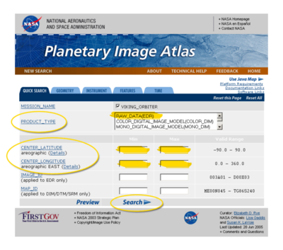](attachments/download/1057/680px-PIA_CenterLatLong_Screenshot.png "PIA CenterLatLong Screenshot")

    Screenshot of the Image Atlas 'Quick Search' options for Mars Viking Orbiter

[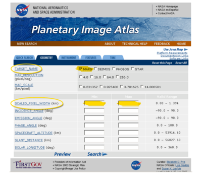](attachments/download/1058/680px-PIA_TargetName_ScaledPixelWidth_Screenshot.png "PIA TargetName ScaledPixelWidth Screenshot")

    Screenshot of the Image Atlas 'Geometry' search options for Mars Viking Orbiter

<span id="Browsing-by-Volume"></span>

### Browsing by Volume [¶](#Browsing-by-Volume-)

You can also go to the online data and Browse Online Data Volumes, which
offers FTP access to the CDs (compact discs)used to archive and
distribute the data. This allows you to look at the image and text files
on the CDs, where you can find more helpful information. To give it a
try, launch the [Planetary Image
Atlas](http://pds-imaging.jpl.nasa.gov/holdings/) in a new browser
window. Now click the [Viking Orbiter Browse Online Data
Volumes](http://pdsimg.jpl.nasa.gov/Admin/resources/cd_viking.html#vkoEDR)
and choose a CD volume to look at. When you know the images that you
would like to work with, you can go to this area with an FTP tool and
download that image or download it using your browser.

<span id="Related-Resources"></span>

### Related Resources [¶](#Related-Resources-)

  - [Planetary Image Atlas](http://pds-imaging.jpl.nasa.gov/holdings/)
  - [Planetary Image Atlas Help
    Pages](http://pds-imaging.jpl.nasa.gov/Atlas/intro.html)

<span id="Data-Acquisition-Tool-USGS-Planetary-GIS-Web-Server"></span>

## Data Acquisition Tool: USGS Planetary GIS Web Server [¶](#Data-Acquisition-Tool-USGS-Planetary-GIS-Web-Server-)

-----

[The USGS Planetary GIS Web Server](http://webgis.wr.usgs.gov/) , hosted
by the USGS Astrogeology Research Program, allows a user to view Viking
footprints and verify image coverage. The site delivers a variety of
data sets through a web GIS interface. When searching for imagery, the
Planetary GIS site's ability to display footprints of data can prove
very helpful in verifying gaps, or determining image placement and
overlaps.

<span id="Related-Resources-2"></span>

### Related Resources [¶](#Related-Resources-2-)

  - [Mars Online Maps](http://webgis.wr.usgs.gov/pigwad/maps/mars.htm)
    page on the [The USGS Planetary GIS Web
    Server](http://webgis.wr.usgs.gov/)

<span id="Data-Acquisition-Tool-JMARS"></span>

## Data Acquisition Tool: JMARS [¶](#Data-Acquisition-Tool-JMARS-)

-----

JMARS is a useful Geographic Information System (GIS) tool to evaluate
Viking images that cover an area of interest before the images are
downloaded. The tool displays Viking footprints and a variety of other
Mars data. JMARS can be used to:

  - query the database of Viking images,
  - select browse images to display on-screen and download via the web,
  - generate a list of Viking images (great for creating scripts), and
  - save the displayed map as an image.

<span id="Give-it-a-Whirl"></span>

### Give it a Whirl\! [¶](#Give-it-a-Whirl-)

If you have JMARS installed, launch it and log in. We'll run through a
quick and easy exercise in displaying Viking footprints.

1.  In the Main tab of the Layer Manger, hit the Add new layer button,
    which opens a menu.
2.  Select Viking from the Stamp menu.
3.  In the Add Viking stamp layer window, just hit the Okay button,
    leaving all the fields blank.
4.  A new tab named Viking stamps will appear in the Layer Manager. When
    it's done loading the footprints, its drawing status indicator will
    turn from red to green,the footprints will be displayed on the map
    and the images shown on the map are list in the Layer Manager.
5.  Try right-clicking on a listing the image list and on the footprints
    displayed on the screen -- there's lots of options for working with
    and accessing information and data. For example, Render and Load
    Selected Stamps will download and display the Viking images for the
    selected footprints on the map, giving you the ability to preview
    the data. Web Browse will launch an image's web page in your browser
    so you can access the information and data.

Of course, there's many other options in JMARS to help you search for
Viking data, such as the tools for narrowing your search and modifying
your display in the Settings, Query, and Render tabs in the Layer
Manager, using the various tools in the main menus, and adding other
useful data layers to the display.

[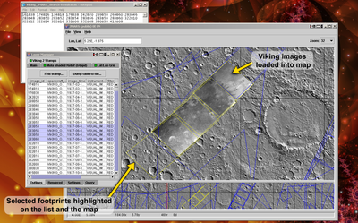](attachments/download/1062/Jmars_screenshot.png "Jmars_screenshot.png")

    Screen shot of JMARS displaying Viking 2 footprints: 
    The Viking footprints (called stamps in JMARS)are displayed as blue polygons on the map. 
    Several footprints are shown selected in the Layers Manager Viking 2 Stamps list and 
    highlighted yellow on the map. Several Viking images are displayed the map, filling in 
    those footprints with a preview of the actual image data. Image names for the selected 
    footprints have been copied from JMARS to our text editor. In this case, we selected 
    Viking 2 for our new layer.

<span id="Resources"></span>

### Resources [¶](#Resources-)

  - [Download JMARS](http://jmars.asu.edu/) (free, registration required
    to use JMARS' full functionality)

<span id="Importing-Viking-Orbiter-Data"></span>

## Importing Viking Orbiter Data [¶](#Importing-Viking-Orbiter-Data-)

-----

Viking VIS data are distributed in Standard Data Products formatted
files, which have an .imq extension, are compressed PDS format images
and are decompressed before ingesting into ISIS3.

The Viking Orbiter images that are distributed on compact disc (CD) are
also compressed image files. The CDs are formatted according to the
ISO-9660 standard. Viking CDs can be obtained from the [NASA National
Space Science Data
Center](http://nssdc.gsfc.nasa.gov/cgi-bin/shop/web_store.cgi?category=viking&cart_id=5682900.7580&store=catalog.setup)
.

<span id="Using-vik2isis-to-ingest-VIS-images-into-ISIS3"></span>

### Using vik2isis to ingest VIS images into ISIS3 [¶](#Using-vik2isis-to-ingest-VIS-images-into-ISIS3-)

The following examples show the use of
[vik2isis](https://isis.astrogeology.usgs.gov/Application/presentation/Tabbed/vik2isis/vik2isis.html)
to ingest (or import) a VIS image into ISIS3. The resulting output file
will be an ISIS3 cube.

Example: ingesting a compressed Standard Data Products VIS image

    vik2isis FROM=Viking_input.imq To=Viking_image.cub

The decompression software for the .imq images is included within
vik2isis. You don't need to worry about the extra step of decompressing
the image.

<span id="Viking-VIS-Problem-Data"></span>

## Viking VIS Problem Data [¶](#Viking-VIS-Problem-Data-)

-----

Many of the problems with the Viking data set are due to environmental
conditions that existed when the image was acquired. To find these poor
quality images, you must visually inspect the images. Clouds and
airborne dust are two elements that will degrade the quality of your
images. The amount of image degradation will vary. Whether or not you
use the image is a judgment based on how much information will be gained
verses how much the image will degrade the final product.

[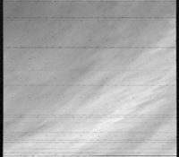](attachments/download/1059/684px-Viking_Image_with_clouds.jpg "Viking Image with Clouds")

    Image with clouds

[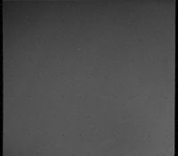](attachments/download/1060/684px-Viking_Image_with_dust.jpg "Viking Image with Dust")

    Image with dust

<span id="Adding-SPICE"></span>

## Adding SPICE [¶](#Adding-SPICE-)

-----

An important capability of ISIS is the ability to geometrically and
photometrically characterize pixels in raw planetary instrument images.
Information such as latitude, longitude, phase angle, incidence angle,
emission angle, local solar time, sun azimuth, and a many other pixel
characteristics can be computed.

To compute this information, the **SPICE** ( **S** pacecraft and **P**
lanetary ephemeredes, **I** nstrument **C** -matrix and **E** vent
kernel) kernels must first be determined for the particular raw
instrument image. These kernels maintain the spacecraft position and
orientation over time as well as the target position and instrument
specific operating modes.

To add SPICE information to your cube, run
[**spiceinit**](https://isis.astrogeology.usgs.gov/Application/presentation/Tabbed/spiceinit/spiceinit.html)
application on the image so that camera/instrument specific applications
(e.g.,
[**cam2map**](https://isis.astrogeology.usgs.gov/Application/presentation/Tabbed/cam2map/cam2map.html)
,
[**campt**](https://isis.astrogeology.usgs.gov/Application/presentation/Tabbed/campt/campt.html)
,
[**qview**](https://isis.astrogeology.usgs.gov/Application/presentation/Tabbed/qview/qview.html)
) will have the information they need to work properly. Generally, you
can simply run spiceinit with your input filename and no other
parameters:

``` 
  spiceinit FROM=my.cub
```

<span id="Related-ISIS-Applications"></span>

### Related ISIS Applications [¶](#Related-ISIS-Applications-)

See the following ISIS documentation for information about the
applications you will need to use to perform this procedure:

  - [**spiceinit**](https://isis.astrogeology.usgs.gov/Application/presentation/Tabbed/spiceinit/spiceinit.html)
    : adds SPICE information to the input cube

<span id="Level-1-Processing-Noise-Removal-and-Radiometric-Calibration"></span>

## Level 1 Processing - Noise Removal and Radiometric Calibration [¶](#Level-1-Processing-Noise-Removal-and-Radiometric-Calibration-)

-----

To create a Level 1 Viking image, we'll clean up noise and other
problems and radiometrically correct the data so we have an image
representing the reflectance of the surface. We'll start by removing
image blemishes caused by malfunctioning detectors, dust specks,
transmission noise, and so forth. We'll finish up our Level 1 image with
radiometric calibration in order to create an image that is
representative of an ideal image acquired by a camera system with
perfect radiometric properties.

[](attachments/download/1064/Viking_Salt_Noise.png "Viking Salt Noise")

    Remove the white speckles called salt noise

[](attachments/download/1065/Viking_reseau.png "Viking Reseau")

    Remove the reseaus

[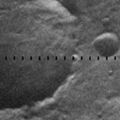](attachments/download/1063/Viking_Missing_Tracks.png "Viking Missing Tracks")

    Fill in missing tracks

[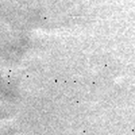](attachments/download/1071/Viking_Black_Specks.png "Viking Black Specks")

    Remove black speckles called pepper noise

[](attachments/download/1053/600px-Viking_Radiometric.png "Viking Radiometric")

    Radiometrically calibrate the image

<span id="Overview-of-Noise-And-Artifacts"></span>

## Overview of Noise And Artifacts [¶](#Overview-of-Noise-And-Artifacts-)

-----

[Overview of Noise And Artifacts](Overview_of_Noise_And_Artifacts)

<span id="Removing-Salt-Noise"></span>

## Removing Salt Noise [¶](#Removing-Salt-Noise-)

-----

The black and white speckle present in Viking images is a result of
interference during the transfer of information from the spacecraft.
This speckle is called salt and pepper noise because it has the
appearance of grains of salt and pepper sprinkled across the image.

**Removing Salt Noise**

The application
[viknosalt](https://isis.astrogeology.usgs.gov/Application/presentation/Tabbed/viknosalt/viknosalt.html)
runs the application **noisefilter** five times to identify white noise
within the image. The identified pixels are set to a value of null. The
final step in **viknosalt** is a low pass filter that replaces the null
pixels with a valid value.

    viknosalt FROM=Viking_image.cub TO=Viking_nosalt.cub

<span id="Related-ISIS3-Applications"></span>

### Related ISIS3 Applications [¶](#Related-ISIS3-Applications-)

See the following ISIS3 documentation for information about the
applications you will need to use to perform this procedure:

  - [viknosalt](https://isis.astrogeology.usgs.gov/Application/presentation/Tabbed/viknosalt/viknosalt.html)
    : Viking salt noise removal application

[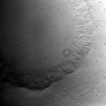](attachments/download/1054/600px-Viking_Salt_Before.png "Viking Salt Before")

    Before removing salt noise

[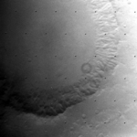](attachments/download/1055/600px-Viking_Salt_After.png "Viking Salt After")

    After removing salt noise

[](attachments/download/1072/Viking_salt_Before_Closeup.png "Viking Salt Before Closeup")

    Close-up of before salt noise removal

[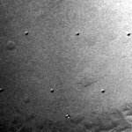](attachments/download/1067/Viking_salt_After_Closeup.png "Viking Salt After Closeup")

    Close-up of after salt noise removal

<span id="Removing-Reseaus"></span>

## Removing Reseaus [¶](#Removing-Reseaus-)

-----

Reseau marks on Viking images are small dots that form a grid of points
across the image. These marks are created by design -- reseaus are
etched in a pattern over the lens of the camera, and the marks the
reseaus make on the image will allow us to refine the image in later
processing steps. The images below show reseau marks on a Vidicon tube
similar to the ones used for the Viking VIS cameras, and an enlargement
of a reseaus mark in a Viking image.

[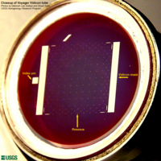](attachments/download/1056/600px-Voyager_reseaus_closeup.png "Voyager Reseaus Closeup")

    Close-up of reseaus on a Vidicon tube

[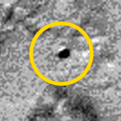](attachments/download/1066/Reseau_mark_closeup.png "Reseau Mark Closeup")

    Enlargement of reseau mark on a Viking image

The next step is to find and remove reseaus. The reseau locations found
in this step are used to correct for the optical distortion. The vidicon
cameras used by the Viking spacecraft have electronic distortions
similar in pattern to the optical distortion in a film camera. These
electronic distortions are introduced because the scanning pattern of
the electron beam used to read out the charge-stored image vidicon is
more "barrel-shaped" than rectangular. Interactions between the charge
on the photo-cathode that represent the image itself and the electron
beam produce additional complex high-order distortions.

Reseaus removal is accomplish by using two applications: **findrx** to
find the reseaus, then **remrx** to remove them.

<span id="Finding-Reseaus-with-findrx"></span>

### Finding Reseaus with findrx [¶](#Finding-Reseaus-with-findrx-)

[findrx](https://isis.astrogeology.usgs.gov/Application/presentation/Tabbed/findrx/findrx.html)
will read in a cube and refine the position of the reseau points based
on information about where the reseaus should be and comparing those
areas of the image against a Viking reseau pattern to locate the actual
reseau mark in the image. The image labels are then modified to reflect
the new sub-pixel accuracy.

findrx Example: The following example shows running
[findrx](https://isis.astrogeology.usgs.gov/Application/presentation/Tabbed/findrx/findrx.html)
on the command line.

``` 
 findrx  FROM=Viking_nosalt.cub
```

<span id="Removing-Reseaus-with-remrx"></span>

### Removing Reseaus with remrx [¶](#Removing-Reseaus-with-remrx-)

[remrx](https://isis.astrogeology.usgs.gov/Application/presentation/Tabbed/remrx/remrx.html)
removes reseaus from a Viking image. When you select a value for the
parameters sdim (sample dimension) and ldim (line dimension), you want
to choose values that are large enough to remove the reseaus but, the
value should not be larger then required or you will remove valid data.
For most Viking images we have found that of sdim= 9 and ldim= 9 works
well. While the reseaus are visibly removed from the images, the reseau
information is retained in the labels for later processing stages.

**remrx Example** : The following example shows running
[remrx](https://isis.astrogeology.usgs.gov/Application/presentation/Tabbed/remrx/remrx.html)
on the command line.

    remrx FROM=Viking_nosalt.cub TO=Viking_norx.cub sdim=9 ldim=9

[](attachments/download/1050/600px-Reseau_before.png "Reseau Before")

    Input image (Viking image with salt noise removed)

[](attachments/download/1049/600px-Reseau_after.png "Reseau After")

    Reseaus removed using sdim=9 and ldim=9

**Comparisons of remrx with different ldim/sdim parameters** : The
following close-ups show the results of using **remrx** with slight
changes to ldim and sdim parameters.


<span id="Removing-Pepper-Noise"></span>

## Removing Pepper Noise [¶](#Removing-Pepper-Noise-)

-----

**Currently, the ISIS3 application to remove the black speckle called
pepper noise is under development. When the application is released, we
will develop a page here in this lesson providing you with examples of
pepper noise and tips for running viknopepper to remove this type of
noise from your Viking images.**

<span id="Related-ISIS3-Applications-2"></span>

### Related ISIS3 Applications [¶](#Related-ISIS3-Applications-2-)

See the following ISIS3 documentation for information about the
applications you will need to use to perform this procedure:

  - [viknopepper](https://isis.astrogeology.usgs.gov/Application/presentation/Tabbed/viknopepper/viknopepper.html)
    : Viking pepper noise removal application

<span id="Remove-Missing-Track-Noise"></span>

## Remove Missing Track Noise [¶](#Remove-Missing-Track-Noise-)

-----

The **missing track noise** is caused by interference from the
spacecraft electronics. Track noise appears as a regular pattern of NULL
values across the image in increments of seven pixels. This noise occurs
because of the way Viking images were transmitted to Earth. On the
spacecraft, an image is broken into seven tracks, each track contains
every seventh value along a scan line. If errors occurred while a track
was transmitted to Earth, then the track contains incorrect data values.
Sometimes, several tracks are missing.

The program
[vikfixtrx](https://isis.astrogeology.usgs.gov/Application/presentation/Tabbed/vikfixtrx/vikfixtrx.html)
will check for this type of noise in each of the seven tracks of a
Viking image cube. If the threshold of invalid pixels in a given track
is met or exceeded, then the track is considered bad and all pixels are
replaced by interpolating valid values from either side of the bad
pixels.

**vikfixtrx Example** : The following example shows running
**vikfixtrx** on the command line:

    vikfixtrx FROM=Viking_norx.cub TO=Viking_notrx.cub

[](attachments/download/1052/600px-Vikfixtrx_before.png "Vikfixtrx Before")

    Input image (Viking image with reseaus removed)

[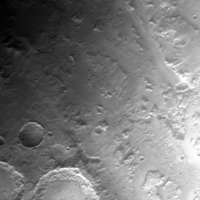](attachments/download/1051/600px-Vikfixtrx_after.png "Vikfixtrx After")

    Output image (null tracks removed)

**vikfixtrx Close-up** : The following is a close-up of the null tracks
and results of removing the null tracks with vikfixtrx


    Input image


    Output image (null tracks removed)

<span id="Overview-of-Radiometric-Calibration"></span>

## Overview of Radiometric Calibration [¶](#Overview-of-Radiometric-Calibration-)

-----

[Overview of Radiometric
Calibration](Overview_of_Radiometric_Calibration)

<span id="Radiometric-Calibration-of-Viking-VIS-Data"></span>

## Radiometric Calibration of Viking VIS Data [¶](#Radiometric-Calibration-of-Viking-VIS-Data-)

-----

[vikcal](https://isis.astrogeology.usgs.gov/Application/presentation/Tabbed/vikcal/vikcal.html)
performs radiometric corrections to planetary images acquired by the
Viking orbiter cameras. **vikcal** performs a radiometric correction in
two steps:

1.  Correct the varying response of the vidicon across the field of view
    of the camera. Multiplicative and additive correction coefficients,
    as a function of line and sample position, are applied to an image
    array to produce the results of an 'ideal' camera.
2.  Convert the image data to reflectance values, where reflectance (a
    value between 0 and 1) is the ratio of the observed radiance and the
    radiance of a white screen, normal to the incident rays of the Sun.

**vikcal Example:** The following example shows the command line for
running the Viking radiometric calibration application ( **vikcal** ):

    vikcal FROM=Viking_notrx.cub TO=Viking_cal.cub

The output image of **vikcal** will be a 32-bit (floating-point) cube,
where the pixel values represent reflectance.

<span id="Related-ISIS3-Applications-3"></span>

### Related ISIS3 Applications [¶](#Related-ISIS3-Applications-3-)

See the following ISIS3 documentation for information about the
applications you will need to use to perform this procedure:

  - [vikcal](https://isis.astrogeology.usgs.gov/Application/presentation/Tabbed/vikcal/vikcal.html)
    : radiometric calibration of Viking VIS image data
  - [catlab](https://isis.astrogeology.usgs.gov/Application/presentation/Tabbed/catlab/catlab.html)
    : outputs an image label

<span id="Level-2-Processing-Geometry"></span>

## Level 2 Processing - Geometry [¶](#Level-2-Processing-Geometry-)

-----

Producing a mosaic requires geometric processing on the individual
images that make up the desired mosaic. The individual images are
geometrically transformed from spacecraft camera orientation to a common
map coordinate system. ISIS3 has generic software applications that are
applied to all supported mission data. Based on the information in the
image labels that was added in our earlier steps, the software
recognizes the instrument and performs accordingly.

[Overview of Map Projecting Images](Overview_of_Map_Projecting_Images)

<span id="Level-3-Processing-Photometric-Correction"></span>

## Level 3 Processing - Photometric Correction [¶](#Level-3-Processing-Photometric-Correction-)

-----

**Currently, ISIS3 photometric correction capabilities are under
development. When the applications are released, we will develop a page
here in this lesson providing you with examples and tips for using ISIS3
photometric correction tools.**

Photometric normalization is applied to all images that make up a mosaic
in order to adjust and balance the brightness levels among the images
that were acquired under the different lighting conditions.

Generally, radiometrically calibrated spacecraft images measure the
brightness of a scene under specific angles of illumination, emission,
and phase. For a planetary body that doesn't have a significant
atmosphere, this brightness is controlled by two basic classes of
information: the **intrinsic properties of the surface materials** ,
(including composition, grain size, roughness, and porosity), and
**local topography of the surface** .

<span id="Level-4-Processing-Mosaicking"></span>

## Level 4 Processing - Mosaicking [¶](#Level-4-Processing-Mosaicking-)

-----

**Currently, ISIS3 photometric correction capabilities are under
development. When the applications are released, we will finish
developing this lesson and provide you with tips for using ISIS3 to
create your final, seamless mosaic using mapmos and tone matching
procedures and applications.**

The final steps in our processing will produce a **seamless mosaic** of
all the images in our region of interest. In spite of best efforts at
radiometric calibration and photometric normalization, small residual
discrepancies in image brightnesses are likely to remain. These
brightness differences appear as *seams* in a mosaic. There are a couple
of methods that will minimize the seams resulting in an improved
aesthetic result for a final mosaic. The accuracy and quality of the
radiometric calibration and photometric normalization effects how well
the seams can be minimized.

<span id="Exporting-ISIS3-Data"></span>

## Exporting ISIS3 Data [¶](#Exporting-ISIS3-Data-)

-----

[Exporting ISIS Data](Exporting_ISIS_Data)

</div>

<div class="attachments">

<div class="contextual">

</div>

[600px-Reseau\_after.png](attachments/download/1049/600px-Reseau_after.png)
[View](attachments/download/1049/600px-Reseau_after.png "View")
<span class="size"> (326 KB) </span> <span class="author"> Marjorie
Hahn, 2016-06-01 11:02 AM </span>

[600px-Reseau\_before.png](attachments/download/1050/600px-Reseau_before.png)
[View](attachments/download/1050/600px-Reseau_before.png "View")
<span class="size"> (329 KB) </span> <span class="author"> Marjorie
Hahn, 2016-06-01 11:02 AM </span>

[600px-Vikfixtrx\_after.png](attachments/download/1051/600px-Vikfixtrx_after.png)
[View](attachments/download/1051/600px-Vikfixtrx_after.png "View")
<span class="size"> (325 KB) </span> <span class="author"> Marjorie
Hahn, 2016-06-01 11:02 AM </span>

[600px-Vikfixtrx\_before.png](attachments/download/1052/600px-Vikfixtrx_before.png)
[View](attachments/download/1052/600px-Vikfixtrx_before.png "View")
<span class="size"> (326 KB) </span> <span class="author"> Marjorie
Hahn, 2016-06-01 11:02 AM </span>

[600px-Viking\_Radiometric.png](attachments/download/1053/600px-Viking_Radiometric.png)
[View](attachments/download/1053/600px-Viking_Radiometric.png "View")
<span class="size"> (325 KB) </span> <span class="author"> Marjorie
Hahn, 2016-06-01 11:02 AM </span>

[600px-Viking\_Salt\_Before.png](attachments/download/1054/600px-Viking_Salt_Before.png)
[View](attachments/download/1054/600px-Viking_Salt_Before.png "View")
<span class="size"> (318 KB) </span> <span class="author"> Marjorie
Hahn, 2016-06-01 11:02 AM </span>

[600px-Viking\_Salt\_After.png](attachments/download/1055/600px-Viking_Salt_After.png)
[View](attachments/download/1055/600px-Viking_Salt_After.png "View")
<span class="size"> (315 KB) </span> <span class="author"> Marjorie
Hahn, 2016-06-01 11:03 AM </span>

[600px-Voyager\_reseaus\_closeup.png](attachments/download/1056/600px-Voyager_reseaus_closeup.png)
[View](attachments/download/1056/600px-Voyager_reseaus_closeup.png "View")
<span class="size"> (559 KB) </span> <span class="author"> Marjorie
Hahn, 2016-06-01 11:03 AM </span>

[680px-PIA\_CenterLatLong\_Screenshot.png](attachments/download/1057/680px-PIA_CenterLatLong_Screenshot.png)
[View](attachments/download/1057/680px-PIA_CenterLatLong_Screenshot.png "View")
<span class="size"> (249 KB) </span> <span class="author"> Marjorie
Hahn, 2016-06-01 11:03 AM </span>

[680px-PIA\_TargetName\_ScaledPixelWidth\_Screenshot.png](attachments/download/1058/680px-PIA_TargetName_ScaledPixelWidth_Screenshot.png)
[View](attachments/download/1058/680px-PIA_TargetName_ScaledPixelWidth_Screenshot.png "View")
<span class="size"> (244 KB) </span> <span class="author"> Marjorie
Hahn, 2016-06-01 11:04 AM </span>

[684px-Viking\_Image\_with\_clouds.jpg](attachments/download/1059/684px-Viking_Image_with_clouds.jpg)
[View](attachments/download/1059/684px-Viking_Image_with_clouds.jpg "View")
<span class="size"> (94.8 KB) </span> <span class="author"> Marjorie
Hahn, 2016-06-01 11:05 AM </span>

[684px-Viking\_Image\_with\_dust.jpg](attachments/download/1060/684px-Viking_Image_with_dust.jpg)
[View](attachments/download/1060/684px-Viking_Image_with_dust.jpg "View")
<span class="size"> (42.6 KB) </span> <span class="author"> Marjorie
Hahn, 2016-06-01 11:05 AM </span>

[Pigwad\_screen.png](attachments/download/1061/Pigwad_screen.png)
[View](attachments/download/1061/Pigwad_screen.png "View")
<span class="size"> (191 KB) </span> <span class="author"> Marjorie
Hahn, 2016-06-01 11:05 AM </span>

[Jmars\_screenshot.png](attachments/download/1062/Jmars_screenshot.png)
[View](attachments/download/1062/Jmars_screenshot.png "View")
<span class="size"> (577 KB) </span> <span class="author"> Marjorie
Hahn, 2016-06-01 11:07 AM </span>

[Viking\_Missing\_Tracks.png](attachments/download/1063/Viking_Missing_Tracks.png)
[View](attachments/download/1063/Viking_Missing_Tracks.png "View")
<span class="size"> (21 KB) </span> <span class="author"> Marjorie Hahn,
2016-06-01 11:08 AM </span>

[Viking\_Salt\_Noise.png](attachments/download/1064/Viking_Salt_Noise.png)
[View](attachments/download/1064/Viking_Salt_Noise.png "View")
<span class="size"> (61.1 KB) </span> <span class="author"> Marjorie
Hahn, 2016-06-01 11:08 AM </span>

[Viking\_reseau.png](attachments/download/1065/Viking_reseau.png)
[View](attachments/download/1065/Viking_reseau.png "View")
<span class="size"> (25.5 KB) </span> <span class="author"> Marjorie
Hahn, 2016-06-01 11:08 AM </span>

[Reseau\_mark\_closeup.png](attachments/download/1066/Reseau_mark_closeup.png)
[View](attachments/download/1066/Reseau_mark_closeup.png "View")
<span class="size"> (25.5 KB) </span> <span class="author"> Marjorie
Hahn, 2016-06-01 11:09 AM </span>

[Viking\_salt\_After\_Closeup.png](attachments/download/1067/Viking_salt_After_Closeup.png)
[View](attachments/download/1067/Viking_salt_After_Closeup.png "View")
<span class="size"> (60.8 KB) </span> <span class="author"> Marjorie
Hahn, 2016-06-01 11:09 AM </span>

[Reseau\_removal\_sample\_guide.png](attachments/download/1068/Reseau_removal_sample_guide.png)
[View](attachments/download/1068/Reseau_removal_sample_guide.png "View")
<span class="size"> (84.5 KB) </span> <span class="author"> Marjorie
Hahn, 2016-06-01 11:10 AM </span>

[Vikfixtrx\_after\_closeup.jpg](attachments/download/1069/Vikfixtrx_after_closeup.jpg)
[View](attachments/download/1069/Vikfixtrx_after_closeup.jpg "View")
<span class="size"> (43.4 KB) </span> <span class="author"> Marjorie
Hahn, 2016-06-01 11:10 AM </span>

[Vikfixtrx\_before\_closeup.jpg](attachments/download/1070/Vikfixtrx_before_closeup.jpg)
[View](attachments/download/1070/Vikfixtrx_before_closeup.jpg "View")
<span class="size"> (44.1 KB) </span> <span class="author"> Marjorie
Hahn, 2016-06-01 11:11 AM </span>

[Viking\_Black\_Specks.png](attachments/download/1071/Viking_Black_Specks.png)
[View](attachments/download/1071/Viking_Black_Specks.png "View")
<span class="size"> (23.6 KB) </span> <span class="author"> Marjorie
Hahn, 2016-06-01 11:18 AM </span>

[Viking\_salt\_Before\_Closeup.png](attachments/download/1072/Viking_salt_Before_Closeup.png)
[View](attachments/download/1072/Viking_salt_Before_Closeup.png "View")
<span class="size"> (61.1 KB) </span> <span class="author"> Marjorie
Hahn, 2016-06-01 11:19 AM </span>

</div>

<div style="clear:both;">

</div>

</div>

</div>
